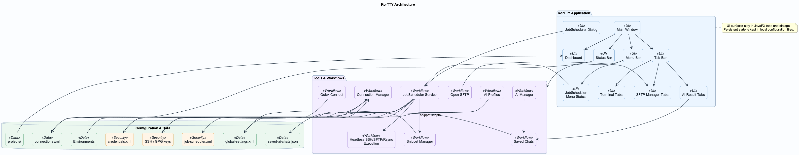
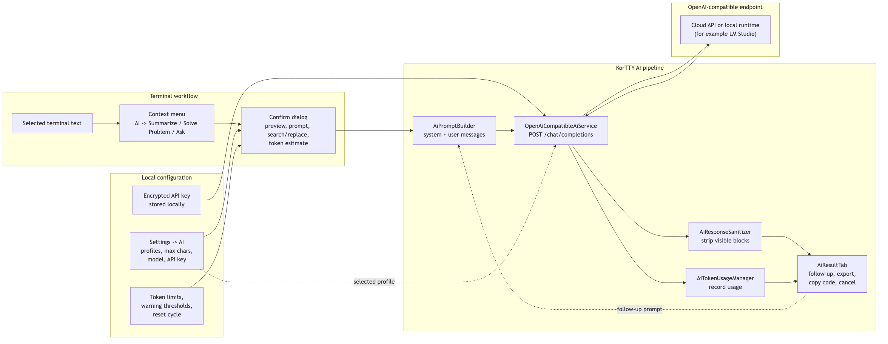
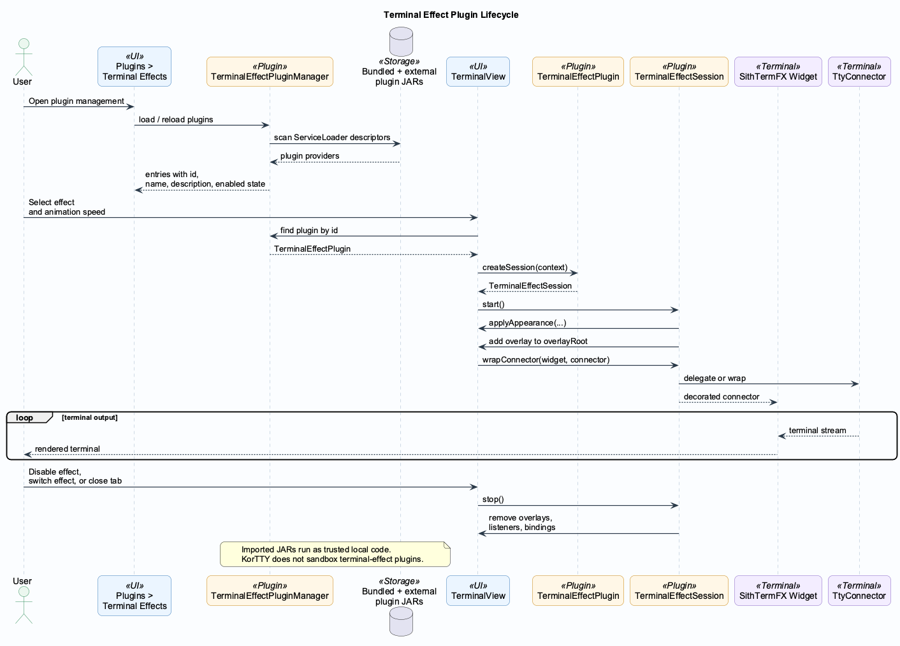
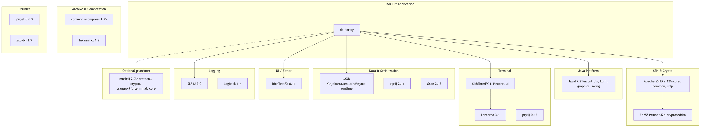
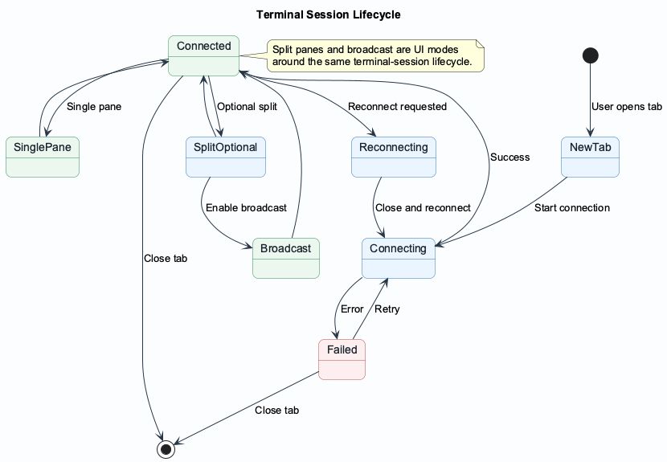
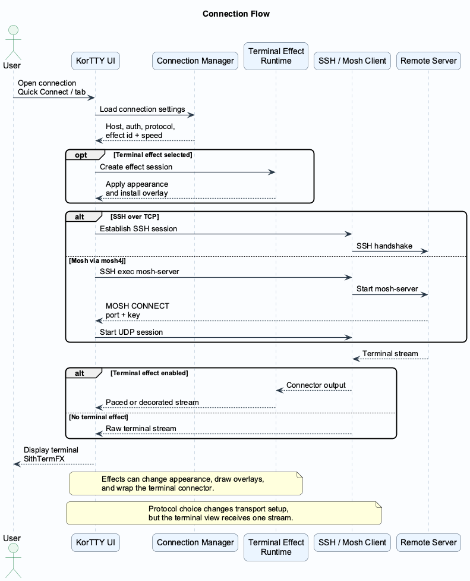
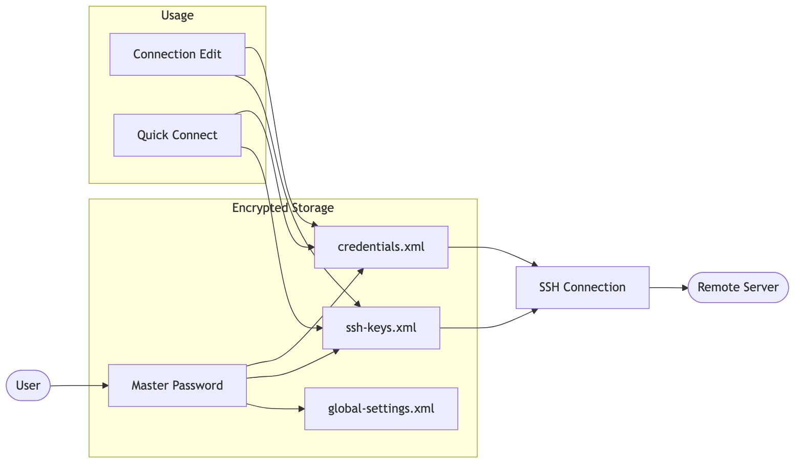
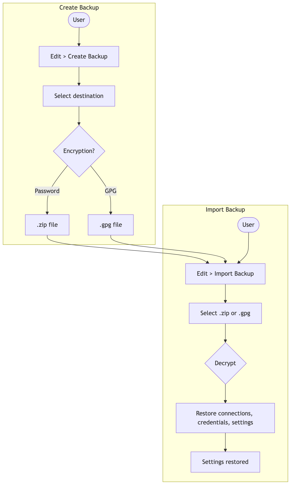
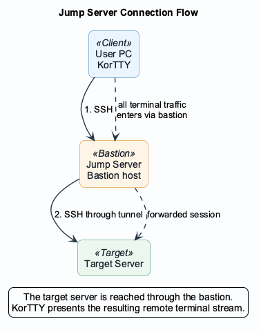

= KorTTY - SSH Client

*v2.2.0* — A modern SSH client with JavaFX interface, tabbed terminals, SFTP tooling, background job scheduling, and OpenAI-compatible AI assistance.

== Architecture Overview

The following diagram shows the main components of KorTTY and how they relate.

== Features

* *GUI-based*: Modern JavaFX interface with dark theme
* *Tab Support*: Multiple SSH connections in one window
* *Font Size Adjustment*: Zoom in/out in running terminal (Alt+Plus, Alt+Minus; on macOS also Cmd). Reset (Alt+0) restores the connection's font size and family (or the font at tab open).
* *Split-Screen with Broadcast*: Split terminal view and broadcast input to all panes
* *Multi-Window*: Open multiple windows for different projects; drag tabs between windows to move sessions (including split terminals)
* *Encrypted Passwords*: AES-256-GCM encryption with master password
* *SSH Key Management*: Centralized management of private SSH keys with encrypted passphrases
* *Customizable Display*: Font size, colors (global or per connection)
* *Theme Profiles*: Multiple built-in color profiles (including IntelliJ-inspired themes) with live preview, one-click apply in Global Settings, editable built-in/custom themes, new theme creation, and dedicated Terminal AI agent panel colors
* *Theme Font Control*: Themes apply colors by default; font family/size are applied only when explicitly enabled in settings
* *Terminal Effect Plugins*: Load, enable, disable, import, and export Java terminal-effect plugins from *Plugins → Terminal Effects*; effects can adjust terminal appearance, overlays, and output animation speed per session or saved connection
* *Project Management*: Save and load connection sets with history
* *Import/Export*: Import connections from MTPuTTY, MobaXterm, and PuTTY Connection Manager
* *JMX Monitoring*: Monitor active connections, memory usage, etc.
* *Dashboard*: Overview of all open connections in the project
* *SFTP Manager*: File transfer between local system and remote servers (User/Group columns, sortable by type with dot-prefix order)
* *SFTP Archive Exclude*: Archive dialogs support exclude patterns (one pattern per line) for files/directories
* *Snippet Manager*: Create, search, favorite, and organize reusable snippets with syntax highlighting, line numbers, one-liner export, optional one-liner script arguments, JSON/XML/YAML import/export, plain-text script export, and ZIP script archives with optional password or GPG encryption
* *Snippet Editor Profiles and Formatting*: Use IntelliJ-inspired built-in editor profiles or custom color/cursor profiles, zoom with toolbar buttons or Ctrl/Cmd +/- keys, and format supported languages through the shared local formatter service
* *AI-assisted Snippet Editing*: Generate snippet name/description/language from code, correct description text, transform selected comments and user-facing output text, create technical descriptions, request alternative implementations, use cursor-based AI completion, run selected-code improvements and security checks with previews, and keep locally rendered PlantUML structure diagrams with snippets
* *AI Skills*: Define reusable local instruction blocks for AI Chat/functions and/or AI Agent, enable or disable them globally or per skill, import/export Markdown skills, and optionally send only skills that match the current request
* *JobScheduler*: Schedule background command, SnippetManager script, AI Agent, SFTP, and Rsync jobs for saved SSH TCP connections or connection groups while KorTTY is running; no terminal tab has to stay open
* *JobScheduler Scheduling and Status*: Run jobs on selected weekdays, fixed times, active date ranges, time windows, and intervals; the optional menu-bar status shows running jobs or the next run countdown and exposes the next five queued jobs
* *JobScheduler Journal and Shutdown Safety*: Persist redacted or full journals, sort and delete journal entries from the UI, store local timestamps, auto-delete entries older than 14 days by default, and warn before quitting while background jobs are still running
* *JobScheduler Security Controls*: Require pinned SSH host keys by default, allow explicit per-job host-key verification disablement, store server/group sudo passwords encrypted, and block secret-dependent jobs while the master password is locked
* *JobScheduler Script, SFTP, and Rsync Actions*: Run SnippetManager scripts with additional per-job parameters; upload, download, sync, delete, rename, mkdir, chmod, chown, remote-copy, and archive via SFTP; synchronize one or more directories via external `rsync` over SSH
* *ASCII Art Banner*: Generate FIGlet banners with multiple styles (Tools menu)
* *Window Geometry Storage*: Automatic restoration of window position and size
* *Dashboard State Storage*: Automatic restoration of dashboard state
* *Backup & Restore*: Create encrypted backups (password or GPG) and import them
* *Multilanguage Support*: Built-in languages (English, German, Italian, Spanish, Portuguese, French, Croatian, Dutch) plus *dynamic translation*: generate language files for any language via translation APIs (Google Translate, DeepL, LibreTranslate, Microsoft Translator, Yandex) in Settings → Translation
* *AI Terminal Actions*: Right-click selected terminal text and choose *Summarize*, *Solve Problem*, or *Ask* via OpenAI-compatible chat-completions APIs, including local tools such as *LM Studio*
* *AI Profiles, Defaults, Reasoning, Internet Access, and Quotas*: Manage multiple named AI profiles with per-profile endpoint/model/API key, optional reasoning effort where supported by the configured API/model, optional internet mode, default profile selection, tokenizer strategy, token budgets, warning thresholds, reset cycles, and code-text language defaults
* *AI Result Tabs*: Continue with follow-up prompts, switch profile and response language per chat, retry or cancel requests, save named chats, save generated scripts as snippets, share/export to PDF/Markdown/Text, copy detected code blocks and markdown tables/columns/cells, and persist the AI tab font size across sessions
* *AI Manager*: Reopen, rename, refresh, and delete saved AI chats, and manage AI profiles from *Tools → AI Manager* (shortcut: *Ctrl/Cmd+Shift+Y*)
* *AI Agent & Planning*: Start AI Agent and AI Planning from *Tools*, the terminal context menu, or shell-style shortcut commands. The agent inspects the active SSH session, plans safe non-interactive commands, runs them with approvals when needed, writes final answers back into the terminal, and can use configured AI Skills and internet access when the task requires it
* *Interactive AI Planning*: Start planning with `agent-plan <task>` or `agent -plan <task>`, answer clarifying questions, select or describe an approach, generate a final plan, and start implementation only after accepting it
* *Split-local Terminal AI Activity*: Terminal-targeted agent runs use the activity panel attached to the current terminal split, support parallel runs in different splits, and provide semantic activity markers, task timing, collapsible details, row copy/snippet actions, persistent *Expand all* / *Keep collapsed* options, history navigation, rerun, resize, font controls, cancel, sudo password prompts, and run export to Markdown/Text/YAML/XML/JSON/PDF/Asciidoctor
* *Terminal AI Commands*: Intercept configurable local shortcut commands such as `agent`, `agent-ask`, `agent-plan`, and `agent -plan` directly at the shell prompt, including the active remote working directory for terminal-targeted tasks
* *AI Internet Modes*: Per AI profile, choose `Disabled`, direct `KorTTY Tavily Tool`, `LM Studio Tavily MCP`, `Bright Data Web MCP`, `Brave Search MCP`, `SearXNG MCP`, or `LM Studio Toolpack`. Direct web tools use hard timeouts and return structured errors instead of silently inventing web facts
* *Quick Connect*: Fast connection dialog with frequently used connections and group support
* *SSH Tunnels*: Local and remote port forwarding (SSH tunnels)
* *Jump Server*: Support for bastion hosts (SSH hopping)
* *Terminal Logging*: Automatic logging of terminal sessions
* *Terminal Recording*: Enable terminal recording for the current app session in *Tools → Video Manager* or permanently in *Settings → Video*, then start and stop lightweight per-tab terminal replay recordings from the terminal bar, *Tools → Start/Stop Terminal Recording*, or *Ctrl/Cmd+Shift+E*. Multiple recording segments in one tab are appended to one JDK/GZIP streaming-compressed `.korttyrec.jsonl.gz` session file until the tab closes; legacy `.korttyrec.jsonl` replays remain readable. Replays can optionally store terminal color runs, preserve recorded terminal geometry for export, and be viewed with timeline/time-jump seeking, 1x-20x playback speed, renamed, or deleted in the Video Manager. Optional timestamp-based WebM/VP9 or MKV/FFV1 export is available with range/color options, CPU-parallel frame rendering, progress, and remaining-time feedback when `ffmpeg` is configured or found on `PATH`; no live/network streaming is implemented.
* *GPG Key Management*: Manage GPG keys for backup encryption
* *Menu Bar Visibility Toggle*: Show or hide the in-window menu bar from *View* or *Settings → Window*; if hidden, restore it with *Ctrl/Cmd+Shift+L*

== AI Integration Overview

KorTTY keeps profile selection, quota tracking, AI Skills, internet-tool configuration, and result handling local while sending only the reviewed terminal selection, prompt, or agent context to the configured AI endpoint. Selection-based AI actions use OpenAI-compatible chat-completions endpoints. Terminal-agent runs send the agent goal together with a compact SSH-session snapshot, including the active remote working directory captured from the shell. In split terminal layouts, terminal-targeted agent state and activity output stay scoped to the split where the run was started.

Internet access is optional per AI profile and is disabled by default. The direct KorTTY Tavily mode uses chat-completions tool calls and Tavily search. LM Studio MCP modes use LM Studio's native `/api/v1/chat` integration payload. Snippet AI and text-correction functions do not use internet access, even when the default AI profile has web tools enabled. Snippet AI can use enabled AI Skills that target Chat/Functions or Both, then applies code changes only through preview/diff dialogs. If a web tool times out, fails authentication, returns no results, or reaches KorTTY's tool-round limit, KorTTY returns that tool failure to the model and the model is instructed to state the failure instead of making up web facts.

AI Skills are local reusable instructions that can be attached to AI Chat/functions, AI Agent, or both. They are managed under *Settings → AI Skills*, can be imported/exported as Markdown, and can be automatically filtered so only skills relevant to the current request are sent.

== JobScheduler Overview

Open *Tools → JobScheduler...* to create unattended jobs that run in the background while the KorTTY process is running. Scheduler jobs use saved SSH TCP connections and connection groups from the Connection Manager. Mosh connections are not supported for scheduler execution and are blocked with a journal entry.

The *Job* tab defines the schedule and targets:

* Select one or more servers or groups through the Connection Manager selection dialog.
* Use an optional working directory, active-from/active-until dates, a start/end time window, interval minutes, fixed times, and selected weekdays. Schedule calculations use the system time zone.
* Confirm and pin host keys before unattended execution, or explicitly disable host-key verification for a single job when that risk is acceptable.
* Store server-specific sudo passwords or group sudo passwords. Server-specific entries take precedence over group entries.
* Toggle the optional menu-bar job status. The menu appears only when at least one enabled scheduler entry exists or a job is running.

The *Action* tab supports:

* `COMMAND` for non-interactive remote shell commands.
* `SNIPPET_SCRIPT` for SnippetManager scripts. Additional parameters are entered in the job as one argument per line and passed to supported script languages as argv values.
* `AI_AGENT` for headless AI-agent execution with explicit auto-approval required before commands are run unattended.
* SFTP actions for upload, download, sync, delete, rename, mkdir, chmod, chown, remote copy, and archive creation. Archive formats are ZIP, password-protected ZIP, TAR, and TAR.BZ2; archive jobs can optionally download the created archive.
* `RSYNC_SYNC` for upload or download directory synchronization via the local `rsync` and `ssh` commands. Multiple sources are supported, `--delete` is optional and off by default, and group downloads are written below separate per-target directories to avoid overwrites.

For SFTP fields, the dialog offers local file-system selection and remote directory browsing where the job target allows it. Owner and group selectors can query the remote target. Permissions accept numeric modes such as `755` or symbolic modes such as `u+rw,o-w`.

Snippet script jobs resolve built-in snippet variables and stored SnippetManager variables before execution. If a selected snippet is missing, a required snippet variable has no stored value, or the snippet language cannot be converted for scheduler execution, the job is blocked and the reason is written to the journal.

Rsync jobs use an external `rsync` binary from `PATH` by default; an explicit binary path can be configured in *Settings → SFTP → JobScheduler Rsync*. The system `ssh` command must also be available in `PATH`. For Rsync sudo, the current scheduler integration uses passwordless remote sudo only through `sudo -n rsync`; stored sudo passwords are not passed to Rsync.

The *Journal* tab records status, local timestamps, exit codes, stdout/stderr, and details according to the selected journal mode. `LIMITED_REDACTED` stores bounded, redacted excerpts. `FULL` stores full output/transcripts while still redacting KorTTY-managed secrets before persistence. Journal columns are sortable, selected entries can be deleted, and journal entries older than 14 days are deleted automatically by default; set the retention value to `0` to keep entries indefinitely. The protocol/detail pane can be resized vertically, KorTTY remembers that divider position, and selected detail text can be copied from the right-click menu.

The in-window menu bar shows the JobScheduler status after *Help* when the status option is enabled and there is an enabled scheduler entry or active run. Clicking the menu shows the next five queued jobs with start time and live countdown. Right-clicking the status label provides a shortcut menu for cancelling running jobs and opening JobScheduler.

When KorTTY is about to quit while scheduler jobs are running, it warns the user. If the user chooses to wait and quit, KorTTY enters drain mode, blocks new job starts, journals the shutdown wait, waits for active jobs to complete or cancel cleanly, and then exits.

== User Guide

For a comprehensive step-by-step user guide covering all features, see *link:docs/USER_GUIDE.adoc[User Guide]*.

For terminal-effect plugin development, packaging, import/export behavior, and validation guidance, see *link:docs/TERMINAL_EFFECT_PLUGINS.adoc[Terminal Effect Plugin Development]*.

== Requirements

* Java 25 or higher
* *Git* and *Maven* (to build SithTermFX from source; no GitHub token needed)
* For GitHub Actions `windows-11-arm` release builds, Java 21 is used in CI for compatibility with currently available runner/toolchain combinations.
* Gradle 9.x (automatically downloaded via wrapper)
* Optional for JobScheduler Rsync jobs: local `rsync` and `ssh` commands available in `PATH`, or a configured `rsync` binary path in *Settings → SFTP*
* Optional for terminal recording video export: local `ffmpeg` available in `PATH`, or a configured binary path in *Tools → Video Manager*

== Build

SithTermFX is built from source during the build (no GitHub token required). You need *Git* and *Maven* installed.

[source,bash]
----
./gradlew build
----

On first run, Gradle will clone link:https://github.com/chardonnay/SithTermFX[SithTermFX] at tag `v1.1.0` into `vendor/sithtermfx`, build it with Maven, and install it to your local Maven repo. Subsequent builds reuse the clone unless you remove `vendor/sithtermfx`.

== Run

[source,bash]
----
./gradlew run
----

== Pre-built Binaries (Releases)

Pre-built packages for *x86_64 (amd64)* and *arm64 (aarch64)* are available on the link:https://github.com/chardonnay/korTTY/releases[GitHub Releases] page:

* *macOS*: Apple Silicon only — `-aarch64` (separate DMG/ZIP files).
* *Windows*: `-x86_64` for Intel/AMD and `-arm64` for Windows on ARM (both as separate MSI/ZIP files).
* *Linux*: `-x86_64` or `-aarch64` (separate DEB/RPM/tar.gz/zip files).
* *Arch Linux*: `-x86_64` (pacman `.pkg.tar.zst`; aarch64: use the Linux tarball).

Each release provides separate packages per platform and architecture; there are no universal binaries. Use the file that matches your OS and CPU.

To *manually trigger* a release build (e.g. after moving the tag without creating a new release), go to *Actions → Build Release Binaries → Run workflow*, choose branch `main`, set *Ref* to the tag (e.g. `v2.2.0`) and *Version* to the numeric version (e.g. `2.2.0`).

== SithTermFX Integration

KorTTY uses *SithTermFX 1.1.0*, built from source. No GitHub token required (local or CI).

* *Local build:* The first time you run `./gradlew build`, the task `cloneSithtermfx` clones the link:https://github.com/chardonnay/SithTermFX[SithTermFX] repo at tag `v1.1.0` into `vendor/sithtermfx`, then `installSithtermfxLocal` runs `mvn -q -DskipTests install` there. The artifacts are installed to your local Maven repo (`mavenLocal()`). Requirements: *Git* and *Maven* on your PATH.
* *CI (GitHub Actions):* The workflow clones SithTermFX at tag `v1.1.0` into `vendor/sithtermfx`, installs Maven, then Gradle runs the same `installSithtermfxLocal` task. No GitHub token required.

== Terminal Effect Plugins

KorTTY terminal-effect plugins are Java `ServiceLoader` plugins loaded from the application classpath, bundled plugin JARs, or external JARs imported into `~/.kortty/plugins`. The plugin SPI is under `de.kortty.plugin.terminaleffects` and covers:

* `TerminalEffectPlugin` for the stable plugin id, display name, description, and session creation.
* `TerminalEffectSession` for lifecycle hooks and optional `TtyConnector` wrapping.
* `TerminalEffectContext` for overlay access, current SithTermFX widgets, animation speed, and appearance application.
* `TerminalEffectAppearance` for optional font/color/cursor overrides.
* `TerminalEffectConnectorWrapper` for transparent connector wrappers that KorTTY can unwrap safely.

External plugins are trusted local code and are not sandboxed. Only import JARs from sources you trust. Dependencies that are not already bundled with KorTTY must be shaded into the plugin JAR; adjacent dependency JARs are not loaded automatically.

The MU/TH/UR 6000 effect is built as an exportable bundled plugin JAR and can be used as the in-repository reference implementation:

[source,bash]
----
./gradlew motherTerminalEffectPluginJar
jar tf build/terminal-effect-plugins/kortty-terminal-effect-mother.jar
----

Detailed development, packaging, lifecycle, security, and validation guidance is documented in *link:docs/TERMINAL_EFFECT_PLUGINS.adoc[Terminal Effect Plugin Development]*.

== Modules and Dependencies

KorTTY uses the following Java and external modules. The diagram below groups them by function.

[cols="2,2,1"]
|===
| Category | Module | Version
| *Java Platform* | JavaFX (controls, fxml, graphics, swing) | 21
| *SSH & Crypto* | Apache SSHD (core, common, sftp) | 2.12.0
| | Ed25519 (net.i2p.crypto:eddsa) | 0.3.0
| *Terminal* | SithTermFX (core, ui) | 1.1.0
| | Lanterna | 3.1.2
| | pty4j (JetBrains) | 0.12.25
| *Data & Serialization* | Jakarta XML Bind (JAXB) / jaxb-runtime | 4.0
| | zip4j | 2.11.5
| | Gson | 2.13.2
| *Archive & Compression* | Apache Commons Compress | 1.25.0
| | Tukaani xz | 1.9
| *UI / Editor* | RichTextFX | 0.11.3
| | google-java-format | 1.35.0
| *Utilities* | jfiglet (ASCII art) | 0.0.9
| | zxcvbn (password strength) | 1.9.0
| *Documentation / Diagrams* | PlantUML renderer used by docs and snippet diagrams | 1.2026.2
| *Logging* | SLF4J / Logback | 2.0.9 / 1.4.14
| *Optional (runtime)* | mosh4j (Mosh support, loaded dynamically) | 2.0.0
| *Optional system tools* | rsync + ssh for JobScheduler Rsync jobs | external
| | Graphviz `dot` for local PlantUML rendering | external
|===

SithTermFX is built from source (see <<#sithtermfx-integration,SithTermFX Integration>>). mosh4j JARs are bundled in release builds so Mosh works without a first-run download.

== Create Native Release

KorTTY can be built with `jpackage` as a native app for macOS, Windows, and Linux. The build tasks automatically detect the operating system and create the appropriate distribution. The resulting binary matches the architecture of the machine on which you run the build (e.g. x86_64 or arm64).

=== Requirements

* *Java 25 or higher* (with jpackage tool)
* *Platform-specific:*
** *macOS*: Xcode Command Line Tools (for code signing, optional)
** *Windows*: WiX Toolset (for MSI installer, optional)
** *Linux*: fakeroot, rpmbuild or dpkg (for DEB/RPM packages, optional)

=== macOS

==== Create App (.app)

Creates a standalone macOS app:

[source,bash]
----
./gradlew jpackage
----

The created app is located at:

[source,text]
----
build/jpackage/korTTY.app
----

*Installation:*
* Drag & drop into `/Applications`
* Or run directly from `build/jpackage/`

==== Create DMG Installer

Creates a DMG installer:

[source,bash]
----
./gradlew jpackageDmg
----

The DMG file is located at:

[source,text]
----
build/jpackage/korTTY-2.2.0.dmg
----

*Icon:* `src/main/resources/icon/kortty_icon.icns`

=== Windows

Both Windows targets produce an MSI installer and a ZIP package:
* `-x86_64`: ZIP contains the full app-image folder.
* `-arm64`: ZIP contains the single `korTTY.exe` binary.

==== Create App (.exe)

Creates a standalone Windows app:

[source,bash]
----
gradlew.bat jpackage
----

The app is located at:

[source,text]
----
build\jpackage\korTTY\
----

*Features:*
* Windows Start menu entry
* Desktop shortcut
* Installation directory selection

==== Create MSI Installer

Creates an MSI installer (requires WiX Toolset):

[source,bash]
----
gradlew.bat jpackageMsi
----

The MSI file is located at:

[source,text]
----
build\jpackage\korTTY-2.2.0.msi
----

*Icon:* `src/main/resources/icon/kortty_icon.ico` (if available, otherwise PNG)

=== Linux

==== Create App Image

Creates a standalone app image:

[source,bash]
----
./gradlew jpackage
----

The app image is located at:

[source,text]
----
build/jpackage/korTTY/
----

*Execution:*
[source,bash]
----
./build/jpackage/korTTY/bin/korTTY
----

==== Create DEB Package

Creates a Debian/Ubuntu package (requires dpkg):

[source,bash]
----
./gradlew jpackageDeb
----

The DEB package is located at:

[source,text]
----
build/jpackage/korTTY-2.2.0.deb
----

*Installation:*
[source,bash]
----
sudo dpkg -i build/jpackage/korTTY-2.2.0.deb
----

==== Create RPM Package

Creates a Red Hat/Fedora package (requires rpmbuild):

[source,bash]
----
./gradlew jpackageRpm
----

The RPM package is located at:

[source,text]
----
build/jpackage/korTTY-2.2.0.rpm
----

*Installation:*
[source,bash]
----
sudo rpm -i build/jpackage/korTTY-2.2.0.rpm
----

*Icon:* `src/main/resources/icon/kortty_icon.png`

=== Technical Details

* *Launcher Class*: The app uses `de.kortty.Launcher` as entry point to bypass JavaFX runtime checks
* *Bundled JVM*: The app contains a complete JVM (approx. 150-200 MB)
* *Platform Detection*: Build tasks automatically detect the operating system
* *Dependencies*: All dependencies (JavaFX, Apache SSHD, etc.) are automatically bundled
* *CI toolchain note*: Release CI uses Java 25 by default, but the GitHub Actions `windows-11-arm` job uses Java 21 to ensure stable Windows ARM64 packaging.
* *Icon Management*: The KorTTY icon is always used:
** *macOS*: `kortty_icon.icns` (fallback: `kortty_icon.png`)
** *Windows*: `kortty_icon.ico` (fallback: `kortty_icon.png`)
** *Linux*: `kortty_icon.png` (required)

=== Troubleshooting

*macOS - App won't open:*
* Check system logs: `log show --predicate 'process == "korTTY"' --last 5m`
* Test app directly: `build/jpackage/korTTY.app/Contents/MacOS/korTTY`

*macOS - Gatekeeper warning:*
* Unsigned apps show a warning on first launch
* Right-click → "Open" bypasses the warning
* For distribution: Sign app with Developer ID (requires Apple Developer account)

*Windows - MSI build failed:*
* Install WiX Toolset: https://wixtoolset.org/
* Add WiX bin directory to PATH

*Linux - DEB/RPM build failed:*
* DEB: `sudo apt-get install fakeroot dpkg-dev`
* RPM: `sudo yum install rpm-build` or `sudo dnf install rpm-build`

*Translation target language list is short in release binary:*
* Current release builds include `jdk.localedata` in the packaged runtime.
* If you use an older binary, rebuild or update to `v2.2.0+` to get the full target language list in *Settings → Translation*.

*JobScheduler job is blocked:*
* Open *Tools → JobScheduler... → Journal* and inspect the selected entry's detail text.
* Common causes are a locked master password, missing host-key pin, unsupported Mosh target, missing `rsync` or `ssh`, or an older host-key pin without OpenSSH public-key material for Rsync.

*JobScheduler Rsync cannot start:*
* Verify local `rsync --version` and `ssh -V`, or configure the Rsync binary path in *Settings → SFTP → JobScheduler Rsync*.

== JMX Monitoring

The SSH client registers a JMX MBean under `de.kortty:type=SSHClient`.

Available attributes:
* `ActiveConnectionCount`: Number of active connections
* `UsedMemoryBytes`: Used memory
* `BufferedTextSize`: Size of buffered terminal text
* `ActiveConnectionNames`: List of active connection names
* `UptimeSeconds`: Application uptime

To use JMX monitoring, start the application with JMX enabled. You can do this in either of the following ways:

* *Gradle run task:* The run task in `build.gradle.kts` already includes optional JMX JVM arguments. Enable them with the `jmx` project property, then run:

[source,bash]
----
./gradlew run -Pjmx=true
----

This uses the JMX flags defined in the run task's `jvmArgs` (port 9010, no auth; adjust in `build.gradle.kts` if you need a different port or authentication).

* *Packaged JAR:* Build the application, then run the JAR with the JVM flags:

[source,bash]
----
./gradlew build
java -Dcom.sun.management.jmxremote \
  -Dcom.sun.management.jmxremote.port=9010 \
  -Dcom.sun.management.jmxremote.local.only=false \
  -Dcom.sun.management.jmxremote.authenticate=false \
  -jar build/libs/kortty-*.jar
----

Then connect with JConsole:

[source,bash]
----
jconsole
----

== Font Size and Split-Screen

=== Font Size Adjustment in Running Terminal

Adjust the font size of the active terminal without reconnecting:

* *Alt+Plus* (or *Ctrl+Plus* on some systems): Zoom in (increase font size)
* *Alt+Minus* (or *Ctrl+Minus*): Zoom out (decrease font size)
* *Alt+0* (or *Ctrl+0*): Reset zoom to the connection's saved font size and family (or the font that was active when you opened the tab)

The zoom level applies to the currently focused terminal tab. The same reset is available via the terminal context menu (*Font size → Reset*).

=== Split-Screen with Broadcast

Split the terminal view to display multiple connections side by side. The following diagram illustrates the session lifecycle including split and broadcast.

* *Split Pane*: Create horizontal or vertical splits within a tab
* *Broadcast Mode*: When enabled, keyboard input is sent to all visible panes simultaneously
* *Independent Sessions*: Each pane can show a different SSH connection
* *Resizable Panes*: Drag dividers to adjust pane sizes

Useful for running the same commands on multiple servers at once.

== Keyboard Shortcuts

[cols="1,2"]
|===
| Shortcut | Action
| Ctrl+T | New Tab
| Ctrl+Shift+N | New Window
| Ctrl+W | Close Tab
| Ctrl+Tab | Next Tab
| Ctrl+Shift+Tab | Previous Tab
| Ctrl+O | Open Project
| Ctrl+S | Save Project
| Ctrl+Shift+D | Toggle Dashboard
| Ctrl+Shift+L | Show/Hide Menu Bar
| Ctrl+Shift+Y | Open AI Manager
| Ctrl+X | Cut (disabled for terminal tabs)
| Ctrl+C | Copy
| Ctrl+V | Paste
| Alt+Plus | Zoom In
| Alt+Minus | Zoom Out
| Alt+0 | Reset Zoom
| Ctrl+Shift+B | Create Backup
| Ctrl+Q | Quit
| Ctrl+K | Quick Connect
|===

== Configuration Files

All configuration files are stored under `~/.kortty/`:

[source,text]
----
~/.kortty/
├── connections.xml      # Saved connections
├── credentials.xml     # Stored credentials
├── ssh-keys.xml        # SSH key management
├── gpg-keys.xml        # GPG keys for backup encryption
├── global-settings.xml # Global application settings
├── job-scheduler.xml   # JobScheduler jobs, host-key pins, sudo secrets, journal
├── terminal-effect-plugins.disabled # Disabled terminal-effect plugin ids
├── master-password-hash # Master password hash
├── kortty.log          # Log file
├── history/            # Terminal history (compressed)
├── plugins/            # Imported terminal-effect plugin JARs
├── bundled-plugins/    # Runtime copies of bundled exportable terminal-effect plugin JARs
├── projects/           # Project files (.kortty)
├── i18n/               # Dynamically generated language files (messages_XX.properties)
└── ssh-keys/           # Copied SSH keys (optional)
----

== Connection Flow

The following sequence diagram shows how a connection is established (SSH or Mosh).

== Import from Other Programs

=== MTPuTTY

Export your connections from MTPuTTY as `servers.xml` and import them via:
*Connections → Import → MTPuTTY Server Files (*.xml)*

=== MobaXterm

Copy the `MobaXterm.ini` file and import it via:
*Connections → Import → MobaXterm Session Files (*.ini)*

=== PuTTY Connection Manager

Export your connections from PuTTY Connection Manager and import them via:
*Connections → Import → PuTTY Connection Manager Files (*.xml)*

*Note:* Passwords are not imported for security reasons. You must re-enter them after import.

== Credential Management

KorTTY provides centralized management for credentials (username/password). The following diagram shows how credentials and SSH keys are stored and used.

=== Features

* *Environment-specific*: Credentials can be stored for Production, Development, Test, or Staging
* *Server Pattern*: Automatic assignment to servers via glob patterns (e.g., `*.example.com` or `10.0.0.*`)
* *Encrypted Storage*: Passwords are encrypted with AES-256-GCM
* *Automatic Usage*: Credentials can be directly selected in connection settings

=== Usage

1. *Add credentials*:
** *Management → Manage Credentials...*
** Click "Add"
** Enter name, username, environment, and optionally a server pattern
** Enter the password (will be encrypted and stored)

2. *Use credentials in connection*:
** When creating/editing a connection
** Select the appropriate credentials from the dropdown list
** Username and password are automatically filled in

=== Import/Export

When importing connections, you can choose:
* Whether credentials should be imported
* Whether imported credentials should be replaced by stored credentials

== SSH Key Management

=== Features

* *Centralized Management*: Manage all SSH keys in one place
* *Encrypted Passphrases*: Key passphrases are stored encrypted
* *Key Copying*: Keys can be copied to the KorTTY directory for easy migration
* *Glob Search*: Quick search for keys with wildcard patterns (`*`)
* *Automatic Usage*: Keys can be directly selected in connection settings

=== Usage

1. *Add SSH key*:
** *Management → Manage SSH Keys...*
** Click "Add"
** Select the path to your private SSH key
** Optional: Enter the passphrase (will be encrypted and stored)

2. *Use key in connection*:
** When creating/editing a connection
** Select "Private Key" as authentication method
** Select the desired key from the dropdown list
** The key path and passphrase are automatically filled in

3. *Copy key to user directory*:
** In SSH key management, select a key
** Click "Copy to User Directory"
** The key is copied to `~/.kortty/ssh-keys/` and included in backups

=== Import/Export

When importing connections, you can choose:
* Whether SSH keys should be imported
* Whether imported keys should be replaced by stored keys from management

== Backup & Restore

KorTTY provides encrypted backup functionality to save and restore all your settings.

=== Features

* *Encrypted Backups*: All backups are encrypted (password-protected ZIP or GPG-encrypted)
* *Complete Backup*: Includes all connections, credentials, GPG keys, SSH keys, and settings
* *Backup Import*: Restore from previously created backups
* *Automatic Rotation*: Old backups are automatically rotated when creating new ones
* *Configurable Retention*: Set maximum number of backups to keep (0 = unlimited)

=== Usage

1. *Create Backup*:
** *Edit → Create Backup...*
** Select destination directory
** Backup is created with encryption method configured in settings

2. *Import Backup*:
** *Edit → Import Backup...*
** Select backup file (.zip or .gpg)
** Enter password if required
** Choose whether to overwrite existing files
** All settings are restored from the backup

=== Backup Settings

Configure backup settings in *Settings → Backup*:
* *Encryption Type*: Choose between password-protected ZIP or GPG encryption
* *Credential/GPG Key*: Select the credential or GPG key for encryption
* *Maximum Backups*: Set how many old backups to keep (0 = unlimited)

== Quick Connect

KorTTY provides a quick connection dialog for fast access to your most frequently used connections:

=== Features

* *Frequently Used Connections*: Shows top 10 most frequently used connections as quick-access buttons
* *Individual Connection*: Connect to a single server with full configuration options
* *Group Connection*: Open all connections in a selected group at once
* *Connection History*: Tracks usage count and last used timestamp
* *Save New Connections*: Option to save new connections directly from the dialog

=== Usage

1. *Open Quick Connect*:
** *File → Quick Connect...* or press `Ctrl+K`
** Or use the menu: *Connections → Quick Connect...*

2. *Quick Access*:
** Click on any frequently used connection button at the top
** Connection opens immediately with saved credentials

3. *Individual Connection*:
** Select "Individual Connection" tab
** Choose from saved connections or enter new connection details
** Configure authentication, terminal appearance, and other settings
** Optionally save the connection for future use

4. *Group Connection*:
** Select "Open Group" tab
** Choose a group from the list
** All connections in the group open in separate tabs

== GPG Key Management

KorTTY provides management for GPG keys used for backup encryption:

=== Features

* *Centralized Management*: Manage all GPG keys in one place
* *System Import*: Import GPG keys directly from your system's GPG keyring
* *Manual Entry*: Add GPG keys manually with key ID and email
* *Backup Encryption*: Use GPG keys to encrypt backups instead of password-protected ZIP

=== Usage

1. *Add GPG Key*:
** *Management → Manage GPG Keys...*
** Click "Add" to manually enter key details
** Or click "Import from GPG" to import from your system's GPG keyring

2. *Edit/Remove Keys*:
** Select a key from the list
** Click "Edit" to modify key details
** Click "Delete" to remove a key

3. *Use for Backup*:
** Configure backup settings in *Settings → Backup*
** Select "GPG Encryption" as encryption type
** Choose the GPG key to use for encryption

== SSH Tunnels (Port Forwarding)

KorTTY supports SSH port forwarding for secure tunneling:

=== Features

* *Local Port Forwarding*: Forward local ports to remote hosts (`-L`)
* *Remote Port Forwarding*: Forward remote ports to local hosts (`-R`)
* *Multiple Tunnels*: Configure multiple tunnels per connection
* *Enable/Disable*: Toggle tunnels on/off without deleting configuration

=== Usage

1. *Configure Tunnel*:
** When creating/editing a connection, go to "Tunnels" tab
** Click "Add Tunnel"
** Select tunnel type (Local or Remote)
** Enter local host/port and remote host/port
** Add optional description
** Enable/disable the tunnel as needed

2. *Local Port Forwarding*:
** Forwards a local port to a remote host:port
** Example: `localhost:8080 → remote-server:80`
** Access `localhost:8080` to reach `remote-server:80` through the SSH tunnel

3. *Remote Port Forwarding*:
** Forwards a remote port to a local host:port
** Example: `remote-server:8080 → localhost:80`
** Access `remote-server:8080` to reach `localhost:80` through the SSH tunnel

== Jump Server (Bastion Host)

KorTTY supports SSH hopping through jump servers (bastion hosts). The following diagram shows the connection path.

=== Features

* *SSH Hopping*: Connect to servers through an intermediate jump server
* *Flexible Authentication*: Use password or SSH key for jump server
* *Auto Command*: Execute commands automatically after connecting to jump server

=== Usage

1. *Configure Jump Server*:
** When creating/editing a connection, go to "Advanced" tab
** Enable "Jump Server"
** Enter jump server host, port, and username
** Select authentication method (password or SSH key)
** Optionally configure auto-command to execute after jump

2. *Connection Flow*:
** First connects to the jump server
** Then establishes connection to the target server through the jump server
** All traffic is routed through the jump server

== Terminal Logging

KorTTY can automatically log terminal sessions for audit and debugging purposes:

=== Features

* *Automatic Logging*: Log all terminal output to files
* *Compressed Storage*: Logs are stored compressed in `~/.kortty/history/`
* *Per-Connection Configuration*: Enable/disable logging per connection
* *Timestamped Logs*: Each session creates a timestamped log file

=== Usage

1. *Enable Logging*:
** When creating/editing a connection, go to "Advanced" tab
** Enable "Terminal Logging"
** Logs are automatically saved to `~/.kortty/history/`

2. *Log Files*:
** Logs are stored as compressed files
** Format: `{connection-name}_{timestamp}.log.gz`
** Located in `~/.kortty/history/`

== Connection Settings

KorTTY provides advanced connection settings for better control and reliability:

=== SSH Keep-Alive

Prevents SSH connections from timing out due to inactivity:

* *Enable/Disable*: Toggle SSH Keep-Alive on/off per connection
* *Configurable Interval*: Set keep-alive interval (5-600 seconds, default: 60 seconds)
* *Heartbeat Messages*: Sends `SSH_MSG_IGNORE` messages at regular intervals and enables TCP socket keepalive while the option is active

*Usage:*
* When creating/editing a connection, go to "Terminal" tab
* Enable "SSH Keep-Alive"
* Set the interval in seconds
* Configure in *Settings → Terminal* for global defaults

=== Connection Timeout and Retry

Configure connection behavior for unreliable networks:

* *Connection Timeout*: Maximum time to wait for connection (default: 15 seconds)
* *Retry Count*: Number of retry attempts on connection failure (default: 4 attempts)

*Usage:*
* When creating/editing a connection, configure in "Advanced" tab
* Set connection timeout in seconds
* Set number of retry attempts

== Multilanguage Support

KorTTY supports multiple languages and automatically detects your system language.

=== Built-in Languages

* English (default)
* German
* Italian
* Spanish
* Portuguese
* French
* Croatian
* Dutch

=== Dynamic Translation (Additional Languages)

You can generate language files for *any language* using a translation API:

1. *Settings → Translation*
2. Choose a *Translation API* (Google Translate, DeepL, LibreTranslate, Microsoft Translator, or Yandex). _Note: Yandex uses the deprecated v1.5 API and requires a legacy API key._
3. Enter your *API key* (optional for LibreTranslate on public instances). The key is stored encrypted with your master password.
4. Optionally set a *custom API URL* (e.g. for self-hosted LibreTranslate).
5. Click *Test API Connection* to verify the setup.
6. Select the *target language* and click *Generate Language File*. The file is saved under `~/.kortty/i18n/`.
7. The new language appears in *Settings → Language* and can be selected after restart.

*After an upgrade:* If the app version changes, generated language files are detected as outdated. In *Settings → Translation* a hint is shown and *Regenerate outdated* lets you refresh all generated languages so new or changed keys are translated again.

=== Changing Language

1. *Settings → Language*
2. Select the desired language (built-in or any previously generated language).
3. Language change takes effect after application restart.

*Auto-detect:* Select "Auto-detect (System Language)" to use your system's language.

=== AI Assistant for Selected Terminal Text

KorTTY can send selected terminal text to OpenAI-compatible chat-completions endpoints and open the response in a temporary AI tab.

1. Open *Settings → AI*.
2. Create one or more profiles and enter the *API URL*. *Model* and *API key* are optional so local endpoints such as *LM Studio* or other OpenAI-compatible gateways can be used without both fields.
3. Optionally tune *Max characters*, *Tokenizer*, *Token limit*, warning thresholds, reset cycle, and supported *Reasoning* effort per profile.
4. Click *Test AI Connection* to verify the endpoint.
5. In a terminal, mark the text you want to analyze and choose *AI → Summarize*, *AI → Solve Problem*, or *AI → Ask*.
6. Review and, if needed, edit the selected text in the preview dialog. For *Ask*, add a custom prompt. The dialog also shows the estimated request tokens and remaining budget.
7. Submit the request. The response opens in a temporary AI tab and can be continued with follow-up prompts.
8. Optionally click *Save* in the AI tab to keep the conversation as a named chat and reopen it later from *Tools → AI Manager*.

Notes:

* Only the reviewed selection plus your optional prompt is sent to the configured endpoint.
* AI profiles are stored locally; API keys are encrypted with the master password.
* AI result tabs are not saved with projects or session restore.
* `<think> ... </think>` blocks are stripped from the visible AI output.
* AI result tabs support follow-up prompts, saving/reopening named chats, export and OS sharing, code-block copy helpers, markdown table copy helpers, request cancellation, and a font size that is reused for future AI tabs.
* When you reopen a saved AI chat and the original AI profile is no longer available, KorTTY prompts you to select a replacement profile before continuing.

=== Terminal AI Agent Commands

When terminal agent shortcuts are enabled in *Settings → AI*, the active SSH shell can start KorTTY-side agent runs with:

[source,text]
----
agent <goal>
agent-ask <question>
agent-plan <task>
agent -plan <task>
----

The base command name is configurable. A separate setting can make the command name case-insensitive. KorTTY intercepts these shortcuts locally before they are sent to the remote shell as normal executables.

Use `agent <goal>` for tasks that may inspect the SSH session and run safe commands, for example:

[source,text]
----
agent show the 10 largest log files in this directory
agent update groesste_xml.pl so -r searches subdirectories recursively
----

Use `agent-ask <question>` for a non-executing answer about the current session context. Use `agent-plan <task>` or `agent -plan <task>` when you want a reviewed plan first. Planning asks clarifying questions, proposes approaches, creates a final report, and starts implementation only after *Implement* is clicked.

For terminal-targeted agent runs, the inline activity panel at the bottom of the current terminal split shows the current task in a two-line scrollable field, token usage when reported by the endpoint, command/read actions, collapsible details, previous/next run navigation, rerun, close, collapse, resize, font controls, export controls, and a cancel button. Different splits can run their own terminal-agent tasks in parallel. While an agent is running, normal terminal input is locked for that split; *Esc*, *Ctrl+C*, or the panel cancel button aborts that run.

Activity rows use semantic markers: `↑` for request/input, `↓` for received output/result, `?` for required user input, `!` for errors, `x` for cancellation, and `i` for neutral information. Red styling is reserved for failed or error activities.

Completed terminal-agent runs can be exported individually or as the full panel history. Export formats are Markdown, plain text, YAML, XML, JSON, PDF, and Asciidoctor. The export includes the AI profile, configured model/LLM, reasoning status, run timestamps, total runtime, per-activity runtimes, reported token usage when available, summaries, and expanded detail text. Activity quote markers (`>`) are removed from exported detail text.

Each activity row also has actions to copy that row's text to the clipboard or open it in the Snippet Editor. For snippet handoff, KorTTY removes leading activity quote markers (`>`) before creating the snippet draft.

Planning mode is advisory until implementation starts. It asks clarifying questions, can evaluate selected answers or a custom approach, generates a final plan report, and only switches to execution after *Implement*. If the accepted plan needs sudo and the current SSH session requires a sudo password, KorTTY performs the password preflight immediately after acceptance so execution is not interrupted later by the password prompt.

KorTTY tracks the current remote directory for the active SSH session. Agent commands then run relative to that directory, so generated files are created where the user is currently working on the server. If sudo is required, KorTTY asks for the password in the activity panel with a masked input field instead of echoing it in the terminal. The password prompt can be submitted with *Enter* or the button, can be cached for the current session, and allows up to three wrong-password retries.

The agent is designed for non-interactive SSH automation. It may inspect files, list directories, run read-only checks, create or modify files after planning, and request confirmation for commands that change the system or require elevated privileges. It rejects interactive commands that would hang in a non-interactive SSH exec channel. Local file or script review tasks should be answered from SSH command output; web search is only offered when the user task clearly needs current or external information.

== SFTP Manager

The integrated SFTP Manager enables direct file transfers between your local system and remote servers.

=== Features

* *Two-Panel View*: Local and remote files side by side
* *Columns*: Name, Type, Size, Date, *User*, *Group*, Permissions (sortable)
* *Default Sort*: By type — parent directory (`..`) first, then dot-prefix directories, then other directories, then dot-prefix files, then other files (each group alphabetically)
* *Drag & Drop*: Easy file moving
* *File Operations*: Delete, rename, copy files and directories
* *Owner/Permissions*: Set owner, group, and permissions (chmod) locally and remotely; separate User/Group fields in dialogs
* *ZIP Archiving*: Create ZIP archives from multiple files/directories
* *Search*: Glob pattern search (`*`) in both panels

=== Access

* *Dashboard*: Right-click on a server → "Open SFTP Manager"
* *Menu*: *Tools → Open SFTP Manager...*

== Window and Dashboard Management

KorTTY automatically remembers:

* *Window Geometry*: Position, size, and maximized status of the main window
* *Dashboard State*: Whether the dashboard was open when closing
* *Menu Bar Visibility*: Whether the in-window menu bar should stay visible

These features can be configured in *Settings → Window*. The menu bar can also be toggled temporarily from *View → Show Menu Bar* or restored with *Ctrl/Cmd+Shift+L* when hidden.

== Security

* Master password is hashed with PBKDF2 (310,000 iterations)
* Connection passwords are encrypted with AES-256-GCM
* Private SSH key passphrases are also stored encrypted
* JobScheduler sudo secrets and archive passwords are stored encrypted, and scheduler journals redact KorTTY-managed secrets before persistence
* JobScheduler unattended SSH/SFTP/Rsync execution requires pinned host keys by default
* Passwords are never stored in plain text
* SSH keys can optionally be copied to user directory (included in backups)

== Rendering PlantUML Diagrams

The documentation uses PlantUML diagrams (`.puml` files in `docs/diagrams/`). To regenerate PNG images from them (e.g. after editing a diagram), use the provided script. Requires Java and Graphviz.

* Render all diagrams: `./scripts/render-plantuml.sh` or `./scripts/render-plantuml.sh all`
* Render specific diagrams: `./scripts/render-plantuml.sh architecture connection-flow`

PNGs are written to `docs/diagrams/` and are embedded in the AsciiDoc documentation.

*CI and releases:* The build-release workflow installs Graphviz and runs the render script in the `docs-render` job before other steps. The generated PNGs are uploaded as the `docs-diagrams` artifact and, on release, packaged into `KorTTY-docs-diagrams-<version>.zip` on the GitHub Release. Use the diagram zip for doc publication or to get the diagrams without running the render script locally.

== License

MIT License
