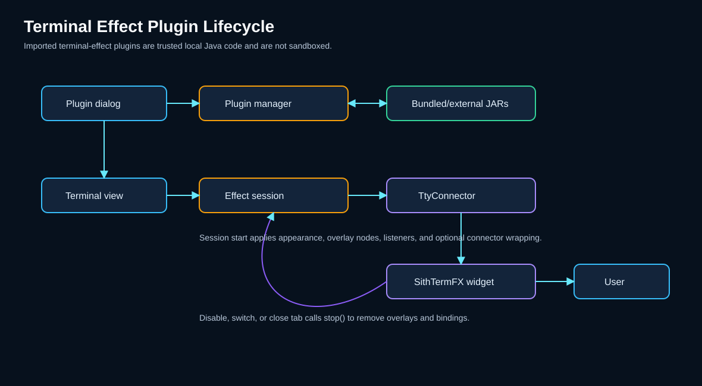
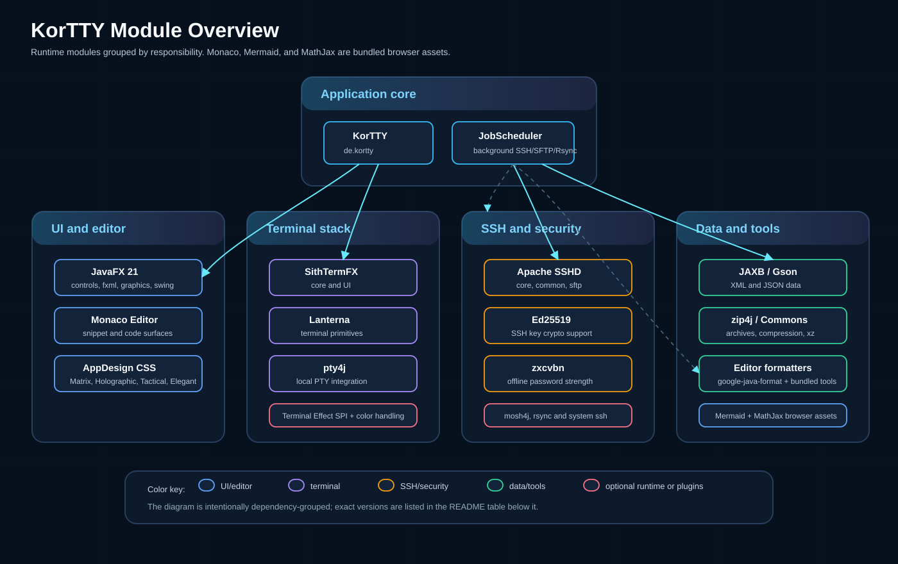

= KorTTY - SSH Client

*v2.7.0* | link:https://github.com/chardonnay/korTTY/releases/latest[Latest release] — A modern SSH client with JavaFX interface, tabbed terminals, local-shell sessions (Windows cmd/PowerShell or your `$SHELL`), SFTP tooling, background job scheduling, and OpenAI-compatible AI assistance.

== Architecture Overview

The following diagram shows the main components of KorTTY and how they relate.

image::app-docs/diagrams/architecture.svg[KorTTY architecture,align=center]

== Features

* *GUI-based*: Modern JavaFX interface with refreshed KorTTY logo, dark login screen, and selectable app-wide designs
* *Tab Support*: Multiple SSH connections in one window
* *Local Shell*: Open the local machine's shell in a terminal tab (no network) — Windows PowerShell or `cmd.exe`, or your `$SHELL` on macOS/Linux, plus a free-form command for `pwsh.exe`, `wsl.exe`, Git Bash, etc. Selectable as a protocol in Quick Connect and the Connection Manager; the AI Agent, AI Planning, AI selection actions, terminal logging, and recording all work for local shells too
* *Font Size Adjustment*: Zoom in/out in running terminal (Alt+Plus, Alt+Minus; on macOS also Cmd) or with *Ctrl + mouse wheel* (Cmd + wheel on macOS). Reset (Alt+0) restores the connection's font size and family (or the font at tab open).
* *Split-Screen with Broadcast*: Split terminal view and broadcast input to all panes
* *Multi-Window*: Open multiple windows for different projects; drag tabs between windows to move sessions (including split terminals)
* *Encrypted Passwords*: AES-256-GCM encryption with master password
* *SSH Key Management*: Centralized management of private SSH keys with encrypted passphrases
* *Customizable Display*: Font size, colors, terminal color-sequence handling, and terminal scrollbars (global or per connection where applicable)
* *Theme Profiles*: Multiple built-in color profiles (including IntelliJ-inspired themes) with live preview, one-click apply in Global Settings, editable built-in/custom themes, new theme creation, and dedicated Terminal AI agent panel colors
* *App Designs*: Choose *Default*, *Matrix Terminal*, *Holographic Interface*, *Klingon Tactical*, or *Elegant Dark* in *Settings → Appearance* for JavaFX windows and dialogs without changing terminal-session or editor-content colors
* *Theme Font Control*: Themes apply colors by default; font family/size are applied only when explicitly enabled in settings
* *Terminal Effect Plugins*: Load, enable, disable, import, and export Java terminal-effect plugins from *Plugins → Terminal Effects*; effects can adjust terminal appearance, overlays, and output animation speed per session or saved connection
* *Project Management*: Save and load connection sets with history
* *Import/Export*: Import connections from MTPuTTY, MobaXterm, and PuTTY Connection Manager
* *JMX Monitoring*: Monitor active connections, memory usage, etc.
* *Dashboard*: Overview of all open connections in the project
* *SFTP Manager*: File transfer between local system and remote servers (User/Group columns, sortable by type with dot-prefix order), including local/remote file editing through the Snippet Editor
* *SFTP Archive Exclude*: Archive dialogs support exclude patterns (one pattern per line) for files/directories
* *Snippet Manager*: Create, search, favorite, and organize reusable snippets with Monaco-powered syntax highlighting, line numbers, save-edited-as-new support, one-liner export, optional one-liner script arguments, JSON/XML/YAML import/export, plain-text script export, ZIP script archives with optional password or GPG encryption, a fixed non-deletable *Script-Header* category for reusable header templates, a *System* (operating system) column, and sortable columns
* *Snippet Editor Profiles, Ruler, and Formatting*: Use IntelliJ-inspired built-in editor profiles or custom color/cursor profiles, zoom with toolbar buttons or Ctrl/Cmd +/- keys, track the current caret column in the fixed ruler label and live marker, set or remove a maximum line-length marker, preview line-width formatting before applying it, and use explicit AI-assisted fallback prompts when local formatting or syntax checking is unavailable
* *AI-assisted Snippet Editing*: Generate snippet name/description/language from code, correct description text, transform selected comments and user-facing output text, create technical descriptions, request alternative implementations, use cursor-based AI completion, give direct right-click AI instructions at the cursor with full-script diff preview, run selected-code improvements (readability/robustness/performance/custom, with optional hardening options) and security checks with previews, open a *Full code analysis* window (summary, dependencies, categorized selectable improvements, an auto-generated flow diagram with hover code references, a searchable per-analysis AI-skills picker, an optional script header, and PDF/HTML/Markdown export), pin auto-detected AI Skills and pick a per-run AI profile, and keep locally rendered Mermaid flowcharts with snippets
* *AI Skills*: Define reusable local instruction blocks for AI Chat/functions and/or AI Agent, enable or disable them globally or per skill, import/export Markdown skills, and optionally send only skills that match the current request
* *JobScheduler*: Schedule background command, SnippetManager script, AI Agent, AI Swarm, SFTP, and Rsync jobs for saved SSH TCP connections or connection groups while KorTTY is running; no terminal tab has to stay open
* *JobScheduler Scheduling and Status*: Run jobs on selected weekdays, fixed times, active date ranges, time windows, and intervals; the optional menu-bar status shows running jobs or the next run countdown and exposes the next five queued jobs
* *JobScheduler Journal and Shutdown Safety*: Persist redacted or full journals, search journal entries across all fields or selected columns with wildcard terms, sort and delete entries from the UI, store local timestamps, auto-delete entries older than 14 days by default, and warn before quitting while background jobs are still running
* *Power Management*: On macOS and Windows, enable *Configuration → Prevent System Sleep* to keep the computer awake only while a terminal is connected, a future or running JobScheduler job exists, or an AI request is in progress; with none of these activities the computer may sleep normally. macOS App Nap is suppressed only during running jobs, active AI requests, and recent terminal I/O, while background UI animations and polling are parked and display sleep remains available
* *JobScheduler Security Controls*: Require pinned SSH host keys by default, allow explicit per-job host-key verification disablement, store server/group sudo passwords encrypted, and block secret-dependent jobs while the master password is locked
* *Interactive SSH Host-Key Trust*: Terminal, SFTP and Mosh bootstrap connections use a shared persistent per-host:port TOFU store with a default-deny first-use prompt and hard blocking on key changes
* *JobScheduler Script, SFTP, and Rsync Actions*: Run SnippetManager scripts with searchable script selection and additional per-job parameters; show only fields used by the selected scheduler action; upload, download, sync, delete, rename, mkdir, chmod, chown, remote-copy, and archive via SFTP; synchronize one or more directories via external `rsync` over SSH
* *ASCII Art*: Generate FIGlet banners with multiple styles, or let the AI draw an ASCII picture from a subject word with a retry button for new variations; shared zoomable preview (Tools menu)
* *Window Geometry Storage*: Automatic restoration of window position and size
* *Dashboard State Storage*: Automatic restoration of dashboard state
* *Backup & Restore*: Create encrypted backups (password or GPG) and import them
* *Multilanguage Support*: Built-in languages (English, German, Italian, Spanish, Portuguese, French, Croatian, Dutch) plus *dynamic translation*: generate language files for any language via translation APIs (Google Translate, DeepL, LibreTranslate, Microsoft Translator, Yandex) in Settings → Translation
* *AI Terminal Actions*: Right-click selected terminal text and choose *Summarize*, *Solve Problem*, or *Ask* through a remote OpenAI-compatible endpoint, local CLI, LM Studio, or korTTY's integrated llama.cpp runtime
* *Integrated Local GGUF Models*: Run private chat and embedding models without LM Studio or Ollama. The Local Models manager installs the preferred signed CPU/Metal/Vulkan `llama-server` runtime, starts one authenticated loopback-only process per compatible model configuration, shares it through request leases, runs several different models concurrently, and unloads model tensors after a configurable idle period
* *Hugging Face Model Manager & Setup Assistant*: Search cursor-paginated GGUF repositories with architecture, quantization, license, selected-quantization size, context and hardware estimates, then use *Load more* without losing earlier results; download immutable revisions with a fixed bottom status panel for repository/quantization, file/shard, bytes, elapsed time, rate and remaining time plus pause/resume/cancel controls; retain resumable `.part` files; use Range/If-Range, free-space and SHA-256 checks; or import existing GGUF files as managed copies/external references. The beginner assistant offers optional Text, Coding and embedding slots, verifies each pinned revision/license/exact size, installs asynchronously, starts from a conservative 4,096-token runtime context, runs a real local chat or embedding test, and persists roles only after every selected model passes
* *Signed Model/Prompt Catalog*: Refresh model recommendations and automatic preset-family mappings independently through immutable JSON plus a detached Ed25519 signature. A monotonic sequence rejects signed older replays and sequence/version collisions; invalid or unavailable catalog data preserves the last verified cache, while builds without the separate trust root use the built-in offline bootstrap without network or cache trust
* *AI Role Routing & Prompt Presets*: Assign different profiles to Text/translation and Coding actions, keep explicit/security/connection selections more specific, and optimize strict prompts for Llama, Qwen, Mistral, Gemma, DeepSeek, Phi and GPT-OSS model families
* *Local RAG Knowledge Stores*: Add individual files or recursive folders through a cancellable asynchronous allowlist preview before indexing them in a local HNSW store, synchronize each source automatically or manually, test retrieval, and assign bounded `[R1]`-cited untrusted context to Text, Coding, or explicitly opted-in autonomous work. The complete store is never sent to a chat model, but retrieved excerpts leave the computer when explicitly assigned to a cloud profile. Qdrant remains an optional second backend
* *AI Profiles, Defaults, Reasoning, Internet Access, and Quotas*: Manage multiple named AI profiles with per-profile endpoint/model/API key, editable model selection pre-filled with common models for known cloud providers (plus live model lists via refresh), LM Studio local-model auto mode, optional reasoning effort where supported by the configured API/model (including Anthropic extended thinking), optional internet mode, default profile selection, tokenizer strategy, token budgets, warning thresholds, reset cycles, and code-text language defaults
* *AI Profile Setup Wizard*: A guided wizard creates AI profiles — choose connection type (local LM Studio vs a cloud provider), pick a cloud provider with key/model/reasoning, or pick a loaded LM Studio model. Native Anthropic (Claude) API support is included alongside OpenAI-compatible endpoints.
* *AI Result Tabs*: Continue with follow-up prompts, switch profile and response language per chat, retry or cancel requests, save named chats, save generated scripts as snippets, share/export to PDF/Markdown/Text, copy detected code blocks and markdown tables/columns/cells, and persist the AI tab font size across sessions
* *Rendered Images, Diagrams & Math in AI Chats*: AI answers render inline as images — SVG documents (sanitized, JavaScript disabled), base64 raster images (PNG/JPEG/GIF/BMP data URIs), full Mermaid diagrams and LaTeX formulas (```latex/```math blocks and `$$…$$` in prose) via separately loaded bundled Mermaid/MathJax resources without a remote renderer — each with a *Show code / Show image* toggle and copy button.
* *AI Manager*: Keep the modeless manager open while using the main window; invoking it again focuses the same instance. Reopen, rename, refresh, and delete saved AI chats, and manage AI profiles from *Tools → AI Manager* (shortcut: *Ctrl/Cmd+Shift+Y*)
* *AI Agent & Planning*: Start AI Agent and AI Planning from *Tools*, the terminal context menu, or shell-style shortcut commands. The agent inspects the active SSH session, plans safe non-interactive commands, runs them with approvals when needed, writes final answers back into the terminal, and can use configured AI Skills and internet access when the task requires it. Each run log starts with the used AI profile and model, expandable 💭 rows show the model's full reasoning where the provider exposes it, rerun uses the currently active profile, and *Ask AI Agent* on a terminal selection answers about that selection
* *Interactive AI Planning*: Start planning with `agent-plan <task>` or `agent -plan <task>`, answer clarifying questions, select or describe an approach, generate a final plan, and start implementation only after accepting it
* *Split-local Terminal AI Activity*: Terminal-targeted agent runs use the activity panel attached to the current terminal split, support parallel runs in different splits and multiple concurrent runs per terminal via closable tabs (max 5 runs per widget), and provide static colored emoji activity icons by action, task timing, collapsible details, row copy/snippet actions, persistent *Expand all* / *Keep collapsed* options, pause/resume per run, rerun, resize, font controls, cancel, sudo password prompts (with auto-expand and selection when input required), and run export to Markdown/Text/YAML/XML/JSON/PDF/Asciidoctor
* *AI Agent Panel Placement & Status*: *View → AI Agent Panel* shows the agent activity either at the bottom of the terminal split (default) or as a resizable side panel docked left/right of the main window (like the file browser). In side mode there is one outer tab per terminal of the active tab, with runs stacked vertically; the dock follows the active terminal tab. A per-terminal AI-agent status badge (✋ awaiting input · ⚡ working · ⏸ paused · ✓ finished) appears in the Dashboard and in the terminal tab title
* *Terminal AI Commands*: Intercept configurable local shortcut commands such as `agent`, `agent-ask`, `agent-plan`, and `agent -plan` directly at the shell prompt, including the active remote working directory for terminal-targeted tasks
* *AI Swarm*: Broadcast one AI-agent task to many servers at once from *AI → AI Swarm...* (*Ctrl/Cmd+Alt+S*) — per-server agents run in parallel (also on servers *without* an open terminal, via background SSH sessions), answers are combined into one comparison table with clickable rows and a readable detail viewer, and the run is visualized by an animated per-agent status-orb strip with adaptive slow detection, expandable live transcripts, and pause/resume/restart/stop per agent or swarm-wide
* *AI Swarm Extras*: Copy or export the swarm conversation (Plain/Markdown/PDF), save swarm chats to their own AI-Manager section, run SnippetManager scripts with parameters on all targets without AI (Base64 transfer, single confirmation, per-server exit/output table), generate hardened multi-server workflow scripts (syntax highlighting, live runtime display, instruction history, save-as-snippet), and schedule swarm runs as *AI_SWARM* JobScheduler jobs with parallelism and read-only controls whose results land in the journal and a saved swarm chat
* *AI Internet Modes*: Per AI profile, choose `Disabled`, direct `KorTTY Tavily Tool`, `LM Studio Tavily MCP`, `Bright Data Web MCP`, `Brave Search MCP`, `SearXNG MCP`, or `LM Studio Toolpack`. Direct web tools use hard timeouts and return structured errors instead of silently inventing web facts
* *Quick Connect*: Fast connection dialog with frequently used connections and group support
* *SSH Tunnels*: Local and remote port forwarding (SSH tunnels)
* *Jump Server*: Support for bastion hosts (SSH hopping)
* *Terminal Logging*: Automatic logging of terminal sessions
* *Terminal Recording*: Enable terminal recording for the current app session in *Tools → Video Manager* or permanently in *Settings → Video*, then start and stop lightweight per-tab terminal replay recordings from the terminal bar, *Tools → Start/Stop Terminal Recording*, or *Ctrl/Cmd+Shift+E*. Multiple recording segments in one tab are appended to one JDK/GZIP streaming-compressed `.korttyrec.jsonl.gz` session file until the tab closes; legacy `.korttyrec.jsonl` replays remain readable. Replays can optionally store terminal color runs, preserve recorded terminal geometry for export, and be viewed with timeline/time-jump seeking, 1x-20x playback speed, renamed, or deleted in the Video Manager. Optional timestamp-based WebM/VP9 or MKV/FFV1 export is available with range/color options, CPU-parallel frame rendering, progress, and remaining-time feedback when `ffmpeg` is configured or found on `PATH`; no live/network streaming is implemented.
* *GPG Key Management*: Manage GPG keys for backup encryption
* *Menu Bar Visibility Toggle*: Show or hide the in-window menu bar from *View* or *Settings → Window*; if hidden, restore it with *Ctrl/Cmd+Shift+L*
* *Terminal-only Fullscreen*: Press *F12* or use *View → Terminal-only Fullscreen* to hide menu/status chrome, dashboard, and file browser while keeping only the terminal visible; *View → Hide terminal scrollbars in fullscreen* can also hide terminal scrollbars while fullscreen is active
* *Anonymous Usage Analytics (opt-in)*: Optionally share anonymous, GDPR-compliant usage statistics (via https://aptabase.com[Aptabase], EU servers) to help prioritize features and find crashes — off by default, asked at first launch, and switchable any time in *Settings → Privacy*. No personal data, hostnames, credentials, or content is ever sent; unsent events are cached locally and retried when offline. See the *Privacy & Anonymous Analytics* section below

== AI Integration Overview

KorTTY keeps profile selection, Text/Coding role routing, quota tracking, AI Skills, optional RAG retrieval, internet-tool configuration, and result handling local while sending only the reviewed terminal selection, prompt, agent context, and any explicitly enabled bounded source excerpts to the chosen AI service. Selection-based AI actions use OpenAI-compatible chat-completions endpoints; an integrated profile acquires its own local llama.cpp sidecar transparently. Terminal-agent runs send the agent goal together with a compact SSH-session snapshot, including the active remote working directory captured from the shell. In split terminal layouts, terminal-targeted agent state and activity output stay scoped to the split where the run was started.

Integrated llama.cpp sidecars listen only on `127.0.0.1` at a random port, require a generated API key, and run offline with web UI, agent, UI MCP proxy and slot endpoint disabled. GGUF downloads are pinned to immutable Hugging Face revisions and verified with SHA-256. Native runtime packages are source-pinned, built separately from the application installer, selected through a detached-Ed25519-signed cumulative index whose public key is pinned in `config/trust/llama-runtime-ed25519-public.pem`, and installed side-by-side. Candidate detection runs in korTTY CI; the public link:https://github.com/chardonnay/kortty-llama-runtimes[llama.cpp runtime repository] rebuilds the reviewed commit, runs the complete platform/API/Qdrant matrix, and signs only from its protected environment. Verified withdrawals persist a denylist and package marker before stopping/rebinding affected sidecars; a new package is promoted only after its first real GGUF-backed authenticated API start, otherwise korTTY restores a healthy non-revoked predecessor. The Local Models manager offers direct installation and stable-update actions, uses Metal first on macOS and CPU first elsewhere with Vulkan fallback when needed, and supports disabled, notification-only, or automatic promoted-stable updates.

Model recommendations and automatic prompt-family mappings use a separate strict-schema catalog and Ed25519 trust root. Every bundled bootstrap recommendation pins a concrete 40-character Hugging Face commit. A monotonic sequence rejects signed older replays and equal-sequence version collisions before the atomic cache high-water mark advances. The verified cache is available immediately and refreshes once in the background; without the key, korTTY makes no catalog request and uses only its compiled bootstrap.

Local knowledge stores accept only allowlisted, content-validated UTF-8/text-PDF sources after an asynchronous preview. Changed files are chunked and embedded incrementally; a candidate HNSW snapshot is atomically activated so cancellation or processing failure leaves the previous index intact, while a source root that was actually deleted atomically removes its stale chunks and becomes *MISSING*. Retrieval sends only the current bounded excerpts—at most six, no more than two per source and no more than 4,000 tokens or 25% of the model context—wrapped as explicitly untrusted `<retrieved_context>`, never the complete store. These excerpts remain local for integrated/loopback profiles and leave the computer for an explicitly assigned cloud profile; the store role/profile assignment is the disclosure authorization. Agent, Planning, Swarm and scheduled autonomous prompts require explicit RAG opt-in. Optional remote Qdrant stores require HTTPS; HTTP is loopback-only.

Internet access is optional per AI profile and is disabled by default. The direct KorTTY Tavily mode uses chat-completions tool calls and Tavily search. LM Studio MCP modes use LM Studio's native `/api/v1/chat` integration payload. Snippet AI and text-correction functions do not use internet access, even when the default AI profile has web tools enabled. Snippet AI can use enabled AI Skills that target Chat/Functions or Both; the Snippet Editor's right-click *AI Assistant* dialog lets the user disable skill inclusion for that request. Code changes are applied only through preview/diff dialogs. If a web tool times out, fails authentication, returns no results, or reaches KorTTY's tool-round limit, KorTTY returns that tool failure to the model and the model is instructed to state the failure instead of making up web facts.

For local LM Studio profiles, the model selector can use *Auto*. KorTTY loads currently available local LLM model keys from LM Studio's `GET /api/v1/models` endpoint and resolves the effective model again immediately before connection tests, chat/follow-up requests, terminal AI actions, and agent runs. With exactly one loaded LLM, Auto uses that model. With multiple loaded LLMs, Auto uses the saved preferred model only if it is currently loaded; otherwise the request is blocked with an explicit error so KorTTY does not guess.

AI Skills are local reusable instructions that can be attached to AI Chat/functions, AI Agent, or both. They are managed under *Settings → AI Skills*, can be imported/exported as Markdown, and can be automatically filtered so only skills relevant to the current request are sent.

image::app-docs/diagrams/ai-api-integration.svg[KorTTY AI API integration,align=center]

== JobScheduler Overview

Open *Tools → JobScheduler...* to create unattended jobs that run in the background while the KorTTY process is running. Scheduler jobs use saved SSH TCP connections and connection groups from the Connection Manager. Mosh connections are not supported for scheduler execution and are blocked with a journal entry.

The *Job* tab defines the schedule and targets:

* Select one or more servers or groups through the Connection Manager selection dialog.
* Use an optional working directory, active-from/active-until dates, a start/end time window, interval minutes, fixed times, and selected weekdays. Schedule calculations use the system time zone.
* Confirm and pin host keys before unattended execution, or explicitly disable host-key verification for a single job when that risk is acceptable.
* Store server-specific sudo passwords or group sudo passwords. Server-specific entries take precedence over group entries.
* Toggle the optional menu-bar job status. The menu appears only when at least one enabled scheduler entry exists or a job is running.

The *Action* tab supports:

* `COMMAND` for non-interactive remote shell commands.
* `SNIPPET_SCRIPT` for SnippetManager scripts. Additional parameters are entered in the job as one argument per line and passed to supported script languages as argv values.
* `AI_AGENT` for headless AI-agent execution with explicit auto-approval required before commands are run unattended.
* `AI_SWARM` for headless AI-swarm execution on all selected targets in parallel, with per-job swarm parallelism (1-16) and a read-only switch (on by default); run outcomes are journaled and the full conversation including the combined comparison table is stored as a saved swarm chat in the AI Manager.
* SFTP actions for upload, download, sync, delete, rename, mkdir, chmod, chown, remote copy, and archive creation. Archive formats are ZIP, password-protected ZIP, TAR, and TAR.BZ2; archive jobs can optionally download the created archive.
* `RSYNC_SYNC` for upload or download directory synchronization via the local `rsync` and `ssh` commands. Multiple sources are supported, `--delete` is optional and off by default, and group downloads are written below separate per-target directories to avoid overwrites.

The *Action* tab shows only the fields that the selected action can use. For `SNIPPET_SCRIPT`, a search field filters the SnippetManager script dropdown by script name, category, language, or ID.

For SFTP fields, the dialog offers local file-system selection and remote directory browsing where the job target allows it. Owner and group selectors can query the remote target. Permissions accept numeric modes such as `755` or symbolic modes such as `u+rw,o-w`.

Snippet script jobs resolve built-in snippet variables and stored SnippetManager variables before execution. If a selected snippet is missing, a required snippet variable has no stored value, or the snippet language cannot be converted for scheduler execution, the job is blocked and the reason is written to the journal.

Rsync jobs use an external `rsync` binary from `PATH` by default; an explicit binary path can be configured in *Settings → SFTP → JobScheduler Rsync*. The system `ssh` command must also be available in `PATH`. For Rsync sudo, the current scheduler integration uses passwordless remote sudo only through `sudo -n rsync`; stored sudo passwords are not passed to Rsync.

The *Journal* tab records status, local timestamps, exit codes, stdout/stderr, and details according to the selected journal mode. `LIMITED_REDACTED` stores bounded, redacted excerpts. `FULL` stores full output/transcripts while still redacting KorTTY-managed secrets before persistence. Journal columns are sortable, selected entries can be deleted, and journal entries older than 14 days are deleted automatically by default; set the retention value to `0` to keep entries indefinitely. The search field can match all persisted journal fields or only selected columns; multiple search terms must all match, and `*` acts as a wildcard inside a term. The protocol/detail pane can be resized vertically, KorTTY remembers that divider position, and selected detail text can be copied from the right-click menu.

The in-window menu bar shows the JobScheduler status after *Help* when the status option is enabled and there is an enabled scheduler entry or active run. Clicking the menu shows the next five queued jobs with start time and live countdown. Right-clicking the status label provides a shortcut menu for cancelling running jobs and opening JobScheduler.

When KorTTY is about to quit while scheduler jobs are running, it warns the user. If the user chooses to wait and quit, KorTTY enters drain mode, blocks new job starts, journals the shutdown wait, waits for active jobs to complete or cancel cleanly, and then exits.

== User Guide

For a comprehensive step-by-step user guide covering all features, see *link:app-docs/USER_GUIDE.adoc[User Guide]*.

For terminal-effect plugin development, packaging, import/export behavior, and validation guidance, see *link:app-docs/TERMINAL_EFFECT_PLUGINS.adoc[Terminal Effect Plugin Development]*.

== Requirements

* *A JDK supported by the pinned Gradle wrapper* (the build resolves a matching Temurin JDK 25 toolchain for compilation and `jpackage`, so a newer system JDK does not silently change the packaged runtime)
* *Git*, *Maven*, and *curl* (to build SithTermFX from source and download pinned release dependencies; no GitHub token needed)
* Internet access for the Gradle wrapper, Maven dependencies, SithTermFX, and pinned bundled tools
* No separate Gradle installation; the pinned version is downloaded by the wrapper
* Optional for JobScheduler Rsync jobs: local `rsync` and `ssh` commands available in `PATH`, or a configured `rsync` binary path in *Settings → SFTP*
* Optional for terminal recording video export: local `ffmpeg` available in `PATH`, or a configured binary path in *Tools → Video Manager*

== Build

SithTermFX is built from source during the build (no GitHub token required). You need *Git*, *Maven*, and *curl* installed and available in `PATH`.

[source,bash]
----
./gradlew build
----

On first run, Gradle will clone link:https://github.com/chardonnay/SithTermFX[SithTermFX] at tag `v1.2.1` into `vendor/sithtermfx`, build it with Maven, and install it to your local Maven repo. Subsequent builds reuse the clone unless you remove `vendor/sithtermfx`.

== Run

[source,bash]
----
./gradlew run
----

[NOTE]
====
*macOS 15+/26 (Local Network Privacy):* When launched via the Gradle *daemon*, korTTY is a child of that long-lived background process, which has no "Local Network" permission. macOS then blocks connections to LAN/private addresses (e.g. a local VM such as `10.211.55.5`) and SSH fails with `java.net.NoRouteToHostException: No route to host` — even though `ping`/`ssh` from Terminal work. During development, start korTTY as a child of Terminal (which is granted) instead:

[source,bash]
----
./gradlew run --no-daemon
----

The packaged `.app` (`./gradlew jpackage`) is unaffected: it has a stable app identity and macOS prompts for Local Network access on first launch.
====

== Pre-built Binaries (Releases)

Pre-built packages for *x86_64 (amd64)* and, where native UI dependencies exist, *arm64 (aarch64)* are available on the link:https://github.com/chardonnay/korTTY/releases[GitHub Releases] page:

* *macOS*: `-aarch64` for Apple Silicon and `-x86_64` for Intel Macs (separate DMG/ZIP files).
* *Windows*: `-x86_64` for Intel/AMD and for Windows on ARM through Windows' x64 emulation; no native ARM package is currently published because the pinned OpenJFX line has no Windows ARM build.
* *Linux*: `-x86_64` or `-aarch64` (separate DEB/RPM/tar.gz/zip files).
* *Arch Linux*: `-x86_64` (pacman `.pkg.tar.zst`; aarch64: use the Linux tarball).

Each release provides separate packages per platform and architecture; there are no universal binaries. Use the file that matches your OS and CPU.

To *manually trigger* a release build (e.g. after moving the tag without creating a new release), go to *Actions → Build Release Binaries → Run workflow*, choose branch `main`, set *Ref* to the release tag, and set *Version* to the matching numeric version without the leading `v`.

== SithTermFX Integration

KorTTY uses *SithTermFX 1.2.1*, built from source. No GitHub token required (local or CI).

* *Local build:* The first time you run `./gradlew build`, the task `cloneSithtermfx` clones the link:https://github.com/chardonnay/SithTermFX[SithTermFX] repo at tag `v1.2.1` into `vendor/sithtermfx`, applies the pinned terminal patch, pins Maven compiler release 17, and then `installSithtermfxLocal` runs `mvn -q -DskipTests install` there. The artifacts are installed to your local Maven repo (`mavenLocal()`). Requirements: *Git* and *Maven* on your PATH.
* *CI (GitHub Actions):* The workflow clones SithTermFX at tag `v1.2.1` into `vendor/sithtermfx`, installs Maven, and then builds korTTY against the locally installed artifacts. No GitHub token required.
* *OSC 8 hyperlinks:* Starting with SithTermFX 1.2.0, the terminal supports OSC 8 explicit hyperlinks — clickable links emitted by programs such as `ls --hyperlink` or `eza`. Links open on explicit click and are restricted to a safe URI-scheme allowlist (`http`, `https`, `mailto`, `ftp`, `ftps`, `news`); `file://` links are limited to the local host.

== Terminal Effect Plugins

KorTTY terminal-effect plugins are Java `ServiceLoader` plugins loaded from the application classpath, bundled plugin JARs, or external JARs imported into `~/.kortty/plugins`. The plugin SPI is under `de.kortty.plugin.terminaleffects` and covers:

* `TerminalEffectPlugin` for the stable plugin id, display name, description, and session creation.
* `TerminalEffectSession` for lifecycle hooks and optional `TtyConnector` wrapping.
* `TerminalEffectContext` for overlay access, current SithTermFX widgets, animation speed, and appearance application.
* `TerminalEffectAppearance` for optional font/color/cursor overrides.
* `TerminalEffectConnectorWrapper` for transparent connector wrappers that KorTTY can unwrap safely.

External plugins are trusted local code and are not sandboxed. Only import JARs from sources you trust. Dependencies that are not already bundled with KorTTY must be shaded into the plugin JAR; adjacent dependency JARs are not loaded automatically.

The MU/TH/UR 6000 effect is built as an exportable bundled plugin JAR and can be used as the in-repository reference implementation:



[source,bash]
----
./gradlew motherTerminalEffectPluginJar
jar tf build/terminal-effect-plugins/kortty-terminal-effect-mother.jar
----

Detailed development, packaging, lifecycle, security, and validation guidance is documented in *link:app-docs/TERMINAL_EFFECT_PLUGINS.adoc[Terminal Effect Plugin Development]*.

== Modules and Dependencies

KorTTY uses the following Java and external modules. The diagram below groups them by function.



[cols="2,2,1"]
|===
| Category | Module | Version
| *Java Platform* | JavaFX (controls, graphics, media, swing, web) | 21
| *SSH & Crypto* | Apache SSHD (core, common, sftp) | 2.12.0
| | Ed25519 (net.i2p.crypto:eddsa) | 0.3.0
| *Terminal* | SithTermFX (core, ui) | 1.2.0
| | Lanterna | 3.1.2
| | pty4j (JetBrains) | 0.12.25
| *Data & Serialization* | Jakarta XML Bind (JAXB) / jaxb-runtime | 4.0
| | zip4j | 2.11.5
| | Gson | 2.13.2
| *Archive & Compression* | Apache Commons Compress | 1.25.0
| | Tukaani xz | 1.9
| *UI / Editor* | Monaco Editor | 0.55.1
| | Mermaid | 11.16.0
| | MathJax | 3.2.2
| | google-java-format | 1.35.0
| *Utilities* | jfiglet (ASCII art) | 0.0.9
| | zxcvbn (password strength) | 1.9.0
| *Logging* | SLF4J / Logback | 2.0.9 / 1.4.14
| *Optional (runtime)* | mosh4j (Mosh support, loaded dynamically) | 2.0.2
| *Optional local AI* | llama.cpp `llama-server` (downloaded separately) | source-pinned
| *Optional system tools* | rsync + ssh for JobScheduler Rsync jobs | external
|===

SithTermFX is built from source (see <<#sithtermfx-integration,SithTermFX Integration>>). pty4j backs both the native Mosh client and the <<#local-shell,Local Shell>> feature (spawning `cmd.exe`/PowerShell or `$SHELL` in a local PTY). mosh4j JARs are bundled in release builds so Mosh works without a first-run download. mosh4j `2.0.2` is a security-hardened release (replay/freshness protection, decompression limits). Its parent-first classloader reuses korTTY's top-level Bouncy Castle `bcprov-jdk18on` `1.84`; only `protobuf-java` `4.35.1` is added to the dynamic child classpath. The GitHub release tag is `v2.0.2` while the artifact files remain versioned `2.0.2`.

== Create Native Release

KorTTY uses the JDK `jpackage` tool to create self-contained application images and native installers for macOS, Windows, and Linux. An application image includes the launcher, application libraries, and a trimmed Java runtime: the macOS `.app` is a bundle, while the Windows and Linux outputs are complete directories. The Windows launcher is not portable by itself, and the Linux task does not create a `.AppImage` file; archive the entire application-image bundle or directory when you need one portable file.

The complete OS-by-OS instructions, including prerequisites, archive commands, Intel Mac builds, signing, notarization, verification, troubleshooting, and official references, are in the *link:app-docs/site/docs/en/getting-started/building-packages.md[Building release packages locally]* guide chapter.

=== Common packaging requirements

* Use a full *JDK 25* for the target CPU or allow Gradle to provision its pinned Temurin toolchain. Packaging invokes `jpackage` from the same selected toolchain as compilation, independently of a newer `jpackage` in `PATH`.
* Install *Git*, *Maven*, and *curl* and allow network access for the pinned build dependencies.
* Use the included Gradle wrapper; no global Gradle installation is required.
* Build on the target operating system. The package CPU architecture follows the selected Gradle JDK 25 toolchain, so provide an x86_64 toolchain for Intel packages and an arm64 toolchain for ARM packages.
* For installers, add Xcode Command Line Tools on macOS, WiX 3 on Windows, `fakeroot`/`dpkg` tools for DEB, or `rpmbuild` for RPM.

Verify the active toolchain before packaging:

[source,bash]
----
java -version
mvn -version
./gradlew -q javaToolchains
----

The system `java` may be newer, but Gradle must list a matching Temurin JDK 25 for the target CPU; the packaging tasks invoke that toolchain's `jpackage` directly.

=== Build outputs

[cols="1,2,2,2"]
|===
|Platform |Portable self-contained application image |Installer |Output

|macOS
|`./gradlew jpackage`
|`./gradlew jpackageDmg`
|`build/jpackage/korTTY.app` and `build/jpackage/korTTY-VERSION.dmg`

|Windows
|`gradlew.bat jpackage`
|`gradlew.bat jpackageMsi`
|`build\jpackage\korTTY\` and `build\jpackage\korTTY-VERSION.msi`

|Linux
|`./gradlew jpackage`
|`./gradlew jpackageDeb` or `./gradlew jpackageRpm`
|`build/jpackage/korTTY/` and a `kortty*.deb` or `kortty*.rpm` package
|===

Run `./gradlew clean build` (or `gradlew.bat clean build`) before the packaging task. On Windows and Linux, distribute the whole application-image directory or archive it as ZIP/TAR; copying only `korTTY.exe` or `bin/korTTY` omits required libraries and the bundled runtime.

The release workflow publishes Windows x86_64 packages. Windows on ARM runs that package through Windows emulation; the former mislabeled ARM archive is no longer built because the pinned OpenJFX line has no native Windows ARM artifacts.

The optional llama.cpp runtime is a separate release surface and never enters the base installer. Build one current-platform/backend package and descriptor with `./gradlew generateLlamaRuntimeManifest -Pllama.backend=CPU` (or `METAL` on macOS / `VULKAN` where supported). Gradle verifies the pinned tag, full commit and source-archive SHA-256 before CMake builds `llama-server`. korTTY CI detects candidates; the public runtime repository rebuilds a reviewed commit, runs the full platform matrix, native-link and authenticated chat/embedding/JSON/sleep/concurrency plus pinned-Qdrant contracts, and requires explicit human promotion through its protected `llama-runtime-signing` environment before signing a cumulative `runtime-index-v1.json` and publishing immutable ZIPs.

The reviewed recommendation/preset catalog lives at `ai-catalog/model-prompt-catalog-v1.json`. Its separate `main`-only manual workflow requires a sequence greater than the latest release, validates the strict schema and trust chain, and enters the reviewer-protected `ai-catalog-signing` environment before checking the signing key against the application public trust root, signing the exact JSON bytes, and publishing immutable `model-prompt-catalog-v1.json` plus `.sig` assets without a preview or automatic promotion channel.

Node.js is downloaded only as an isolated Monaco build tool and never enters the installer. Prettier Standalone (Babel, Estree, TypeScript, HTML and PostCSS plugins) and sql-formatter run offline in a lazy JavaFX WebView. The final `prepareJpackage` Sync removes stale dependency versions and old Mosh architectures, reuses the application's Bouncy Castle JAR, and repacks JNA/pty4j with only target-platform native binaries.

=== macOS Intel releases

For a local Intel release, run the build on an Intel Mac with an x86_64 JDK 25 and confirm `uname -m`, Java's `os.arch`, and `lipo -archs build/jpackage/korTTY.app/Contents/MacOS/korTTY` report `x86_64`. The GitHub release workflow also uses the standard `macos-15-intel` runner to publish separate `-x86_64` ZIP and DMG assets alongside Apple Silicon packages. Distribution outside your own Mac additionally requires a Developer ID Application certificate, code signing, Apple notarization, and stapling as described in the detailed guide.

=== Troubleshooting

* *macOS app does not open:* Run `build/jpackage/korTTY.app/Contents/MacOS/korTTY` directly and inspect `log show --predicate 'process == "korTTY"' --last 5m`.
* *Windows MSI build fails:* Install WiX 3 and ensure `candle.exe` and `light.exe` are in `PATH`.
* *Linux package build fails:* Install `fakeroot` and `dpkg` tooling for DEB, or `rpm-build`/`rpm` tooling for RPM.

*Translation target language list is short in release binary:*
* Current release builds include `jdk.localedata` in the packaged runtime.
* If you use an older binary, rebuild or update to the current release to get the full target language list in *Settings → Translation*.

*JobScheduler job is blocked:*
* Open *Tools → JobScheduler... → Journal* and inspect the selected entry's detail text.
* Common causes are a locked master password, missing host-key pin, unsupported Mosh target, missing `rsync` or `ssh`, or an older host-key pin without OpenSSH public-key material for Rsync.

*JobScheduler Rsync cannot start:*
* Verify local `rsync --version` and `ssh -V`, or configure the Rsync binary path in *Settings → SFTP → JobScheduler Rsync*.

== JMX Monitoring

The SSH client registers a JMX MBean under `de.kortty:type=SSHClient`.

Available attributes:
* `ActiveConnectionCount`: Number of active connections
* `UsedMemoryBytes`: Used memory
* `BufferedTextSize`: Size of buffered terminal text
* `ActiveConnectionNames`: List of active connection names
* `UptimeSeconds`: Application uptime

To use JMX monitoring, start the application with JMX enabled. You can do this in either of the following ways:

* *Gradle run task:* The run task in `build.gradle.kts` already includes optional JMX JVM arguments. Enable them with the `jmx` project property, then run:

[source,bash]
----
./gradlew run -Pjmx=true
----

This uses the JMX flags defined in the run task's `jvmArgs` (port 9010, no auth; adjust in `build.gradle.kts` if you need a different port or authentication).

* *Packaged JAR:* Build the application, then run the JAR with the JVM flags:

[source,bash]
----
./gradlew build
java -Dcom.sun.management.jmxremote \
  -Dcom.sun.management.jmxremote.port=9010 \
  -Dcom.sun.management.jmxremote.local.only=false \
  -Dcom.sun.management.jmxremote.authenticate=false \
  -jar build/libs/kortty-*.jar
----

Then connect with JConsole:

[source,bash]
----
jconsole
----

== Font Size and Split-Screen

=== Font Size Adjustment in Running Terminal

Adjust the font size of the active terminal without reconnecting:

* *Alt+Plus* (or *Ctrl+Plus* on some systems): Zoom in (increase font size)
* *Alt+Minus* (or *Ctrl+Minus*): Zoom out (decrease font size)
* *Ctrl + mouse wheel* (Cmd + wheel on macOS): Zoom in (wheel up) / out (wheel down) over the terminal instead of scrolling the buffer
* *Alt+0* (or *Ctrl+0*): Reset zoom to the connection's saved font size and family (or the font that was active when you opened the tab)

The zoom level applies to the currently focused terminal tab. The same reset is available via the terminal context menu (*Font size → Reset*).

=== Split-Screen with Broadcast

Split the terminal view to display multiple connections side by side. The following diagram illustrates the session lifecycle including split and broadcast.

image::app-docs/diagrams/session-lifecycle.svg[Terminal session lifecycle,align=center]

* *Split Pane*: Create horizontal or vertical splits within a tab
* *Broadcast Mode*: When enabled, keyboard input is sent to all visible panes simultaneously
* *Independent Sessions*: Each pane can show a different SSH connection
* *Resizable Panes*: Drag dividers to adjust pane sizes

Useful for running the same commands on multiple servers at once.

== Keyboard Shortcuts

[cols="1,2"]
|===
| Shortcut | Action
| Ctrl+T | New Tab
| Ctrl+Shift+N | New Window
| Ctrl+W | Close Tab
| Ctrl+D | EOF (closes EOF-aware shells); closes a local cmd.exe/PowerShell tab
| Ctrl+Tab | Next Tab
| Ctrl+Shift+Tab | Previous Tab
| Ctrl+O | Open Project
| Ctrl+S | Save Project
| Ctrl+Shift+D | Toggle Dashboard
| Ctrl+Shift+L | Show/Hide Menu Bar
| Ctrl+Shift+Y | Open AI Manager
| Ctrl+X | Cut (disabled for terminal tabs)
| Ctrl+C | Copy
| Ctrl+V | Paste
| Alt+Plus | Zoom In
| Alt+Minus | Zoom Out
| Alt+0 | Reset Zoom
| F11 | Toggle Fullscreen
| F12 | Toggle Terminal-only Fullscreen
| Ctrl+Shift+B | Create Backup
| Ctrl+Q | Quit
| Ctrl+K | Quick Connect
|===

The following shortcuts are specific to terminal AI features:

[cols="1,2"]
|===
| Shortcut | Action
| At shell prompt, `agent<TAB>` | Show agent command variants (`agent`, `agent-ask`, `agent-plan`)
| At shell prompt, `agent <space><TAB>` | Show recent agent-prompt history (newest first)
| Esc or Ctrl+C (during agent run) | Cancel the selected agent run's tab
| Ctrl+R (during agent run) | Toggle thinking details for the selected run
| ⏸ (activity panel) | Pause the selected run at a safe checkpoint
| ▶️ (activity panel) | Resume a paused run
|===

== Configuration Files

All configuration files are stored under `~/.kortty/`:

[source,text]
----
~/.kortty/
├── connections.xml      # Saved connections
├── credentials.xml     # Stored credentials
├── ssh-keys.xml        # SSH key management
├── gpg-keys.xml        # GPG keys for backup encryption
├── ssh-host-keys.properties # Interactive SSH/SFTP/Mosh host-key TOFU pins
├── global-settings.xml # Global application settings
├── llm/                # GGUF registry, managed models, runtimes, temporary sidecars
│   ├── models.xml      # Model paths and typed runtime settings
│   └── catalog/        # Regenerable signature-verified catalog cache
├── rag/
│   ├── stores.json     # Knowledge-store and source configuration
│   └── stores/         # Regenerable local HNSW snapshots
├── job-scheduler.xml   # JobScheduler jobs, host-key pins, sudo secrets, journal
├── terminal-effect-plugins.disabled # Disabled terminal-effect plugin ids
├── master-password-hash # Master password hash
├── kortty.log          # Log file
├── history/            # Terminal history (compressed)
├── plugins/            # Imported terminal-effect plugin JARs
├── bundled-plugins/    # Runtime copies of bundled exportable terminal-effect plugin JARs
├── projects/           # Project files (.kortty)
├── i18n/               # Dynamically generated language files (messages_XX.properties)
└── ssh-keys/           # Copied SSH keys (optional)
----

== Connection Flow

The following sequence diagram shows how a connection is established (SSH, Mosh, or a local shell). A local shell skips host resolution, authentication, and transport handshake — KorTTY spawns a local PTY process directly and feeds its stream into the same terminal pipeline.

image::app-docs/diagrams/connection-flow.svg[Connection flow,align=center]

== Local Shell

In addition to SSH and Mosh, KorTTY can open the *local machine's shell* directly in a terminal tab — no network connection is made. This is handy for quick local commands without leaving the app.

=== Features

* *No network*: KorTTY spawns the shell in a local pseudo-terminal (PTY) via pty4j; there is no host, port, or authentication.
* *Shell choice*: On Windows, choose *PowerShell* (default), *cmd.exe*, and — when detected on the machine — *Git Bash*, *Cygwin*, and *WSL* (Windows Subsystem for Linux, listed only when at least one distribution is installed); on macOS/Linux the default is your `$SHELL` (falling back to `/bin/zsh` or `/bin/bash`). A free-form *Custom command* field accepts any executable with arguments, e.g. `pwsh.exe`, `wsl.exe -d Ubuntu`, or a full path (quote paths that contain spaces).
* *Start directory*: Optionally set a working directory for the shell; otherwise the process default / home directory is used.
* *Full terminal features*: Resize, colors, terminal effects, terminal logging, and terminal recording all work the same as for remote sessions.
* *AI for local shells*: The AI selection actions (Summarize/Solve/Ask), the *AI Agent*, and *AI Planning* all work in local shells. The agent runs its commands locally in the connection's shell — PowerShell or `cmd.exe` on Windows, your `$SHELL` on macOS/Linux — and is told the platform so it generates native commands.
* *Saved or ad-hoc*: Use it as a one-off from Quick Connect, or save it in the Connection Manager like any other connection.

=== Usage

1. *Quick Connect* (`Ctrl/Cmd+K`) or *Connections → Manage Connections → New*.
2. Set *Protocol* to *Local Shell*. The host/port/username/authentication fields are disabled because they do not apply.
3. Choose the *Shell* (PowerShell, cmd.exe, and — when installed — *Git Bash*, *Cygwin*, *WSL*, or *Custom command…*) and, if custom, enter the command. Optionally set a *Start directory*.
4. Connect. The shell opens in a new terminal tab; closing the shell (e.g. `exit`) ends the session.

NOTE: Local-shell AI Agent limitations: there is no `sudo`/administrator elevation on Windows (admin-only commands will fail), and the agent runs in the connection's start directory without live working-directory tracking (Windows shells emit no OSC 7). The JobScheduler's headless AI-agent action remains SSH-only.

== Import from Other Programs

=== MTPuTTY

Export your connections from MTPuTTY as `servers.xml` and import them via:
*Connections → Import → MTPuTTY Server Files (*.xml)*

=== MobaXterm

Copy the `MobaXterm.ini` file and import it via:
*Connections → Import → MobaXterm Session Files (*.ini)*

=== PuTTY Connection Manager

Export your connections from PuTTY Connection Manager and import them via:
*Connections → Import → PuTTY Connection Manager Files (*.xml)*

*Note:* Passwords are not imported for security reasons. You must re-enter them after import.

== Credential Management

KorTTY provides centralized management for credentials (username/password). The following diagram shows how credentials and SSH keys are stored and used.

image::app-docs/diagrams/credential-flow.svg[Credential and authentication flow,align=center]

=== Features

* *Environment-specific*: Credentials can be stored for Production, Development, Test, or Staging
* *Server Pattern*: Automatic assignment to servers via glob patterns (e.g., `*.example.com` or `10.0.0.*`)
* *Encrypted Storage*: Passwords are encrypted with AES-256-GCM
* *Automatic Usage*: Credentials can be directly selected in connection settings

=== Usage

1. *Add credentials*:
** *Management → Manage Credentials...*
** Click "Add"
** Enter name, username, environment, and optionally a server pattern
** Enter the password (will be encrypted and stored)

2. *Use credentials in connection*:
** When creating/editing a connection
** Select the appropriate credentials from the dropdown list
** Username and password are automatically filled in

=== Import/Export

When importing connections, you can choose:
* Whether credentials should be imported
* Whether imported credentials should be replaced by stored credentials

== SSH Key Management

=== Features

* *Centralized Management*: Manage all SSH keys in one place
* *Encrypted Passphrases*: Key passphrases are stored encrypted
* *Key Copying*: Keys can be copied to the KorTTY directory for easy migration
* *Glob Search*: Quick search for keys with wildcard patterns (`*`)
* *Automatic Usage*: Keys can be directly selected in connection settings

=== Usage

1. *Add SSH key*:
** *Management → Manage SSH Keys...*
** Click "Add"
** Select the path to your private SSH key
** Optional: Enter the passphrase (will be encrypted and stored)

2. *Use key in connection*:
** When creating/editing a connection
** Select "Private Key" as authentication method
** Select the desired key from the dropdown list
** The key path and passphrase are automatically filled in

3. *Copy key to user directory*:
** In SSH key management, select a key
** Click "Copy to User Directory"
** The key is copied to `~/.kortty/ssh-keys/` and included in backups

=== Import/Export

When importing connections, you can choose:
* Whether SSH keys should be imported
* Whether imported keys should be replaced by stored keys from management

== Backup & Restore

KorTTY provides encrypted backup functionality to save and restore all your settings.

image::app-docs/diagrams/backup-restore.svg[Backup and restore flow,align=center]

=== Features

* *Encrypted Backups*: All backups are encrypted (password-protected ZIP or GPG-encrypted)
* *Configuration Backup*: Includes all connections, credentials, GPG keys, SSH keys, settings, local-model registrations, and knowledge-store/source metadata
* *Large Regenerable Assets Excluded*: GGUF weights, native llama.cpp runtime packages, signed-catalog cache, temporary sidecar data, source documents, and HNSW snapshots are restored/downloaded or rebuilt separately
* *Backup Import*: Restore from previously created backups
* *Automatic Rotation*: Old backups are automatically rotated when creating new ones
* *Configurable Retention*: Set maximum number of backups to keep (0 = unlimited)

=== Usage

1. *Create Backup*:
** *Edit → Create Backup...*
** Select destination directory
** Backup is created with encryption method configured in settings

2. *Import Backup*:
** *Edit → Import Backup...*
** Select backup file (.zip or .gpg)
** Enter password if required
** Choose whether to overwrite existing files
** All settings are restored from the backup

=== Backup Settings

Configure backup settings in *Settings → Backup*:
* *Encryption Type*: Choose between password-protected ZIP or GPG encryption
* *Credential/GPG Key*: Select the credential or GPG key for encryption
* *Maximum Backups*: Set how many old backups to keep (0 = unlimited)

== Quick Connect

KorTTY provides a quick connection dialog with a live search field for fast access to your most frequently used connections:

=== Features

* *Frequently Used Connections*: Shows top 10 most frequently used connections as quick-access buttons
* *Live Search*: Case-insensitive search field with glob pattern support (`*`) filters saved connections in real time
* *Individual Connection*: Connect to a single server with full configuration options
* *Local Shell*: Pick *Local Shell* as the protocol to open the local machine's shell instead of a remote host; choose PowerShell, `cmd.exe`, or a custom command and an optional start directory (host/port/authentication are not required)
* *Group Connection*: Open all connections in a selected group at once
* *Connection History*: Tracks usage count and last used timestamp
* *Save New Connections*: Option to save new connections directly from the dialog
* *Terminal Color Control*: Enable or disable ANSI/TrueColor terminal color sequences for the connection before opening it

=== Usage

1. *Open Quick Connect*:
** *File → Quick Connect...* or press `Ctrl+K`
** Or use the menu: *Connections → Quick Connect...*

2. *Quick Access*:
** Click on any frequently used connection button at the top
** Connection opens immediately with saved credentials

3. *Individual Connection*:
** Select "Individual Connection" tab
** Choose from saved connections or enter new connection details
** Configure authentication, terminal appearance, terminal color handling, and other settings
** Optionally save the connection for future use

4. *Group Connection*:
** Select "Open Group" tab
** Choose a group from the list
** All connections in the group open in separate tabs

== GPG Key Management

KorTTY provides management for GPG keys used for backup encryption:

=== Features

* *Centralized Management*: Manage all GPG keys in one place
* *System Import*: Import GPG keys directly from your system's GPG keyring
* *Manual Entry*: Add GPG keys manually with key ID and email
* *Backup Encryption*: Use GPG keys to encrypt backups instead of password-protected ZIP

=== Usage

1. *Add GPG Key*:
** *Management → Manage GPG Keys...*
** Click "Add" to manually enter key details
** Or click "Import from GPG" to import from your system's GPG keyring

2. *Edit/Remove Keys*:
** Select a key from the list
** Click "Edit" to modify key details
** Click "Delete" to remove a key

3. *Use for Backup*:
** Configure backup settings in *Settings → Backup*
** Select "GPG Encryption" as encryption type
** Choose the GPG key to use for encryption

== SSH Tunnels (Port Forwarding)

KorTTY supports SSH port forwarding for secure tunneling:

=== Features

* *Local Port Forwarding*: Forward local ports to remote hosts (`-L`)
* *Remote Port Forwarding*: Forward remote ports to local hosts (`-R`)
* *Multiple Tunnels*: Configure multiple tunnels per connection
* *Enable/Disable*: Toggle tunnels on/off without deleting configuration

=== Usage

1. *Configure Tunnel*:
** When creating/editing a connection, go to "Tunnels" tab
** Click "Add Tunnel"
** Select tunnel type (Local or Remote)
** Enter local host/port and remote host/port
** Add optional description
** Enable/disable the tunnel as needed

2. *Local Port Forwarding*:
** Forwards a local port to a remote host:port
** Example: `localhost:8080 → remote-server:80`
** Access `localhost:8080` to reach `remote-server:80` through the SSH tunnel

3. *Remote Port Forwarding*:
** Forwards a remote port to a local host:port
** Example: `remote-server:8080 → localhost:80`
** Access `remote-server:8080` to reach `localhost:80` through the SSH tunnel

== Jump Server (Bastion Host)

KorTTY supports SSH hopping through jump servers (bastion hosts). The following diagram shows the connection path.

image::app-docs/diagrams/jump-server-flow.svg[Jump server connection flow,align=center]

=== Features

* *SSH Hopping*: Connect to servers through an intermediate jump server
* *Flexible Authentication*: Use password or SSH key for jump server
* *Auto Command*: Execute commands automatically after connecting to jump server

=== Usage

1. *Configure Jump Server*:
** When creating/editing a connection, go to "Advanced" tab
** Enable "Jump Server"
** Enter jump server host, port, and username
** Select authentication method (password or SSH key)
** Optionally configure auto-command to execute after jump

2. *Connection Flow*:
** First connects to the jump server
** Then establishes connection to the target server through the jump server
** All traffic is routed through the jump server

== Terminal Logging

KorTTY can automatically log terminal sessions for audit and debugging purposes:

=== Features

* *Automatic Logging*: Log all terminal output to files
* *Compressed Storage*: Logs are stored compressed in `~/.kortty/history/`
* *Per-Connection Configuration*: Enable/disable logging per connection
* *Timestamped Logs*: Each session creates a timestamped log file

=== Usage

1. *Enable Logging*:
** When creating/editing a connection, go to "Advanced" tab
** Enable "Terminal Logging"
** Logs are automatically saved to `~/.kortty/history/`

2. *Log Files*:
** Logs are stored as compressed files
** Format: `{connection-name}_{timestamp}.log.gz`
** Located in `~/.kortty/history/`

== Connection Settings

KorTTY provides advanced connection settings for better control and reliability:

=== SSH Keep-Alive

Prevents SSH connections from timing out due to inactivity:

* *Enable/Disable*: Toggle SSH Keep-Alive on/off per connection
* *Configurable Interval*: Set keep-alive interval (5-600 seconds, default: 60 seconds)
* *Heartbeat Messages*: Sends `SSH_MSG_IGNORE` messages at regular intervals and enables TCP socket keepalive while the option is active

*Usage:*
* When creating/editing a connection, go to "Terminal" tab
* Enable "SSH Keep-Alive"
* Set the interval in seconds
* Configure in *Settings → Terminal* for global defaults

=== Terminal Colors and ANSI/TrueColor Handling

KorTTY can ignore terminal color control sequences when a plain configured text/background palette is preferred.

* *Global default:* Use *Settings → Colors → Enable terminal colors*.
* *Quick Connect:* Toggle terminal colors in the terminal appearance section before opening a temporary or saved connection.
* *Saved connections:* Use the connection editor's terminal appearance settings to enable or disable terminal colors for that connection.

When terminal colors are disabled, KorTTY ignores ANSI and TrueColor color sequences from the remote program and uses the configured foreground/background colors instead. Non-color terminal control sequences continue to work.

=== Connection Timeout and Retry

Configure connection behavior for unreliable networks:

* *Connection Timeout*: Maximum time to wait for connection (default: 15 seconds)
* *Retry Count*: Number of retry attempts on connection failure (default: 4 attempts)

*Usage:*
* When creating/editing a connection, configure in "Advanced" tab
* Set connection timeout in seconds
* Set number of retry attempts

== Multilanguage Support

KorTTY supports multiple languages and automatically detects your system language.

=== Built-in Languages

* English (default)
* German
* Italian
* Spanish
* Portuguese
* French
* Croatian
* Dutch

=== Dynamic Translation (Additional Languages)

You can generate language files for *any language* using a translation API:

1. *Settings → Translation*
2. Choose a *Translation API* (Google Translate, DeepL, LibreTranslate, Microsoft Translator, or Yandex). _Note: Yandex uses the deprecated v1.5 API and requires a legacy API key._
3. Enter your *API key* (optional for LibreTranslate on public instances). The key is stored encrypted with your master password.
4. Optionally set a *custom API URL* (e.g. for self-hosted LibreTranslate).
5. Click *Test API Connection* to verify the setup.
6. Select the *target language* and click *Generate Language File*. The file is saved under `~/.kortty/i18n/`.
7. The new language appears in *Settings → Language* and can be selected after restart.

*After an upgrade:* If the app version changes, generated language files are detected as outdated. In *Settings → Translation* a hint is shown and *Regenerate outdated* lets you refresh all generated languages so new or changed keys are translated again.

=== Changing Language

1. *Settings → Language*
2. Select the desired language (built-in or any previously generated language).
3. Language change takes effect after application restart.

*Auto-detect:* Select "Auto-detect (System Language)" to use your system's language.

=== AI Assistant for Selected Terminal Text

KorTTY can send selected terminal text to OpenAI-compatible chat-completions endpoints and open the response in a temporary AI tab.

image::app-docs/diagrams/ai-api-integration.svg[KorTTY AI API integration,align=center]

1. Open *Settings → AI*.
2. Create one or more profiles and enter the *API URL*. The editable *Model* selector supports manual model names and, for local LM Studio endpoints, an *Auto* option plus currently loaded local LLMs. *API key* is optional for endpoints that do not require one.
3. Optionally tune *Max characters*, *Tokenizer*, *Token limit*, warning thresholds, reset cycle, and supported *Reasoning* effort per profile.
4. Click *Test AI Connection* to verify the endpoint.
5. In a terminal, mark the text you want to analyze and choose *AI → Summarize*, *AI → Solve Problem*, or *AI → Ask*.
6. Review and, if needed, edit the selected text in the preview dialog. For *Ask*, add a custom prompt. The dialog also shows the estimated request tokens and remaining budget.
7. Submit the request. The response opens in a temporary AI tab and can be continued with follow-up prompts.
8. Optionally click *Save* in the AI tab to keep the conversation as a named chat and reopen it later from *Tools → AI Manager*.

Notes:

* Only the reviewed selection plus your optional prompt is sent to the configured endpoint.
* AI profiles are stored locally; API keys are encrypted with the master password.
* AI result tabs are not saved with projects or session restore.
* `<think> ... </think>` blocks are stripped from the visible AI output.
* AI result tabs support follow-up prompts, saving/reopening named chats, export and OS sharing, code-block copy helpers, markdown table copy helpers, request cancellation, and a font size that is reused for future AI tabs.
* When you reopen a saved AI chat and the original AI profile is no longer available, KorTTY prompts you to select a replacement profile before continuing.

=== Terminal AI Agent Commands

When terminal agent shortcuts are enabled in *Settings → AI*, the active SSH shell can start KorTTY-side agent runs with:

[source,text]
----
agent <goal>
agent-ask <question>
agent-plan <task>
agent -plan <task>
----

The base command name is configurable. A separate setting can make the command name case-insensitive. KorTTY intercepts these shortcuts locally before they are sent to the remote shell as normal executables.

At the shell prompt, typing the agent command name then *TAB* offers command variants (`agent`, `agent-ask`, `agent-plan`). Typing the command and a space then *TAB* offers recent agent-prompt history (each row shows the prompt and the date/time it was last run, de-duplicated by prompt text, newest first). Outside that context *TAB* remains normal shell completion. The history size is configurable in *Settings → AI* (default 20, range 5–100). Each history row shows the prompt on the left (shortened with an ellipsis when longer than 60 characters; the full prompt is still inserted when selected) and the date/time it was last run on the right. The popup is resizable — drag the bottom-right grip — and remembers its size across restarts, and it scrolls when the history is long. In the history popup, click a row's ✕ button (or press *Del* on keyboards with a forward-delete key) to remove a single prompt, or use *Clear all* (two-step confirm) to wipe the whole history.

Use `agent <goal>` for tasks that may inspect the SSH session and run safe commands, for example:

[source,text]
----
agent show the 10 largest log files in this directory
agent update groesste_xml.pl so -r searches subdirectories recursively
----

Use `agent-ask <question>` for a non-executing answer about the current session context. Use `agent-plan <task>` or `agent -plan <task>` when you want a reviewed plan first. Planning asks clarifying questions, proposes approaches, creates a final report, and starts implementation only after *Implement* is clicked.

For terminal-targeted agent runs, the inline activity panel at the bottom of the current terminal split shows one closable tab per run, with the current task in a two-line scrollable field, token usage when reported by the endpoint, command/read actions, collapsible details, rerun, pause/resume, collapse, resize, font controls, export controls, and a cancel button. Different splits can run their own terminal-agent tasks in parallel; multiple concurrent runs in the same split appear as separate tabs. Normal terminal input is no longer locked while an agent is running — you can keep typing and launch new `agent` commands (they open new tabs). Only run-control keys are intercepted: *Esc* or *Ctrl+C* cancel the selected run's tab; *Ctrl+R* toggles the selected run's thinking details.

Activity rows use static colored emoji icons chosen by the action: 💾 for write/create file, 📖 for read, ▶️ for run/execute, 📁 for directory, 📦 for package, ⚙️ for service, 🌐 for network, 🔍 for inspect, 💭 for thinking, 💬 for message, ✋ for awaiting user input (sudo/approval), ❌ for error/failed, and 🚫 for cancelled. Red styling is reserved for failed or error activities.

Completed terminal-agent runs can be exported individually or as the full panel history. Export formats are Markdown, plain text, YAML, XML, JSON, PDF, and Asciidoctor. The export includes the AI profile, configured model/LLM, reasoning status, run timestamps, total runtime, per-activity runtimes, reported token usage when available, summaries, and expanded detail text. Activity quote markers (`>`) are removed from exported detail text.

Each activity row also has actions to copy that row's text to the clipboard or open it in the Snippet Editor. For snippet handoff, KorTTY removes leading activity quote markers (`>`) before creating the snippet draft.

Planning mode is advisory until implementation starts. It asks clarifying questions, can evaluate selected answers or a custom approach, generates a final plan report, and only switches to execution after *Implement*. If the accepted plan needs sudo and the current SSH session requires a sudo password, KorTTY performs the password preflight immediately after acceptance so execution is not interrupted later by the password prompt.

KorTTY tracks the current remote directory for the active SSH session. Agent commands then run relative to that directory, so generated files are created where the user is currently working on the server. If sudo is required, KorTTY asks for the password in the activity panel with a masked input field instead of echoing it in the terminal. The password prompt can be submitted with *Enter* or the button, can be cached for the current session, and allows up to three wrong-password retries.

The agent is designed for non-interactive SSH automation. It may inspect files, list directories, run read-only checks, create or modify files after planning, and request confirmation for commands that change the system or require elevated privileges. It rejects interactive commands that would hang in a non-interactive SSH exec channel. Local file or script review tasks should be answered from SSH command output; web search is only offered when the user task clearly needs current or external information.

=== Generate Workflow Script

After a finished agent run, a *Workflow* button converts the run into a single self-contained, reproducible script in a chosen language (Bash, Python, Perl, Ruby, PowerShell, Windows-CMD, AppleScript, Ansible playbook) with robust error handling, detailed comments, and a deterministic metadata header (script name, creator, date/time) injected by the application. The generator:

* Auto-loads matching AI Skills (e.g. a language-quality skill)
* Offers *Hardening options* (see below) that bake production-quality techniques into the generated script
* Can produce several language variants and multiple suggestions as inline tabs
* Supports header templates from a fixed *Script-Header* snippet category
* Optionally includes a Mermaid flowchart
* Saves into the Snippet Manager with a short auto-generated name + correct extension
* De-duplicates by full name including extension
* Tags the snippet "workflow" and auto-sets the System (OS) column from the agent's probed OS (any Linux distro → Linux)
* Runs with internet access forced OFF
* Resizable dialog that remembers size/position

=== Full Code Analysis

The Snippet Editor's *AI Code → Full code analysis* opens a non-modal window (its title bar shows the script's file name) that examines the whole snippet at once:

* *Profile in use* — the window shows the name of the AI profile that produced the analysis (the default profile's real name, not just "Default profile")
* *Summary* — a plain-language description of what the script does (shown without a selection accent, since it is not a pickable item)
* *Improvements* — suggestions grouped into *Security*, *Optimization* and *Design* (each section title carries a colour-coded icon and a count), each with a severity badge, explanation and concrete recommendation; tick the ones to apply (or *Select all*)
* *Dependencies* — external programs/scripts/services the snippet relies on, each with a purpose and a reduce/replace suggestion you can also apply
* *Flow diagram* — an auto-generated Mermaid diagram of the script logic with the full toolbar (zoom, fit, save SVG/PNG, copy image/Mermaid, *Dark mode*, background colour, regenerate) that highlights the matching source lines when you hover a node
* *Diagram Dark mode* — both diagram windows (Full code analysis and the standalone Diagram dialog) have a *Dark mode* button with *Auto* (follow the OS appearance), *Light* and *Dark*; the choice is remembered and recolours the whole diagram (dark canvas, light text and connectors), while the manual background-colour picker applies in light mode
* *AI skills* — a row of chips shows which AI Skills were included, labelled *(auto-selected)* or *(manual)*; a *Select…* button opens a searchable picker (filter by name, description or tags) and your changes are applied on the next *Re-run*
* *Hardening options* — a collapsible panel (see below) whose techniques are baked into the applied fixes; its title shows a live *(N)* count of ticked options and its open/closed state is remembered
* *Script header* — optionally prepend one of your saved *Script-Header* snippets to the code when you apply; a header on its own is inserted without an AI round-trip
* *Apply selected* — sends the ticked items (plus any hardening options) to the AI in one request and shows a side-by-side before/after diff with per-change reasons before anything changes; any chosen script header is prepended to the result
* *Export* — save the whole report, including the flow diagram, as a *PDF*, a self-contained *HTML* page, or *Markdown*, in a print-friendly design that records the profile and included skills

The AI-code windows also share a per-run AI-profile picker with a *Re-run* button and remembered font sizes. The editor pre-selects relevant AI Skills that you can pin so they apply to every AI-code action; the Full code analysis window additionally lets you refine that set per analysis and applies the change on the next *Re-run*.

=== Hardening Options

*Hardening options* are production-quality techniques the AI bakes into a generated or rewritten script. They appear in the *Generate Workflow Script* and *Generate multi-server workflow* dialogs and in the Snippet Editor's *AI Code → Improve robustness*, *Custom improvement*, and *Full code analysis* actions. Every option is ticked by default; untick the ones you do not want. Each ticked option becomes one instruction line appended to the AI prompt, phrased for imperative scripts (Bash, Python, Perl, Ruby, PowerShell, Windows-CMD, AppleScript) or, for Ansible playbooks and YAML snippets, in Ansible-idiomatic form.

The first seven options harden and document the script _without changing what it does_; the last four can change control flow or add a command-line interface, so leave them off for a minimal rewrite.

[cols="1,3a",options="header"]
|===
| Option | Meaning — and how it is applied

| *Strict mode (abort on error)*
| Stop on the first error. Scripts: enable the language's strict / abort-on-error mode (e.g. `set -euo pipefail`, `Set-StrictMode`, `use strict`). Ansible: `assert`/`failed_when` fail the play immediately.

| *Error trap & cleanup*
| Report failures clearly and always clean up temporary state. Scripts: an error trap / `finally` / `ensure` block. Ansible: `block`/`rescue`/`always`.

| *Meaningful exit codes*
| Let callers tell _why_ it failed. Scripts: distinct, documented non-zero exit codes per failure class. Ansible: failing tasks stop the play with a clear message (`any_errors_fatal` where sensible).

| *Logging (--verbose)*
| Make progress visible and debuggable. Scripts: timestamped messages to stderr plus a `--verbose`/`-v` flag. Ansible: the `debug` module (visible with `-v`).

| *Configuration block for literals*
| Collect changeable values (paths, hosts, packages) in one place. Scripts: a clearly commented configuration block near the top. Ansible: a `vars:` block at the top.

| *Final summary*
| End with a short report. Scripts: a final summary with success/failure counts. Ansible: a `debug` summary of what changed.

| *Style-guide / linter clean*
| Pass the standard linter. Scripts: follow the style guide (e.g. ShellCheck-clean). Ansible: `ansible-lint` conventions and fully-qualified module names.

| *Precondition checks*
| Fail fast if the environment is not ready. Scripts: verify required commands, privileges (root/sudo) and connectivity before doing work. Ansible: `pre_tasks`/`assert` checks before any change.

| *Idempotency (skip completed steps)*
| Safe to re-run. Scripts: detect already-completed steps and skip them. Ansible: rely on module idempotency and `creates`/`removes`.

| *Safe mode (--dry-run + confirm)*
| Preview without changing anything. Scripts: a `--dry-run` flag plus confirmation before destructive operations (suppressible with `--yes`). Ansible: check mode (`--check`) guarding destructive tasks.

| *--help & argument parsing*
| Turn the script into a real CLI tool. Scripts: a `--help`/usage message and command-line argument parsing for the configurable values. Ansible: document all variables and their `--extra-vars` overrides at the top.
|===

== SFTP Manager

The integrated SFTP Manager enables direct file transfers between your local system and remote servers.

=== Features

* *Two-Panel View*: Local and remote files side by side
* *Columns*: Name, Type, Size, Date, *User*, *Group*, Permissions (sortable)
* *Default Sort*: By type — parent directory (`..`) first, then dot-prefix directories, then other directories, then dot-prefix files, then other files (each group alphabetically)
* *Drag & Drop*: Easy file moving
* *File Operations*: Delete, rename, copy files and directories
* *Snippet Editor File Editing*: Select exactly one local or remote file and choose *Edit → Edit in Snippet Editor* or the context-menu entry. The editor can overwrite the original file, save a local copy or same-folder remote copy under another name, or save the content as a Snippet Manager snippet.
* *Owner/Permissions*: Set owner, group, and permissions (chmod) locally and remotely; separate User/Group fields in dialogs
* *ZIP Archiving*: Create ZIP archives from multiple files/directories
* *Search*: Glob pattern search (`*`) in both panels

=== Access

* *Dashboard*: Right-click on a server → "Open SFTP Manager"
* *Menu*: *Tools → Open SFTP Manager...*

== Window and Dashboard Management

KorTTY automatically remembers:

* *Window Geometry*: Position, size, and maximized status of the main window
* *Dashboard State*: Whether the dashboard was open when closing
* *Menu Bar Visibility*: Whether the in-window menu bar should stay visible

These features can be configured in *Settings → Window*. The menu bar can also be toggled temporarily from *View → Show Menu Bar* or restored with *Ctrl/Cmd+Shift+L* when hidden.

For distraction-free terminal work, *F12* toggles *View → Terminal-only Fullscreen*. This mode hides the menu bar, status bar, dashboard, local file browser, and other window chrome, then restores the previous fullscreen and UI state when toggled off. If *View → Hide terminal scrollbars in fullscreen* is enabled, terminal scrollbars are hidden while fullscreen mode is active and restored when leaving fullscreen.

== Security

* Master password is hashed with PBKDF2 (310,000 iterations)
* Connection passwords are encrypted with AES-256-GCM
* Private SSH key passphrases are also stored encrypted
* JobScheduler sudo secrets and archive passwords are stored encrypted, and scheduler journals redact KorTTY-managed secrets before persistence
* JobScheduler unattended SSH/SFTP/Rsync execution requires pinned host keys by default
* Passwords are never stored in plain text
* SSH keys can optionally be copied to user directory (included in backups)
* Integrated llama.cpp servers are loopback-only, use generated API keys, run offline with UI/agent/MCP/slot features disabled, and reject inherited server-option overrides
* GGUF downloads use immutable revisions and SHA-256 verification; runtime indexes use detached Ed25519 signatures, signed package metadata, side-by-side activation, and rollback
* The separate model/prompt catalog uses its own Ed25519 trust root, strict schema, monotonic anti-replay sequence, reverified cache, protected human promotion, and offline bootstrap fallback
* RAG scans only reviewed allowlisted text, does not follow symbolic links, activates HNSW snapshots atomically, and inserts only bounded excerpts as explicitly untrusted context; assigning a cloud profile authorizes those excerpts to leave the computer
* Remote Qdrant knowledge stores require HTTPS; plain HTTP is accepted only for loopback
* *Automated security scanning*: Dependabot, CodeQL, and CodeRabbit (with Gitleaks, Semgrep, and OSV Scanner) automatically surface dependency vulnerabilities and security issues in every pull request; merged security-labeled fixes trigger automated patch releases

== Privacy & Anonymous Analytics

KorTTY can collect *anonymous usage statistics* to help decide which features to improve and to find crashes and frequent errors. This is strictly opt-in, *off by default*, and can be changed at any time in *Settings → Privacy*.

* You are asked once — together with the master-password setup on first launch (existing installations are asked once after unlocking).
* Data is processed by https://aptabase.com[Aptabase] in its *EU region* (`eu.aptabase.com`), on servers in the European Union, in compliance with the *GDPR*.
* *Collected*: event names, aggregate counts/flags, app version, OS name/version, app language, and an anonymous session id regenerated on every launch and after one hour of inactivity.
* *Never collected*: hostnames, usernames, connection data, file paths, snippet/terminal/chat content, keys, passwords, or error-message text.
* If offline, events are cached locally in `~/.kortty` and sent later (discarded if you opt out; dropped after three days).

See the *Anonymous data for application optimization* chapter in the in-app manual (*Help → Manual*) for full details.

== Documentation SVG Diagrams

The documentation diagrams are hand-maintained SVG files in `app-docs/diagrams/`. They are versioned directly and embedded in the AsciiDoc documentation.

* Validate all diagrams: `./scripts/validate-doc-svg.sh` or `./scripts/validate-doc-svg.sh all`
* Validate specific diagrams: `./scripts/validate-doc-svg.sh architecture connection-flow`

The validator runs XML checks with `xmllint` and, when available, a render smoke test with `rsvg-convert`.

*CI and releases:* The build-release workflow validates the SVGs in the `docs-render` job before other steps. The SVGs are uploaded as the `docs-diagrams` artifact and, on release, packaged into `KorTTY-docs-diagrams-<version>.zip` on the GitHub Release.

== License

MIT License
