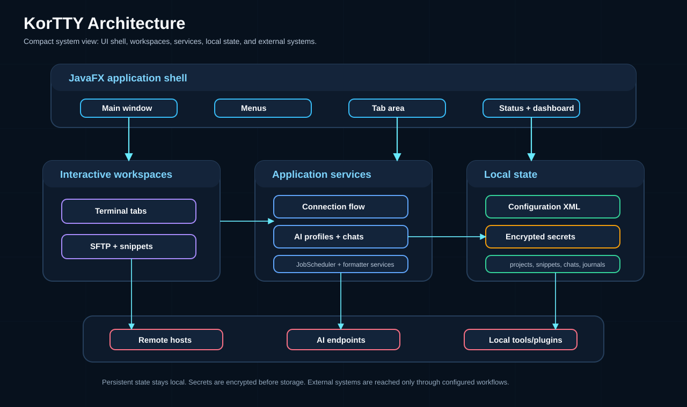
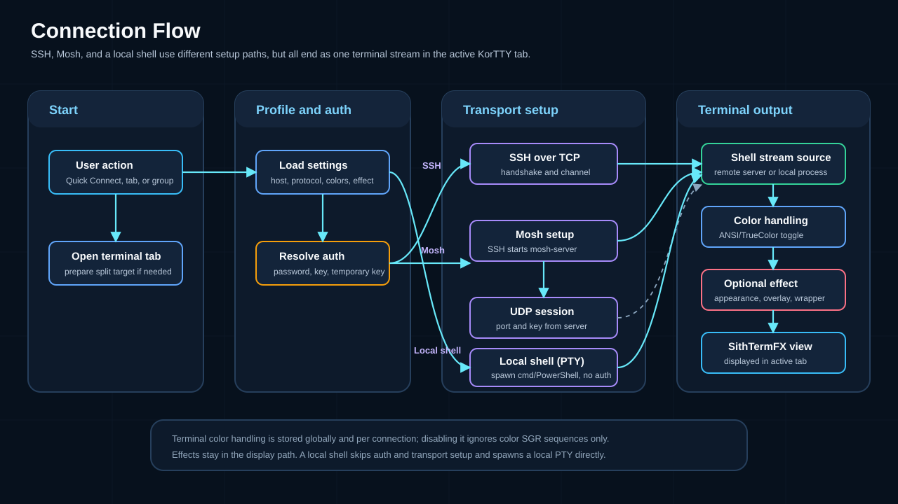
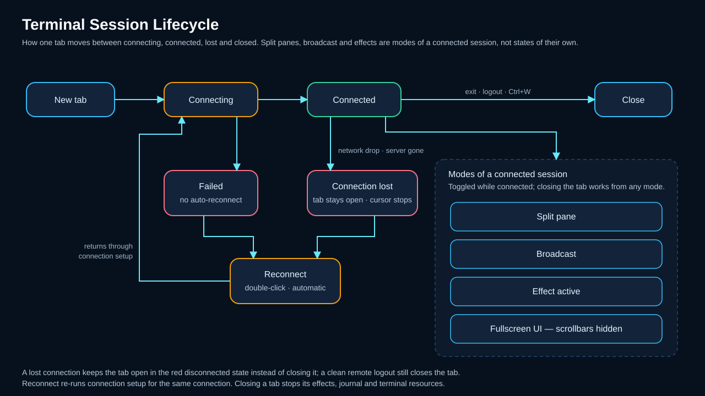
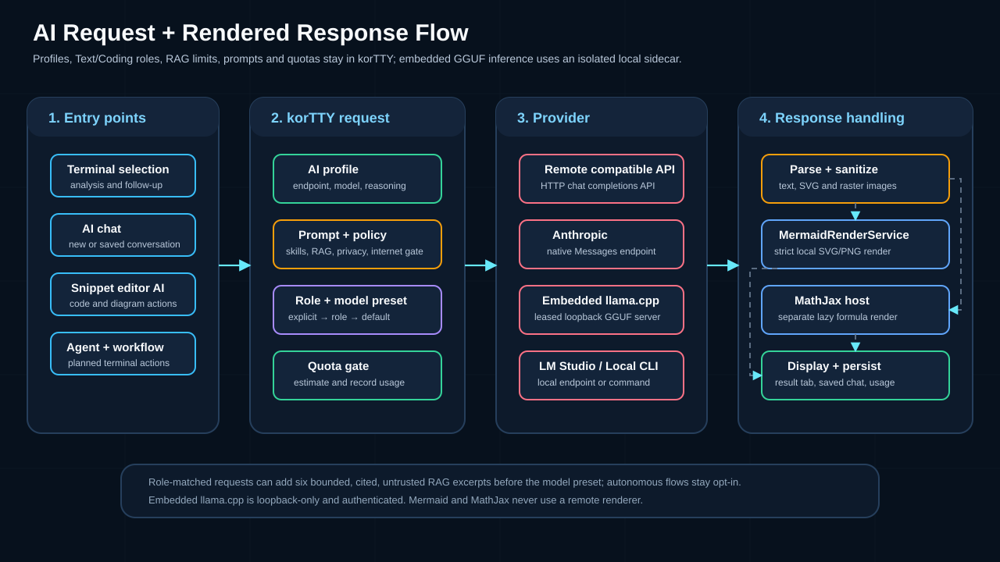
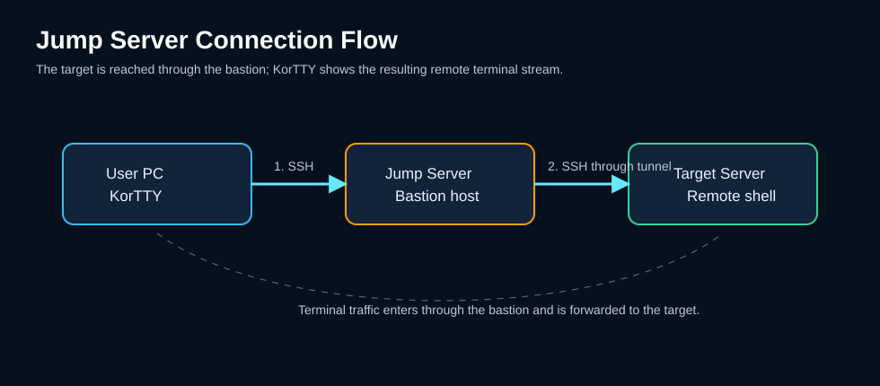
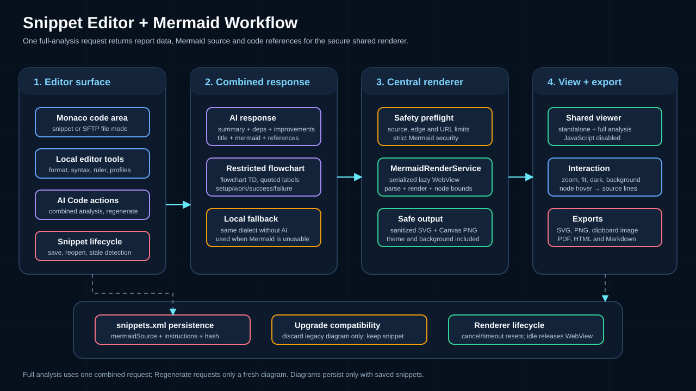
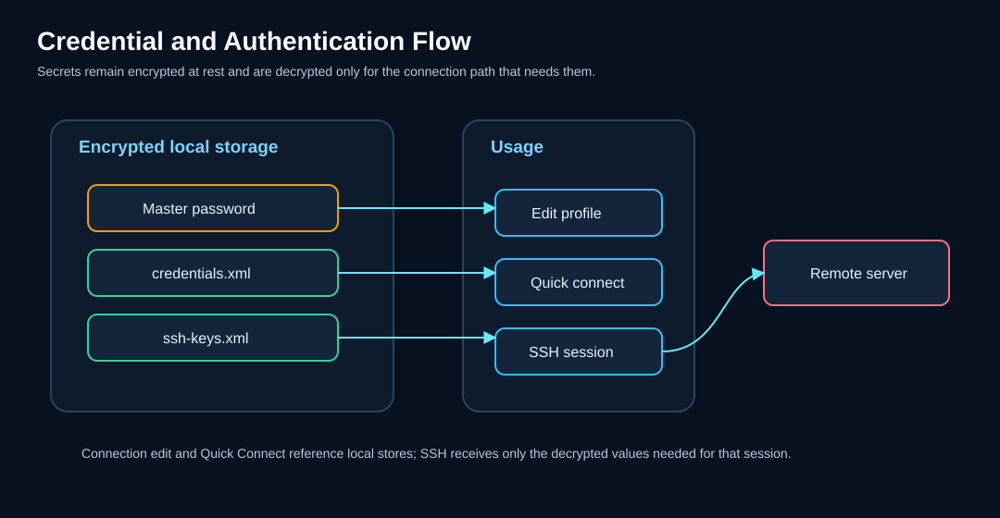
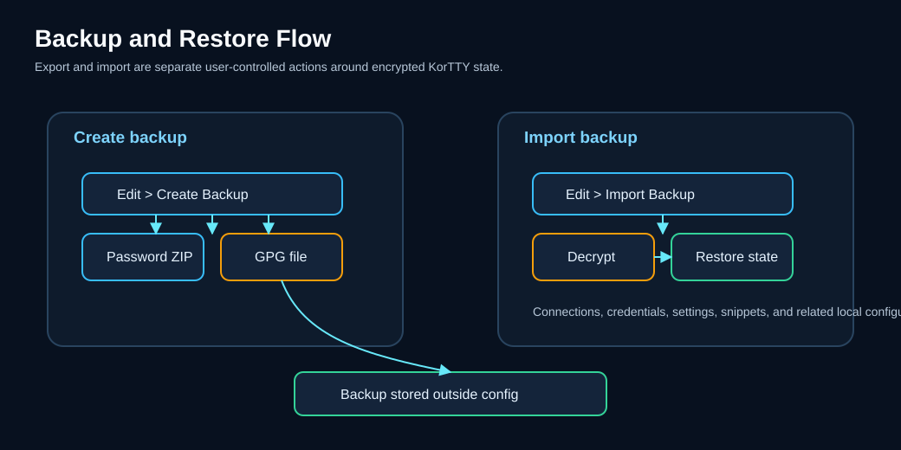

= KorTTY User Guide

*v2.9.0* | link:../README.adoc[Back to README]

:toc:
:toclevels: 3

== 1. Introduction

KorTTY is a modern, cross-platform SSH client built with JavaFX. It provides a tabbed terminal interface, selectable app designs for the JavaFX UI, advanced connection management, and tools for everyday server administration.

=== Key Highlights

* *Tabbed terminals* with split-screen and broadcast input
* *Encrypted credential storage* using AES-256-GCM with a master password
* *Project workspaces* that save and restore your complete session
* *SFTP file manager* with a dual-panel view and Snippet Editor handoff for local/remote file edits
* *Code snippet manager* with syntax highlighting, line numbers, one-liner export, optional one-liner script arguments, placeholder variables, local formatting, AI-assisted editing, diagrams, and import/export
* *JobScheduler* for background command, SnippetManager script, AI Agent, SFTP, and Rsync jobs that run while KorTTY is open without requiring a terminal tab
* *ASCII Art Banner* generator with 11+ FIGlet font styles
* *Terminal recording* with lightweight KorTTY replay files, optional color capture, auto-pause on inactivity, split-scope selection, and optional WebM/MKV export via local `ffmpeg`
* *Session journal* that documents a terminal session as a timeline: password-safe capture of output and typed commands (XML/JSON/YAML), periodic AI summaries with a closing wrap-up, screenshots and notes, a self-contained HTML page with a searchable log panel, a journal manager with full-text search and descriptions, after-the-fact redaction of leaked secrets across entries and capture log, exports to PDF/Markdown/HTML bundle, and enterprise-policy mandates
* *Terminal effect plugins* with per-session or per-connection selection, animation speed, import/export, and plugin enable/disable management
* *Selectable app designs* for JavaFX windows and dialogs: Default, Matrix Terminal, Holographic Interface, Klingon Tactical, and Elegant Dark
* *SSH tunnels* (local, remote, dynamic) and jump server support
* *Backup and restore* with password-protected ZIP or GPG encryption
* *8 built-in languages* plus *dynamic translation*: generate language files for any language via Google Translate, DeepL, LibreTranslate, Microsoft Translator, or Yandex (Settings → Translation)
* *AI assistant for terminal selections* with profile-based OpenAI-compatible endpoints, follow-up prompts, split-local Terminal AI Agent / Planning workflows, inline activity panels, and token quota tracking
* *JMX monitoring* for active connections and memory usage

=== System Requirements

[cols="1,1"]
|===
| Requirement | Minimum
| Java | 25 or higher (CI exception: Windows ARM64 release runner currently uses Java 21)
| Gradle | 9.x (included via wrapper)
| OS | macOS, Windows, Linux
| Optional for JobScheduler Rsync | local `rsync` and `ssh` commands available in PATH, or a configured `rsync` binary path
| Optional for terminal video export | local `ffmpeg` available in PATH, or a configured `ffmpeg` binary path in Tools > Video Manager
|===

== 2. Getting Started

=== 2.1 Installation

==== Build from Source

[source,bash]
----
git clone https://github.com/chardonnay/korTTY.git
cd korTTY
./gradlew build
----

==== Run Directly

[source,bash]
----
./gradlew run
----

==== Pre-built Binaries (GitHub Releases)

Ready-to-use packages are published on link:https://github.com/chardonnay/korTTY/releases[GitHub Releases]. Each asset name includes the architecture (e.g. `-x86_64` or `-aarch64`). Choose the file that matches your system:

* *macOS*: Apple Silicon only — use `-aarch64`.
* *Windows*: Use `-x86_64` for Intel/AMD, or `-arm64` for Windows on ARM.
* *Linux*: Use `-x86_64` or `-aarch64` for ARM (e.g. Raspberry Pi 4, many cloud instances). Packages include `.deb`, `.rpm`, `.tar.gz`, and `.zip`.

==== Building Native Packages Locally

KorTTY can be packaged as a native application using `jpackage`. The output matches the architecture of the machine you build on (x86_64 or arm64):

[cols="1,1,1"]
|===
| Platform | Command | Output
| macOS (.app) | `./gradlew jpackage` | `build/jpackage/korTTY.app`
| macOS (.dmg) | `./gradlew jpackageDmg` | `build/jpackage/korTTY-2.3.0.dmg`
| Windows (.exe) | `gradlew.bat jpackage` | `build\jpackage\korTTY\`
| Windows (.msi) | `gradlew.bat jpackageMsi` | `build\jpackage\korTTY-2.3.0.msi`
| Linux (AppImage) | `./gradlew jpackage` | `build/jpackage/korTTY/`
| Linux (.deb) | `./gradlew jpackageDeb` | `build/jpackage/korTTY-2.3.0.deb`
| Linux (.rpm) | `./gradlew jpackageRpm` | `build/jpackage/korTTY-2.3.0.rpm`
|===

=== 2.2 First Launch - Master Password

On the first launch, KorTTY asks you to create a *master password*. This password encrypts all stored connection passwords, SSH key passphrases, and credentials.

1. Enter a password (minimum 6 characters). The field border turns green when the length is sufficient and red when too short. A strength indicator shows the quality. If you choose a weak or common password, a warning is shown but you can still use it if you confirm.
2. Confirm the password.
3. Click *Setup*.

On subsequent launches, you are prompted to enter the master password to unlock your encrypted data. You can disable this prompt in *Settings > Security*, but stored passwords will not be accessible until you enter the master password manually.

The master-password dialog uses the refreshed KorTTY logo on a black background. The password field is blue with black text for high contrast, and the current version remains visible beside the logo.

=== 2.3 Main Window Overview

The following diagram shows the main components of KorTTY (see also the architecture diagram in the README).

[source,text]
----
+---------------------------------------------------------------+
| Menu Bar: File | Edit | Connections | Management | Tools |    |
|           Plugins | View | Help | optional JobScheduler status   |
+---------------------------------------------------------------+
| Tab Bar: [Server-1] [Server-2] [Server-3]                    |
+-------------------+-------------------------------------------+
| Dashboard         |                                           |
| (optional)        |           Terminal Area                    |
|                   |                                           |
| - Server-1 (ok)  |   user@server:~$                          |
| - Server-2 (ok)  |                                           |
| - Server-3 (err) |                                           |
+-------------------+-------------------------------------------+
| Status Bar                                                    |
+---------------------------------------------------------------+
----

* *Menu Bar* - Access all features through menus and keyboard shortcuts.
* *Tab Bar* - Each SSH session runs in its own tab. Ctrl+T opens Quick Connect for a new tab; Ctrl+Tab / Ctrl+Shift+Tab switch between tabs.
* *Dashboard* - Toggle with Ctrl+Shift+D. Shows all open connections with status indicators. Right-click a connection to *Reconnect* (always available; closes active connection and re-establishes it), duplicate, open SFTP, or close.
* *Status Bar* - Shows connection state, host/IP, active protocol, temporary SSH key timer, and connection duration.
* *JobScheduler menu status* - When enabled and at least one scheduler entry is active, an additional menu appears after *Help*. It shows running jobs or the next scheduled run with a live countdown.
* *Terminal-only fullscreen* - Press Ctrl+Shift+F (Cmd+Shift+F on macOS) or use *View > Terminal-only Fullscreen* to show the whole korTTY window - menu bar, tabs, and status bar included - kept at its previous window size and centered on an empty fullscreen background, hiding the desktop and other windows. *View > Hide terminal scrollbars in fullscreen* can also hide terminal scrollbars while fullscreen mode is active. Press Ctrl+Shift+F again to restore the previous fullscreen and UI state.

== 3. Connections

=== 3.1 Connection Flow (SSH, Mosh, or Local Shell)

KorTTY supports SSH over TCP, Mosh (via mosh4j), and a *local shell* (no network). For SSH and Mosh the following diagram illustrates the connection sequence; a local shell skips host resolution, authentication, and transport handshake and instead spawns a local pseudo-terminal (PTY) directly (see <<#local-shell,Local Shell>>).

=== 3.2 Quick Connect

Open with *File > Quick Connect* or press *Ctrl+K* (Cmd+K on macOS).

The Quick Connect dialog has four sections:

1. *Search field* - A live search field (case-insensitive, supports `*` glob patterns) filters the saved connections in real time. For example, `prod*` matches all connections starting with "prod". Leave the field empty to see all connections.

2. *Frequently Used Connections* - The 10 last used connections appear as quick-access buttons at the top (when the search field is empty), ordered by last used (most recent first). Click one to connect immediately. Usage is tracked when you connect from Quick Connect or the Dashboard.

3. *Individual Connection* tab:
* Select a saved connection from the filtered dropdown (filtered by the search field above), or enter host, port, and username manually.
* Choose the *Protocol*: SSH over TCP, Mosh, Mosh Client, or *Local Shell*. Selecting *Local Shell* opens the local machine's shell instead of a remote host — host, port, username, and authentication are disabled, and a *Shell* selector (PowerShell, cmd.exe, plus Git Bash / Cygwin / WSL when installed, or a custom command) plus an optional start directory become active (see <<#local-shell,Local Shell>>).
* Choose an authentication method (Password, SSH Key, or Temporary SSH Key).
* Optionally customize terminal appearance (font, size, colors, terminal color-sequence handling), terminal effect plugin, and terminal-effect animation speed.
* Check *Save Connection* to add the connection to your library.

4. *Open Group* tab:
* Select a group from the list.
* All connections in that group open simultaneously in separate tabs.

=== 3.3 Connection Manager

Open with *Connections > Manage Connections* or press *Ctrl+M* (Cmd+M on macOS).

The Connection Manager provides a tree view of all saved connections organized in groups (folders).

*Key actions:*

[cols="1,2"]
|===
| Button | Description
| *New* | Create a new connection
| *Edit* | Edit the selected connection
| *Delete* | Delete selected connection(s) or folder
| *Duplicate* | Create a copy of the selected connection
| *Create Folder* | Create a new folder (at root, or under the selected folder)
| *Rename Folder* | Rename the selected group/folder
| *Undo* | Undo the last move operation
| *Import* | Import connections from file
| *Export* | Export connections to file
|===

*Context menu (empty area):* Right-click in the free space of the connection tree (not on a folder or connection) to open a context menu with *Create folder* and *Create connection* (New…).

*Searching:* Type in the search field to filter connections. Wildcard patterns are supported (e.g., `prod*` matches all connections starting with "prod").

*Drag and Drop:* Drag connections between groups to reorganize them.

=== 3.4 Creating / Editing a Connection

When you create or edit a connection, a dialog with multiple tabs opens:

==== Connection Tab
* *Name* - Display name for the connection.
* *Host* - Server hostname or IP address.
* *Port* - SSH port (default: 22).
* *Protocol* - SSH over TCP (default), Mosh, Mosh Client, or *Local Shell*. With *Local Shell*, the host/port/username/authentication fields are disabled and the shell fields below apply instead.
* *Shell* (Local Shell only) - PowerShell (default on Windows), cmd.exe, and — only when detected — *Git Bash*, *Cygwin*, *WSL* (listed when a WSL distribution is installed), or *Custom command…* (then type any executable with arguments, e.g. `pwsh.exe`, `wsl.exe -d Ubuntu`, or a quoted full path). On macOS/Linux the default resolves to your `$SHELL`.
* *Start directory* (Local Shell only) - Optional working directory for the shell; empty uses the process default / home directory.
* *Username* - Login username.
* *Group* - Folder/group to organize the connection (use `/` for nested groups, e.g., `Production/Web`).
* *Authentication Method:*
** *Password* - Enter the password directly (stored encrypted).
** *Private Key* - Select an SSH key from your key management. If the key has a passphrase (stored with the key or entered in the passphrase field), it is saved with the connection (encrypted) and used automatically when connecting.
** *Temporary SSH Key* - Paste a time-limited key (e.g., from CyberArk) with an expiration timer.
* *Credentials* - Select stored credentials from the credential manager.
* *Connection Timeout* - Maximum wait time in seconds (default: 15).
* *Retries* - Number of reconnection attempts on failure (default: 4).

==== Terminal Settings Tab
* Override global font, colors, and terminal size for this specific connection.
* Enable or disable terminal colors for this connection. When disabled, ANSI and TrueColor color sequences from the remote process are ignored and the configured foreground/background colors are used.
* Select a terminal-effect plugin and animation speed for this connection. The slider covers `1x` through `10x`; the numeric field accepts larger values up to `99x`.
* *Close Confirmation* - Ask before closing this tab.

When you save a connection (e.g. after changing font size or family), any *open terminal tabs* using that connection update their font and appearance *immediately*; no restart or reconnect is required.

==== SSH Tunnels Tab
* Add, edit, or remove SSH tunnels (see <<#ssh-tunnels,SSH Tunnels>>).

==== Jump Server Tab
* Configure a bastion host (see <<#jump-server,Jump Server>>).

==== Terminal Logging Tab
* Enable/disable automatic session logging.
* Configure log file path, maximum file size, and format (Plain Text, XML, or JSON).

==== Window Geometry Tab
* Set a fixed window size/position for this connection.

=== 3.5 Import / Export Connections

KorTTY can import connections from several sources:

[cols="1,1"]
|===
| Format | Menu Path
| KorTTY (XML/ZIP/GPG) | Connections > Import
| MTPuTTY (servers.xml) | Connections > Import
| MobaXTerm (.ini) | Connections > Import
| PuTTY Connection Manager (.xml) | Connections > Import
|===

*Import options* include whether to import usernames, passwords, tunnels, jump servers, and whether to replace with stored credentials or SSH keys.

*Exporting* supports KorTTY, MTPuTTY, MobaXTerm, and PuTTY CM formats. You can select individual connections and optionally encrypt the export (password ZIP or GPG).

NOTE: Passwords are never included when importing from third-party formats for security reasons.

[#local-shell]
=== 3.6 Local Shell

Besides connecting to remote hosts, KorTTY can open the *local machine's shell* in a terminal tab. No network connection is made: KorTTY spawns the shell in a local pseudo-terminal (PTY) using pty4j, so there is no host, port, or authentication.

*Opening a local shell:*

1. Open *Quick Connect* (`Ctrl/Cmd+K`) or *Connections > Manage Connections > New*.
2. Set *Protocol* to *Local Shell*. Host/port/username/authentication fields are disabled.
3. Choose the *Shell*:
* *PowerShell* (default on Windows)
* *cmd.exe*
* *Git Bash* — only offered on Windows when Git for Windows is detected; launches `bash.exe --login -i` from the Git installation.
* *Custom command…* — type any executable with arguments, e.g. `pwsh.exe`, `wsl.exe -d Ubuntu`, or a full path (quote paths that contain spaces). On macOS/Linux the default resolves to your `$SHELL` (falling back to `/bin/zsh` or `/bin/bash`).
4. Optionally set a *Start directory* (empty uses the process default / home directory).
5. Connect. The shell opens in a new terminal tab. Exiting the shell (e.g. `exit`) ends the session and closes the tab as usual.

*Closing with Ctrl+D:* In bash-family shells (Git Bash, Cygwin, WSL, and macOS/Linux) Ctrl+D sends EOF, the shell exits, and the tab closes. cmd.exe and PowerShell do not exit on EOF (a Windows limitation), so for those local shells korTTY closes the tab directly on Ctrl+D. You can always close any tab with Ctrl+W or by typing `exit`.

You can save a local-shell connection in the Connection Manager like any other connection; if you do not give it a name, it is labelled by its shell (e.g. `powershell.exe`).

*What works:* resize, colors, terminal effects, terminal logging, and terminal recording behave the same as for remote sessions.

*AI in local shells:* The AI selection actions (Summarize/Solve/Ask), the *AI Agent*, and *AI Planning* all work in a local shell. The agent runs its commands locally in the connection's shell (PowerShell or `cmd.exe` on Windows, your `$SHELL` on macOS/Linux) and is told the platform so it generates native commands; the existing approval flow applies (read-only commands run automatically, system-changing ones ask for confirmation).

NOTE: Local-shell AI Agent limitations: there is no `sudo`/administrator elevation on Windows (admin-only commands will fail), and the agent runs in the connection's start directory without live working-directory tracking (Windows shells emit no OSC 7). The JobScheduler's headless AI-agent action remains SSH-only.

== 4. Terminal

=== 4.1 Session Lifecycle

The following diagram shows the terminal tab and session lifecycle (including split and broadcast).

=== 4.2 Working with Tabs

* *New Tab:* Ctrl+T (Cmd+T) opens Quick Connect to start a new session.
* *Close Tab:* Ctrl+W (Cmd+W) closes the active tab (with optional confirmation).
* *Switch Tabs:* Ctrl+Tab (next) / Ctrl+Shift+Tab (previous).
* *Tab Groups:* Right-click a tab to assign it to a named group for better organization.
* *Reconnect:* Right-click a tab, the terminal area, or a server entry in the Dashboard to reconnect. If the connection is active, it is closed and re-established immediately; if disconnected, it is re-established. The terminal window stays open.

=== 4.3 Multi-Window

Open additional windows with *File > New Window* (Ctrl+Shift+N / Cmd+Shift+N). Each window can have its own set of tabs and connections.

* *Move tabs between windows:* Drag a tab from the tab bar and drop it onto another KorTTY window's tab bar to move that tab (and its session, including any split terminals) into the other window.
* *Reorder tabs:* Drag a tab within the same window to change its order; the "+" tab stays at the end.

=== 4.4 Font Size / Zoom

Adjust the font size of the active terminal without reconnecting:

[cols="1,2"]
|===
| Shortcut | Action
| Alt+Plus | Zoom in (increase font size)
| Alt+Minus | Zoom out (decrease font size)
| Ctrl + mouse wheel | Zoom in/out (Cmd + wheel on macOS); wheel up enlarges, wheel down shrinks
| Alt+0 | Reset zoom to saved/default font
|===

*Ctrl + mouse wheel* over the terminal changes the font size instead of scrolling the buffer (use Cmd on macOS). *Reset zoom* restores the font size and family to what the connection had when you opened the tab (or the connection's saved settings, or the global default). The same reset is available via the terminal context menu: right-click → *Font size* → *Reset*. The zoom level applies only to the currently focused terminal.

=== 4.5 Terminal Effects

Terminal effects can change the visible terminal style and output animation. Effects are Java plugins managed from *Plugins > Terminal Effects*.

User controls:

* *Current terminal:* Use *View > Terminal Effect* or the terminal context menu to choose an effect for the active terminal.
* *Quick Connect:* Choose the effect and speed before opening a temporary or saved connection.
* *Connection Manager:* Store the effect and speed on a saved connection so new tabs use it automatically.
* *Speed:* Use the slider for `1x` through `10x`; if that is still too slow, type a custom value up to `99x` in the numeric speed field.

Plugin management:

* Open *Plugins > Terminal Effects*.
* The table lists loaded plugins with active state, name, and description.
* Disable a plugin to keep it installed but unavailable for activation.
* Import external `.jar` plugins. KorTTY copies them into `~/.kortty/plugins`.
* Export plugins that have a source JAR. The bundled MOTHER effect is exportable.

[WARNING]
====
Imported terminal-effect plugins are trusted Java code and are not sandboxed. Only import plugins from sources you trust.
====

Developer documentation for creating plugin JARs is in link:TERMINAL_EFFECT_PLUGINS.adoc[Terminal Effect Plugin Development].

=== 4.6 Split-Screen with Broadcast

Split the terminal view to display multiple connections side by side:

* *Split Pane:* Create horizontal or vertical splits within a tab.
* *Broadcast Mode:* When enabled, keyboard input is sent simultaneously to all visible panes. This is useful for running the same commands on multiple servers.
* *Independent Sessions:* Each pane can show a different SSH connection.
* *Resizable Panes:* Drag dividers to adjust pane sizes.
* *Move Panes:* Hold *Shift+Alt* (Windows/Linux) or *Shift+Option* (Mac) and drag a pane onto another to reorder. Without the modifiers, mouse drag is used for text selection in the terminal.

=== 4.7 AI Assistant for Terminal Selections

KorTTY can analyze selected terminal text with an OpenAI-compatible AI endpoint and open the answer in a temporary AI result tab.

[WARNING]
====
Selected terminal text is transmitted to the configured AI endpoint for analysis. That text can contain sensitive information such as credentials, hostnames, file paths, stack traces, or other operational details. For sensitive data, prefer a trusted local or OpenAI-compatible endpoint such as *LM Studio*, or verify that you trust the remote endpoint before sending anything. If you provide an *API Key*, KorTTY stores it encrypted with your master password.
====

*Setup:*

1. Open *Edit > Global Settings*.
2. Go to *AI*.
3. Create one or more AI profiles and enter the *API URL* for each profile you want to use. You can manage profiles in *Settings > AI* or in *Tools > AI Manager > Profiles*.
4. Optionally enter *Model* and *API Key*. The editable model selector supports manual model names and, for local LM Studio endpoints, an *Auto* option plus the currently loaded local LLMs.
   The *API Key* is stored encrypted with your master password. Prefer local endpoints for sensitive data, or verify the endpoint's trust level before sending selections.
5. Optionally configure *Max characters*, *Tokenizer*, *Token limit*, warning thresholds, token reset cycle, supported *Reasoning* effort, and *Internet access* per profile. KorTTY exposes reasoning choices based on the configured API URL and model; profiles without a supported reasoning mode stay disabled.
6. Click *Test AI Connection*.
7. Optionally choose a *Default profile* for terminal AI actions and follow-up chats that do not explicitly select another profile.
8. Optionally configure the default language for AI-generated text inside code comments and program output, enable the extra instructions field for snippet AI actions, and set how many alternative solutions the snippet editor should request.
9. Optionally configure the terminal-agent input-history size (default 20, range 5–100), the agent command name, case-insensitive command matching, execution target, prompt-hook usage, per-run setup dialog, debug/runtime visibility, and activity-panel preferences for *AI Agent* and *AI Planning*.
10. Optionally disable the confirmation dialog for *Summarize* and *Solve Problem* if you want a faster workflow. *Ask* always opens the prompt dialog.

==== AI Profile Setup Wizard

A guided wizard creates AI profiles with support for both local and cloud-based language models.

To open the wizard:

* *Settings > AI*, click *Add Profile* or *Edit* an existing profile.
* *Tools > AI Manager > Profiles*, click *Add*.

The wizard guides you through:

1. *Connection Type* - Choose local LM Studio or a cloud provider.
2. *LM Studio Setup* - If local: pick a loaded LM Studio model from the list or use *Auto* mode.
3. *Cloud Provider Setup* - If cloud: select the provider (Anthropic Claude API, OpenAI, or other OpenAI-compatible endpoint).
4. *API Details* - Enter API Key, select or enter Model name, and optionally configure Reasoning effort (if the provider/model supports extended thinking).
5. *Profile Name* - Enter a display name for the profile (e.g., "Claude Opus", "Local LM Studio").

Native Anthropic (Claude) API support was added alongside existing OpenAI-compatible endpoints.

==== Local LM Studio model selection

For local LM Studio profiles, KorTTY can discover currently loaded LLM model keys through LM Studio's `GET /api/v1/models` endpoint. The model selector in *Settings > AI* and *Tools > AI Manager > Profiles* is editable:

* *Auto* keeps the profile in automatic mode.
* A listed model stores that model as the manual selection.
* A typed model name is stored as a manual selection so other OpenAI-compatible endpoints still work.

Auto mode resolves the effective model immediately before connection tests, AI chat and follow-up requests, terminal AI actions, and Terminal AI Agent runs. If exactly one LLM is loaded, KorTTY uses that model. If multiple LLMs are loaded, KorTTY uses the saved preferred model only when that model is currently loaded. If no LLM is loaded, or multiple LLMs are loaded without a valid saved preference, KorTTY stops the request with an explicit error instead of guessing.

==== AI internet access

Internet access is configured per AI profile. Existing and new profiles default to *Disabled*.

[cols="1,3"]
|===
| Mode | Behavior

| *Disabled*
| No web tools or MCP integrations are sent with AI requests.

| *KorTTY Tavily Tool*
| KorTTY adds a `web_search` tool to eligible OpenAI-compatible `/v1/chat/completions` requests. Tool calls are executed by KorTTY through `POST https://api.tavily.com/search`.

| *LM Studio Tavily MCP*
| KorTTY sends an LM Studio native `/api/v1/chat` request with a Tavily MCP integration.

| *Bright Data Web MCP*
| KorTTY sends an LM Studio native `/api/v1/chat` request with a Bright Data MCP integration.

| *Brave Search MCP*
| KorTTY sends an LM Studio native `/api/v1/chat` request with a configured Brave Search MCP plugin ID.

| *SearXNG MCP*
| KorTTY sends an LM Studio native `/api/v1/chat` request with a configured SearXNG MCP plugin ID.

| *LM Studio Toolpack*
| KorTTY sends an LM Studio native `/api/v1/chat` request with the configured LM Studio Toolpack MCP plugin ID.
|===

Required provider configuration is entered under *Settings > AI > Internet tool configuration*. API keys and tokens are stored encrypted with the master password. MCP server labels and plugin IDs are stored as normal settings.

Important behavior:

* Snippet AI, text correction, translation, snippet descriptions, and alternative-solution requests do not use internet access.
* Direct KorTTY web tools have a 5-second connect timeout, a 20-second request timeout, and a maximum of two web-tool rounds per AI request.
* LM Studio MCP requests with internet access use a longer total request timeout because the MCP server runs behind LM Studio.
* Canceling a running request interrupts the Java HTTP request where the active provider supports interruption.
* Tool errors are returned to the model as structured data. If the web tool times out, fails authentication, returns no results, or reaches the tool-round limit, the model is instructed to say that explicitly and not invent web facts.
* For terminal-agent JSON planning, KorTTY offers web tools only when the user task clearly asks for current or external information. Local file/script review tasks should be handled by SSH commands such as `sed`, `cat`, `find`, or test commands, not by web search.

==== AI Skills

AI Skills are reusable local instruction blocks that KorTTY can add to AI requests. Use them for persistent preferences such as coding standards, review rules, operational policies, or language-specific style guidance.

Open *Edit > Global Settings > AI Skills*.

Skill fields:

* *Skill name* - Human-readable name shown in the skill list and activity logs.
* *Description* - Short explanation used by automatic skill matching.
* *Tags* - Comma-separated keywords used by automatic skill matching.
* *Target* - `AI Chat/Functions`, `AI Agent`, or `Both`.
* *Active* - Enables or disables only this skill.
* *Skill Markdown* - The instruction body sent to the model when the skill is selected.

Controls:

* *Enable AI Skills* disables or enables all skills globally.
* *Automatically send only matching skills* sends only active skills that match the current request. When disabled, all active skills with a matching target are sent.
* *Add* creates a new active skill with target `Both`.
* *Delete* removes the selected skill after confirmation.
* *Import* accepts `.md` and `.markdown` files.
* *Export* writes Markdown files for the selected skill, or all skills if none is selected.
* The skill list can be sorted alphabetically or by enabled/disabled status.

Markdown import/export format:

[source,markdown]
----
---
kortty-ai-skill: 1
name: My Skill
description: Short purpose statement
enabled: true
target: BOTH
tags: [linux, bash]
---

Skill instructions as Markdown.
----

Plain Markdown without KorTTY frontmatter is imported with the file name as the skill name, target `Both`, and disabled by default so the user can review it before use. Claude/Codex-style `SKILL.md` frontmatter with `name`, `description`, and `tags` is also accepted and imported disabled by default unless it is KorTTY's own export format.

When an AI Agent run uses one or more skills, the terminal-agent activity panel logs the selected skill names. Connection tests never send skills, so `Reply with exactly OK` tests remain stable.

*Usage:*

1. Select text in the terminal.
2. Right-click the selected text.
3. Open *AI* and choose:
* *Summarize* - Creates a concise summary of the selected output.
* *Solve Problem* - Analyzes the selected error output and suggests likely fixes.
* *Ask* - Sends the selection together with your own follow-up question or instruction.
4. Confirm the request in the preview dialog. You can edit the selected text before sending it. For *Ask*, add your own prompt. The dialog also shows the estimated request tokens and projected remaining quota.
5. The response opens in a temporary AI tab. You can continue the same context with follow-up prompts from the bottom composer field.
6. Use *Save* in the AI tab to store the conversation under a custom title.
7. Reopen saved conversations later via *Tools > AI Manager* or *Ctrl/Cmd+Shift+Y*. There you can open, rename, refresh, or delete saved chats.

*AI result tab behavior:*

* The conversation transcript is read-only and not included in saved project/session state.
* `<think> ... </think>` blocks are removed from the visible output.
* The toolbar lets you copy the conversation, save or rename the chat, share/export it to PDF/Markdown/plain text, retry the last request, close the tab, cancel running requests, and change the font size.
* The response language defaults to the current GUI language. You can change the response language and the active AI profile per chat before sending a follow-up prompt.
* Follow-up prompts in *Summarize* and *Solve Problem* continue as normal chat questions; they are not forced back into the original summarizing/problem-analysis prompt.
* Detected code blocks get their own copy button and can also be saved directly into the Snippet Manager.
* Rendered markdown tables can be copied as a whole table, a single column, or a single cell.
* The chosen AI tab font size is stored globally and reused for future AI result tabs.
* Token usage is recorded per AI profile after successful requests so warnings and reset cycles remain accurate.
* If a saved chat references an AI profile that no longer exists, KorTTY asks you to choose a replacement profile before you continue with follow-up prompts.

==== AI Manager

Open *Tools > AI Manager* or press *Ctrl/Cmd+Shift+Y*.

The AI Manager has two working areas:

* *Profiles* - Create, edit, test, save, and remove AI profiles. The profile list shows the current quota/usage status for each profile.
* *Saved Chats* - Open, rename, refresh, or delete previously saved AI conversations.

Use *Settings > AI* for the global defaults and behavior switches, and *AI Manager* for day-to-day profile/chat management.

==== AI Agent and AI Planning

KorTTY also supports agent-style workflows for an active terminal session.

* *AI Agent* - Start from *Tools > AI Agent...*, from the terminal right-click menu, or with the terminal shortcut command. The agent can open in a dedicated chat tab or target the active terminal window, depending on *Settings > AI*.
* *AI Planning* - Start from *Tools > AI Planning...*, from the terminal right-click menu, or with `agent-plan` / `agent -plan`. Planning mode asks clarifying questions, proposes one or more options, creates a final plan report, and lets you start the accepted plan.
* *Split-local activity panel* - Terminal-targeted runs appear at the bottom of the terminal split where the run was started. Each split has its own panel, so different splits can run their own agent tasks in parallel.
* *Panel placement (bottom or docked side)* - *View → AI Agent Panel* lets you choose *At Bottom* (default), *Dock Left*, or *Dock Right*. Docked mode shows the activity in a resizable side panel attached to the main window (like the file browser); drag its divider to resize, and the placement + width are remembered across restarts. In side mode there is one outer tab per terminal of the *active* terminal tab (e.g. a base terminal plus two splits = three tabs), and within each tab the individual runs are listed stacked vertically. Switching to another terminal tab swaps the dock to that tab's terminals (others are hidden); runs keep executing across the switch.
* *Agent status indicators* - A per-terminal AI-agent status icon — ✋ awaiting input, ⚡ working, ⏸ paused, ✓ finished — is shown in the Dashboard tree and prefixed to the terminal's tab title, aggregated across that terminal's runs and refreshed about once a second.
* *Concurrent runs as tabs* - Multiple concurrent runs per split are shown as closable tabs in the activity panel (one tab per run), with a per-widget concurrency cap of 5 runs. Finished runs stay as tabs until closed. This replaces the old "previous/next run navigation". The selected tab's run controls (cancel, pause/resume, Ctrl+R for thinking) operate on that tab only.
* *Typing while agent is active* - Typing is no longer locked while a run is active. You can continue typing in the shell prompt and launch another `agent ...` command (it opens a new concurrent tab). Only run-control keys are intercepted: *Esc* or *Ctrl+C* cancel the SELECTED tab's run; *Ctrl+R* toggles that run's thinking details.
* *Pause and Resume* - Each run tab shows pause (⏸) and cancel buttons. Pause parks the agent at a safe point between steps (a command already running finishes first); paused time is excluded from the run work-time. Drag the resize handle to change the panel height.
* *Panel content* - The panel shows the user prompt in a two-line scrollable field, agent messages, read/run actions, task timing, reported token usage, semantic activity markers, collapsible details, per-row copy/snippet actions, rerun, close, collapse/expand, resize, font-size controls, and export controls.
* *Current directory* - Terminal shortcut runs use KorTTY's tracked current remote directory. Commands and generated files are executed relative to that directory.
* *Approvals and sudo* - The agent can request explicit approval before command execution and can ask for a sudo password in the activity panel. Password input is masked, can be submitted with *Enter*, and allows up to three wrong-password retries. If a password is cached, it is used only for the current agent/session context. When user input (sudo password / command approval) is required, the panel auto-expands and selects that run, and the tab shows a bold ✋ "input required" badge. After accepting a planning report, KorTTY checks sudo before starting implementation when the current SSH session requires a sudo password.
* *Collapsed status bar* - When the panel is collapsed, it shows a compact status bar with the run prompt, state, pause/cancel buttons, and an expand button. With several runs it surfaces the most relevant one (a run awaiting input first, otherwise one that is still working) and shows a run breakdown such as "1 running · 2 done" instead of a bare total. A small spinner appears while the agent is actively working, and a bold ✋ marker signals when user input is required — both without opening the full panel.
* *Keep collapsed preference* - Use *Keep collapsed* to make the panel start minimized to the status bar and stay collapsed when new activity, approval prompts, or sudo password prompts arrive. You can still expand the panel manually.
* *Terminal output* - Final terminal-agent answers are written back to the terminal area so the shell transcript contains the answer, not only the activity panel state.
* *Transcripts* - Dedicated agent and planning tabs can copy and save their transcript.
* *Planning font size* - The planning tab supports *A-*, *A+*, and Ctrl/Cmd plus `+` / `-` shortcuts. The chosen planning font size is saved globally and restored after restart.

==== Terminal agent shortcut commands

When terminal agent shortcuts are enabled and the terminal is at a shell prompt, KorTTY intercepts these commands locally instead of sending them to the server as normal executables:

[source,text]
----
agent <goal>
agent-ask <question>
agent-plan <task>
agent -plan <task>
----

The base command name is configurable in *Settings > AI*. If you rename `agent`, KorTTY derives the matching `-ask` and `-plan` commands automatically. The same settings page can make the command name case-insensitive and can disable the per-run setup dialog; when the dialog is disabled, KorTTY uses the configured default profile.

KorTTY intercepts these shortcuts locally before they are sent to the remote shell as normal executables. User-entered agent commands remain available in shell history.

==== TAB completion and prompt history

At the shell prompt, TAB completion is enhanced for agent commands:

* Type the agent command name (e.g., `agent`) then press *TAB* to offer the command variants (`agent`, `agent-ask`, `agent-plan`).
* Type the command + a space (e.g., `agent `) then press *TAB* to offer the recent agent-prompt history. Each row shows the prompt and the date/time it was last run, de-duplicated by prompt text (newest first).
* Each history row shows the prompt on the left and the date/time it was last run on the right. Prompts longer than 60 characters are shortened with an ellipsis so rows stay readable; the full prompt is still inserted when the entry is selected.
* The history popup is resizable — drag the grip in the bottom-right corner — and remembers its size across restarts. It shows a vertical scrollbar when the history is longer than the popup.
* In the history popup, remove a single prompt by clicking the row's ✕ button (or pressing *Del* on keyboards with a forward-delete key), or remove the entire history with *Clear all* (a two-step confirm guards against accidental wipes). Deletions are saved immediately.
* Outside this context, TAB is normal shell completion.

History size is configurable in *Settings > AI* (default 20, range 5–100).

==== How the AI Agent works

The Terminal AI Agent is a controlled SSH automation workflow. It does not run arbitrary model output directly in the interactive terminal. Instead, each turn follows this pattern:

1. KorTTY probes the active SSH session with a non-interactive command and records compact context such as current user, host, operating system, active terminal working directory, sudo availability, disk path, and recent command state.
2. KorTTY sends the user task, probe snapshot, previous command results, active AI Skills, and optionally web-tool availability to the selected AI profile.
3. The model must return a strict JSON decision: run commands, ask for confirmation, finish, or block.
4. KorTTY validates the JSON schema and command constraints. Invalid responses are repaired once; unsafe or unsupported command decisions are rejected.
5. KorTTY runs approved commands through SSH exec channels. Each command starts in the tracked active terminal directory. A `cd` inside one command does not persist to the next command.
6. Command output is added to the activity panel and to the next model turn until the task is complete, blocked, canceled, or the turn limit is reached.

The agent is suitable for:

* inspecting files, directories, package state, logs, service state, and system configuration;
* creating or modifying scripts and configuration files when the task asks for it;
* running tests, syntax checks, linters, or read-only diagnostic commands;
* summarizing command output and explaining findings;
* planning multi-step operational changes before implementation.

The agent is not intended for:

* interactive full-screen programs such as `vim`, `nano`, `top`, `less`, `ssh`, or commands that wait for prompts;
* long-running daemons or commands without clear completion;
* secret exfiltration or blind destructive commands;
* web research for local files unless the user explicitly asks for external/current information.

Examples:

[source,text]
----
agent show the 10 largest XML files in this directory
agent update groesste_xml.pl so the -r flag searches subdirectories recursively
agent check why nginx failed to start and suggest the safest fix
agent-ask what user and directory am I currently using?
agent-plan migrate this host from package X to package Y
----

For local file review tasks, name the file in the task. The agent should then inspect it with SSH commands such as `sed -n`, `cat`, `file`, or language-specific syntax checks. If an internet-enabled profile is active, KorTTY still keeps web tools away from these local file planning prompts unless the user task clearly asks for current or external information.

==== Safety and failure handling

KorTTY adds guardrails around agent execution:

* Commands are limited per turn and must be non-interactive.
* Commands that change the system or require privilege can be routed through confirmation depending on settings and model decision.
* Sudo uses `sudo -n` and activity-panel password prompts. KorTTY does not allow `sudo -S`, `su`, or commands that wait indefinitely for a terminal password prompt.
* The current remote directory is tracked from shell hooks, terminal prompt context, and probe results. If a tracked directory no longer exists, KorTTY retries the probe from the SSH default directory and reports the issue.
* While a terminal-targeted run is active, normal typing is still allowed; only run-control keys (*Esc*/*Ctrl+C* to cancel the selected run, *Ctrl+R* to toggle its thinking details) are intercepted, and new `agent` commands open additional run tabs.
* Web-search failures, HTTP errors, authentication errors, empty results, and timeouts are surfaced as explicit tool errors.
* If the AI response does not match the required JSON schema, KorTTY asks for a repair. If repair also fails, the run is blocked with an explanation.

The terminal activity panel can be adjusted during use:

* *Run tabs* - Multiple concurrent runs are shown as closable tabs. Click a tab to select it; only the selected tab's run is controlled by run-control keys and buttons.
* Use the reload button to run the selected agent command again.
* Use the copy action on an activity row to copy that row's text to the clipboard.
* Use the snippet action on an activity row to open the row text in the Snippet Editor. Leading activity quote markers (`>`) are removed before the snippet draft is created.
* Use the export format list and export menu to save the current run or all panel-history runs as Markdown, plain text, YAML, XML, JSON, PDF, or Asciidoctor. Exports include the AI profile, configured model/LLM, reasoning status, run timestamps, total runtime, per-activity runtimes, reported token usage when available, summaries, and expanded detail text. Leading activity quote markers (`>`) are removed from exported detail text.
* Use *Expand all* to keep activity details open instead of compacting them. This option is saved globally and restored after restarting KorTTY.
* Use *A-* and *A+* to change the activity font size.
* Drag the resize handle to change the panel height.
* Enable *Remember size* to persist panel height and activity font size across application restarts.
* Use the collapse/expand button to hide or show the panel. When collapsed, the panel shows a compact status bar with the run prompt, state, pause/cancel buttons, and expand button. If the panel is collapsed while the agent is waiting for sudo input, the status bar shows "✋ input required" and the panel auto-expands when you interact with it.

Activity rows use semantic emoji icons (static, non-blinking):

[cols="1,3"]
|===
| Icon | Meaning
| 💾 | Request or input: write/create file
| 📖 | Action: read file/directory
| ▶️ | Action: run/execute command
| 📁 | Action: directory operation
| 📦 | Context: package manager
| ⚙️ | Context: service or system
| 🌐 | Action: network operation
| 🔍 | Action: inspect/analyze
| 💭 | State: thinking/reasoning
| 💬 | Output: message or result
| ✋ | Required: awaiting user input (sudo/approval)
| ❌ | State: error or failed activity
| 🚫 | State: cancelled activity
|===

Red styling is reserved for error and failed states.

==== Generate Workflow Script

After a finished agent run completes successfully, a *Workflow* button turns the run into a single self-contained, reproducible script in a chosen language (Bash, Python, Perl, Ruby, PowerShell, Windows-CMD, AppleScript, Ansible playbook) with robust error handling, detailed comments, and a header (script name, creator, date/time).

Script generation:

* Auto-loads matching AI Skills (e.g., a language-quality skill for the target language).
* Can produce several language variants and multiple suggestions as inline tabs.
* Supports header templates from the fixed non-deletable *Script-Header* snippet category.
* Optionally includes a Mermaid flow diagram for the script logic.
* Saves into the Snippet Manager with a short auto-generated name + correct extension (de-duplicated by full name incl. extension).
* Tags the snippet as `workflow` for easy filtering.
* Auto-sets the *System* (OS) column from the agent's probed OS (any Linux distro → Linux).
* Internet access is forced OFF during generation.

The workflow dialog is resizable and remembers its size and position for future use.

=== 4.8 Terminal Logging

Automatically log terminal session output for audit and debugging:

1. Enable logging in the connection's *Terminal Logging* tab.
2. Choose a log format:
** *Plain Text* - Raw terminal output.
** *XML* - Structured XML with timestamps.
** *JSON* - Structured JSON with timestamps.
3. Set a *maximum file size* (default: 10 MB). When exceeded, the log file is rotated.
4. Logs are stored in `~/.kortty/history/` as compressed files.

=== 4.9 Terminal Recording

Terminal recording is designed as a low-resource replay feature. KorTTY records terminal screen-state changes and timing events into one JDK/GZIP streaming-compressed `.korttyrec.jsonl.gz` file per terminal tab session. Legacy `.korttyrec.jsonl` replay files remain readable. It does not continuously capture pixels, and it does not stream over the network. Optional color capture stores per-cell terminal style runs in new replay files, which can increase file size.

Configure recordings:

1. To make recording available after every app restart, open *Settings > Video* and enable *Enable terminal recording after app restart*.
2. To enable recording only until KorTTY quits, open *Tools > Video Manager...* and select *Enable terminal recording for this app session*.
3. Set the *Storage path*. If left at the default, KorTTY uses `~/.kortty/recordings`.
4. Choose the default format and default split scope. KorTTY replay is always available; video export requires `ffmpeg`.
5. Enable or disable *Auto-pause when the terminal is idle* and set the idle threshold. The default is 20 seconds.
6. Optional: enable *Capture terminal colors in new recordings* before recording if exported videos should reproduce terminal colors.
7. Optional: set the `ffmpeg` path and click *Check*. If `ffmpeg` is missing, video export stays disabled and replay files remain usable.
8. Click *Save*.

Start and stop a recording:

1. Open or focus an SSH terminal tab.
2. If terminal recording is enabled, click *Start recording* in the terminal bar, choose *Tools > Start/Stop Terminal Recording*, or press *Ctrl/Cmd+Shift+E*. The terminal bar control is hidden until recording is enabled or the menu item/shortcut is used. If recording is disabled, the menu item or shortcut reveals the control but the recording does not start.
3. If the tab contains multiple split terminals, choose whether to record only the active split or the whole tab.
4. Click *Stop recording* or press *Ctrl/Cmd+Shift+E* again to stop the current segment.
5. Start and stop as often as needed in the same tab. KorTTY appends all segments to the same replay file until the tab closes.

Export a video:

1. Open *Tools > Video Manager...*.
2. Select a `.korttyrec.jsonl.gz` replay file from the list.
3. Verify that the ffmpeg status says video export is enabled.
4. Click *Export...*.
5. In the export options, choose *Export entire recording* or enter a start/end time with minute or `MM:SS` input. Values past the replay duration are rejected.
6. Choose whether to include terminal colors. This is available only when the selected replay contains color data.
7. Choose *WebM/VP9* or *MKV/FFV1*, then choose an output path.
8. While KorTTY renders frames and runs `ffmpeg`, the export progress dialog shows the current phase, a progress bar, and the estimated remaining time. Export uses the recorded terminal geometry or a computed legacy fallback size so large terminal screens are not cropped.

Manage and view recordings:

1. Open *Tools > Video Manager...*.
2. Select a `.korttyrec.jsonl.gz` replay file.
3. Click *View* to play the replay directly inside KorTTY.
4. Use the replay viewer timeline to scrub to a position, or enter a *Time jump* value such as `5` for minute 5 or `5:30` for minute 5 and 30 seconds. Values past the replay duration are rejected.
5. Set *Speed* between `1x` and `20x` to control playback speed.
6. Click *Rename...* to rename the replay file in the recording folder.
7. Click *Delete* to delete the selected replay after confirmation.

Validation path:

1. Open *Settings > Video*, ensure the permanent recording option is off, restart KorTTY, and verify that recording is disabled. Then open *Tools > Video Manager...*, select *Enable terminal recording for this app session*, set a writable storage path, keep auto-pause enabled, optionally enable color capture, and save.
2. Open an SSH tab, start recording, run a command that changes the visible terminal, wait longer than the configured idle threshold, then run another command.
3. Stop recording, start again, run another command, stop again, and close the tab.
4. In the storage path, verify that exactly one `.korttyrec.jsonl.gz` file was created for that tab session and that its decompressed JSONL content contains `recording_start`, `screen`, `auto_pause`, `auto_resume`, `recording_stop`, and `session_closed` events.
5. In the Video Manager, select that replay, click *View*, and verify that it opens in the KorTTY replay viewer.
6. Drag the timeline to the middle of the replay and verify that the visible terminal content jumps to that time. Enter `0:10` in *Time jump*, click *Go*, and verify that the time display jumps to `0:10`; then enter a value larger than the replay duration and verify that KorTTY rejects it.
7. Set *Speed* to `10x`, click *Play*, and verify that the replay advances faster than normal.
8. Rename the replay, verify that the file name changes in the storage folder, then delete it and verify that it disappears from the list.
9. If color capture was enabled, inspect the replay JSONL and verify that new `screen` events contain `styleRuns` with foreground/background values.
10. If `ffmpeg` is available, click *Export...*, choose a custom range, select WebM or MKV, and export. Verify that the progress dialog appears, advances through frame rendering and video encoding, shows a remaining-time estimate, and closes when the export finishes. Open the resulting video in a player and verify that quick terminal output plays back at the recorded speed, the chosen range is reflected in the video length, and wide terminal content is not cropped.

=== 4.10 SSH Keep-Alive

Prevent connections from dropping due to inactivity:

1. Enable *SSH Keep-Alive* in the connection's Terminal tab or in *Settings > Terminal*.
2. Set the interval (5 to 600 seconds, default: 60).
3. KorTTY sends `SSH_MSG_IGNORE` heartbeat messages at the configured interval and enables TCP socket keepalive while the option is active.

If a server, firewall, VPN, or NAT gateway closes idle sessions sooner than the configured interval, the connection can still end. In that case, check the server-side SSH configuration and network idle-timeout settings as well as the KorTTY log.

== 5. SSH Tunnels
[[ssh-tunnels]]

SSH tunnels securely forward traffic between local and remote ports through an encrypted SSH connection.

=== 5.1 Configuring Tunnels

1. Open a connection for editing (*Connection Manager > Edit*).
2. Go to the *SSH Tunnels* tab.
3. Click *Add Tunnel* and fill in:

[cols="1,2"]
|===
| Field | Description
| *Type* | Local (`-L`), Remote (`-R`), or Dynamic (`-D`)
| *Local Host* | Local bind address (usually `localhost`)
| *Local Port* | Local port number
| *Remote Host* | Target host (from the SSH server's perspective)
| *Remote Port* | Target port on the remote host
| *Description* | Optional label
| *Enabled* | Toggle on/off without deleting
|===

=== 5.2 Tunnel Types

*Local Port Forwarding (-L):* Forward a local port to a remote service.

Your machine:8080  --->  SSH Server  --->  database-server:5432

Access the remote database at `localhost:8080`.

*Remote Port Forwarding (-R):* Make a local service accessible from the remote side.

Remote:9090  --->  SSH Server  --->  Your machine:3000

Access your local dev server from the remote machine at `localhost:9090`.

*Dynamic Port Forwarding (-D):* Create a SOCKS proxy.

Your machine:1080  --->  SSH Server  --->  (any destination)

Configure your browser or application to use `localhost:1080` as a SOCKS5 proxy.

== 6. Jump Server (Bastion Host)
[[jump-server]]

A jump server (bastion host) acts as an intermediate gateway to reach servers on a private network.

=== Configuration

1. Edit a connection and go to the *Jump Server* tab (or *Advanced* tab).
2. Enable *Jump Server*.
3. Enter the jump server's details:
* *Host* and *Port*
* *Username*
* *Authentication* (Password or SSH Key)
4. Optionally, set an *Auto-Command* to execute after connecting to the jump server (e.g., `ssh internal-server`).

=== How It Works

Your Machine  --->  Jump Server (bastion)  --->  Target Server

KorTTY first establishes an SSH connection to the jump server, then uses it to connect to the target server. All traffic is routed through the jump server.

== 7. JobScheduler

The JobScheduler runs unattended background jobs while the KorTTY process is open. It does not start an operating-system service and it does not require an SSH terminal tab to remain open for the scheduled job.

Open it with *Tools > JobScheduler...*. The dialog remembers its window position and size after you resize it.

=== 7.1 Targets and Schedules

Use the *Job* tab to define where and when a job runs.

[cols="1,2"]
|===
| Field | Description
| *Enabled* | Enables or disables the job.
| *Name* | Display name shown in the job list, journal, and menu-bar status.
| *Connection* | Opens the Connection Manager selection dialog. Select individual SSH TCP servers, whole groups, or both.
| *Working directory* | Optional remote directory. Use *Browse...* to connect to the target and pick a directory when the path is not known.
| *Journal* | `LIMITED_REDACTED` stores bounded, redacted excerpts. `FULL` stores full output/transcripts with KorTTY-managed secrets still redacted.
| *Active from* / *Active until* | Optional date range for the job.
| *Window start* / *Window end* | Time window for the job. Values are selected from validated time lists.
| *Interval minutes* | Optional repeated interval inside the active window.
| *Fixed times* | Optional explicit start times. Values are selected from validated time lists.
| *Weekdays* | Optional weekday filter. Use the all-toggle to select or clear all weekdays.
|===

Schedule calculations use the local system time zone. If no fixed time and no interval is configured, the next run is the window start on an allowed date.

Scheduler jobs support saved SSH TCP connections. Mosh targets are blocked as unsupported and the reason is written to the journal.

=== 7.2 Host Keys, Sudo, and Secrets

Host-key verification is secure by default. Before unattended SSH/SFTP/Rsync execution, select the target and click *Confirm host key* so KorTTY stores the pinned fingerprint and OpenSSH public-key material. Rsync jobs need the OpenSSH key material, so older pins without it must be confirmed again.

The checkbox *Disable host-key verification for this job* disables host-key verification only for the selected job. This is unsafe and should only be used when the risk is understood.

Sudo passwords can be stored for one server or for a server group:

* Server-specific sudo passwords are used first.
* Group sudo passwords are used as fallback.
* Stored sudo passwords are encrypted with the master password.
* If the master password is locked and a job needs SSH, sudo, API, or archive secrets, the job is blocked and journaled.

For Rsync jobs, *Use sudo* means passwordless remote sudo only through `sudo -n rsync`. Stored sudo passwords are not used by the current Rsync integration.

=== 7.3 Actions

Use the *Action* tab to choose what the job does. The tab shows only the fields that the selected action can use, so unrelated command, SFTP, archive, AI, or Rsync fields are hidden. The action selector includes:

[cols="1,2"]
|===
| Action | Purpose
| `COMMAND` | Run a non-interactive remote command.
| `SNIPPET_SCRIPT` | Run a SnippetManager script on the selected target. The *Snippet search* field filters the script dropdown by snippet name, category, language, or ID; *Snippet parameters* passes additional arguments as one argv value per line.
| `AI_AGENT` | Run the headless scheduler AI agent. Unattended command execution requires *Auto-approve AI commands* on the job.
| `SFTP_UPLOAD` | Upload a local path to a remote path.
| `SFTP_DOWNLOAD` | Download a remote path to a local path.
| `SFTP_SYNC` | Synchronize local and remote paths in the selected upload/download direction.
| `SFTP_DELETE` | Delete a remote path.
| `SFTP_RENAME` | Rename a remote path.
| `SFTP_MKDIR` | Create a remote directory.
| `SFTP_CHMOD` | Change permissions. Numeric modes such as `755` and symbolic modes such as `u+rw,o-w` are accepted.
| `SFTP_CHOWN` | Change owner and/or group. Owner and group buttons can query the target and show available values.
| `SFTP_COPY_REMOTE` | Copy a remote path to another remote path on the same target.
| `SFTP_ARCHIVE` | Create a remote archive.
| `RSYNC_SYNC` | Synchronize one or more directories via external `rsync` over SSH.
|===

Path fields provide local Finder/Explorer selection where the path is local and remote directory browsing where the path is remote. Remote browsing requires a selected target and host-key verification unless the job explicitly disables host-key verification.

Snippet script jobs use the selected SnippetManager entry without requiring an open terminal tab. KorTTY resolves built-in snippet variables and stored SnippetManager variables before execution. Missing snippets, missing stored variable values, and unsupported snippet languages block the job and write the reason to the journal. Additional snippet parameters are entered one per line so values with spaces are passed as single script arguments.

SFTP archive jobs support ZIP, password-protected ZIP, TAR, and TAR.BZ2. Archive sources and exclude patterns accept one path or pattern per line. The archive can optionally be downloaded after creation.

When *Use sudo staging for SFTP paths* is enabled, KorTTY stages files in a temporary location and uses sudo-assisted remote commands such as `mv`, `cp`, `tar`, `chmod`, and `chown` where elevated rights are required. Cleanup failures are written to the journal.

=== 7.4 Rsync Jobs

`RSYNC_SYNC` supports upload and download between the local filesystem and saved SSH TCP connections.

* Upload: local source directories are synchronized under the remote target root.
* Download: remote source directories are synchronized under the local target root.
* Multiple sources are supported.
* *Delete missing files* adds `--delete`; it is off by default.
* For downloads from multiple group targets, KorTTY writes each target into its own subdirectory below the local target root to avoid overwriting files from another server.

KorTTY builds Rsync execution as a `ProcessBuilder` argument list instead of shell-concatenating the command. The command uses `-a --itemize-changes`; `--delete` is added only when the job checkbox is enabled.

Rsync prerequisites:

* `rsync` is taken from `PATH`, unless an explicit binary path is configured in *Settings > SFTP > JobScheduler Rsync*.
* `ssh` must be available in `PATH`.
* Host-key pinning is required unless the job explicitly disables host-key verification.
* Password and private-key passphrase authentication use a temporary owner-only `SSH_ASKPASS` helper. Secrets, helper paths, and temporary secret-file paths are redacted before journaling.

=== 7.5 Journal

The *Journal* tab lists job runs with local KorTTY timestamps, status, job name, and summary. The columns *Started*, *Status*, *Job*, and *Summary* are sortable; the default order shows the newest started entries first. The search row can match all persisted journal fields or only selected columns such as status, job, summary, stdout, stderr, and detail. Enter multiple whitespace-separated terms when every term must occur somewhere in the selected search scope; use `*` inside a term as a wildcard, for example `backup*fail`. Selecting a row shows stdout, stderr, and detail text. Use *Delete selected* to remove selected journal entries. By default, KorTTY automatically deletes scheduler journal entries older than 14 days; set the retention value to `0` to keep entries indefinitely.

The protocol/detail area below the table is separated by a vertical splitter. Resize it to give the output more or less height; KorTTY stores that divider position in the global settings. In the detail text area, mark text and right-click to copy the selected text to the clipboard.

Journal statuses include successful, failed, blocked, cancelled, and running/system entries. Reasons such as locked master password, missing host-key pin, missing `rsync`/`ssh`, unsupported Mosh target, or shutdown drain are written as journal details.

*Validation path:* open *Tools > JobScheduler...*, create or select a job, and switch through `COMMAND`, `SNIPPET_SCRIPT`, `AI_AGENT`, SFTP, archive, and `RSYNC_SYNC` actions. Confirm that only the fields used by the selected action are visible. For `SNIPPET_SCRIPT`, type part of a snippet name/category/language/ID into *Snippet search* and confirm that the script dropdown narrows without losing the selected script. In *Journal*, search for two terms that both occur in an entry, repeat with a wildcard such as `fail*`, then switch to selected-column mode and confirm that unchecked columns are no longer searched.

=== 7.6 Menu-Bar Status and Cancellation

When *Show Jobs status in menu bar* is enabled, KorTTY shows the scheduler status after *Help* only if an enabled scheduler entry exists or a job is currently running. The status shows the running job, cancellation state, or the next job with a live countdown.

Click the status menu to see:

* *Open JobScheduler...*
* running jobs and cancel entries
* up to five next queued jobs with start time and live countdown

Right-click the status label for a compact menu with cancel actions for running jobs and a shortcut to open JobScheduler. Cancellation requests are journaled and running SSH/Rsync work is interrupted cleanly where possible.

=== 7.7 Quitting KorTTY While Jobs Run

If KorTTY is about to exit while JobScheduler jobs are running, it shows a warning with the active job names. Choosing *Cancel* keeps KorTTY running. Choosing *Wait and quit* starts shutdown drain mode:

* new scheduled or manual job starts are blocked;
* the shutdown wait is written to the journal;
* KorTTY waits for running jobs to complete or cancel;
* KorTTY exits automatically after the drain finishes.

== 8. SFTP Manager

The integrated SFTP Manager provides a graphical file manager for transferring files between your local machine and remote servers.

=== 8.1 Opening SFTP Manager

* *Menu:* Tools > Open SFTP Manager
* *Dashboard:* Right-click a connection > "Open SFTP Manager"

If the connection uses a temporary SSH key that has expired, you will be prompted to enter a new key.

=== 8.2 Interface

The SFTP Manager uses a *two-panel layout*:

[cols="1,1"]
|===
| Left Panel (Local) | Right Panel (Remote)
| Browse local files | Browse remote files
| Upload to remote | Download to local
|===

Both panels show the same *sortable columns*:

[cols="1,2"]
|===
| Column | Description
| *Name* | File or directory name
| *Type* | Directory (📁) or file (📄)
| *Size* | File size (directories show —)
| *Date* | Last modified date/time
| *User* | Owner (local: from filesystem; remote: from SFTP or UID)
| *Group* | Group (local: from filesystem; remote: from SFTP or GID)
| *Permissions* | Permissions (e.g. rwxr-xr-x)
|===

=== 8.3 Default Sort Order (Type Column)

The default sort is by *Type*. The order is:

1. *Parent directory* (`..`) — always at the top
2. *Directories starting with "."* (e.g. `.git`, `.config`) — alphabetically
3. *Other directories* — alphabetically
4. *Files starting with "."* (e.g. `.bashrc`) — alphabetically
5. *All other files* — alphabetically

You can click any column header to sort by that column; clicking the Type column again toggles ascending/descending.

=== 8.4 File Operations

[cols="1,2"]
|===
| Operation | How
| *Upload* | Select local file(s), click Upload (or drag and drop)
| *Download* | Select remote file(s), click Download
| *Delete* | Select file(s), click Delete
| *Rename* | Select a file, click Rename
| *Copy* | Copy files within the same panel
| *Edit in Snippet Editor* | Select exactly one local or remote file, then use the *Edit* toolbar menu or the right-click context menu
| *Create Directory* | Click "New Folder" in either panel
| *Create ZIP* | Select multiple files/directories, click "Create ZIP"
| *Set Owner/Permissions* | Select file(s), use context menu or button. Separate fields for User, Group, and octal permissions (e.g. 755).
|===

The *Edit in Snippet Editor* action is enabled only for one selected file. It is disabled for folders, the parent-directory entry (`..`), and multi-selection. Local files are read from the local filesystem; remote files are downloaded through the active SFTP session.

When the file opens, the normal Snippet Editor toolbar remains available, including formatting, syntax checks, editor profiles, line numbers, word wrap, and configured AI actions. The file-mode buttons add these save choices:

* *Overwrite file* writes the current editor content back to the original local or remote file.
* *Save as...* writes a new local file through a file chooser, or for remote files asks for a new file name in the same remote directory.
* *Save as snippet* stores the current content as a new Snippet Manager snippet without marking the source file as saved.

=== 8.5 Search

Both panels support *glob pattern search* using the `*` wildcard. For example, `*.log` finds all log files in the current directory.

== 9. Snippet Manager

The Snippet Manager lets you store, organize, and quickly insert reusable code snippets, scripts, and configuration templates.

The Snippet Manager now includes:

* *System (OS) column* - A new sortable operating system column for each snippet (Any, Linux, macOS, Windows). This is auto-set to the agent's probed OS when a snippet is created via *Generate Workflow Script*.
* *Sortable columns* - All columns (Name, Language, Category, System, Tags, etc.) are now sortable.
* *Script-Header category* - A fixed, non-deletable category containing reusable header templates. Use these templates when generating workflow scripts via *Generate Workflow Script*.

=== 9.1 Opening the Snippet Manager

* *Menu:* Tools > Snippet Manager
* *Shortcut:* Ctrl+Shift+S (Cmd+Shift+S on macOS)

=== 9.2 Creating and Editing Snippets

1. Click *Add* (or *Edit* to modify an existing snippet).
2. Fill in the fields:
* *Name* - A descriptive name.
* *Language* - Select the programming language (Bash, Python, Java, JavaScript, SQL, XML, JSON, YAML, and more). This enables syntax highlighting.
* *Category* - Select an existing category or type a new one. The fixed non-deletable *Script-Header* category contains reusable header templates for use in generated workflow scripts.
* *System* - Optionally select a target operating system (Any, Linux, macOS, Windows). This column is auto-set when a snippet is created via *Generate Workflow Script* from an agent run, based on the agent's probed OS. You can manually override it for any snippet.
* *Tags* - Comma-separated keywords for searching (e.g., `docker, deploy, backup`).
* *Description* - Optional free-text description of the snippet.
* *Content* - The snippet code. The editor provides live syntax highlighting based on the selected language.
3. Click *OK*. If the snippet content changed, KorTTY saves the edited snippet while closing the dialog. When editing an existing Snippet Manager entry, *Save as new snippet* stores the current editor content as a new snippet with a new ID and leaves the original snippet unchanged.

The snippet editor toolbar also provides *Format Code*, *Check Syntax*, *AI Text*, *AI Code*, *One-liner*, editor zoom, editor profile selection, background brightness, *Word Wrap*, and *Line numbers*. When the editor is opened from the SFTP Manager for a local or remote file, the same toolbar remains available and the dialog uses file-mode save buttons for overwrite, save-as, or saving the content as a new snippet.

The content field uses the bundled Monaco Editor. Above it, the column ruler keeps the current caret column fixed at the left side as `Column N` and shows a live marker at the matching editor position. Moving the mouse over that live marker shows the current position as `Position N`. Click the ruler to set a maximum line-length marker between columns 20 and 240. Right-click that marker to format the whole editor content to the selected width or remove the marker. Line-width formatting is available locally only for formatters that support a configurable width: Prettier-backed web formats, Python/Black, and Perl/Perl::Tidy. Local and AI-assisted line-width formatting both show a before/after preview before changing the editor content. If local line-width formatting is unavailable, KorTTY asks whether it should use AI-assisted formatting.

*Format Code* uses KorTTY's shared local formatter service, which is also used by the file editor. JSON, XML, YAML/YML, TOML, INI/properties, and Groovy formatting are handled internally. Packaged builds can include bundled formatters for Java (`google-java-format`), shell/Bash (`shfmt`), Web/JS/TS/HTML/CSS (Prettier), SQL (`sql-formatter`), and Perl (`Perl::Tidy`, with a local `perl` runtime). Optional PATH fallbacks are used only for developer setups when a bundled formatter is missing. If local formatting or local syntax checking is unavailable and the configured AI profile provides the needed snippet AI capability, KorTTY asks whether to use AI assistance instead. AI formatting is applied only after the before/after preview is accepted; AI syntax checking returns an informational findings report. Formatting from the ruler always targets the full editor content, opens a preview before applying the formatted text, and can report when a syntax-safe formatter leaves lines longer than the selected marker.

The profile menu in the editor can switch between the current custom colors, ten built-in IntelliJ-inspired profiles, and user-created snippet-editor profiles. Profiles store foreground/background colors, syntax colors, cursor color, and cursor style. The editor font size can be changed with the toolbar or Ctrl/Cmd plus `+` / `-`.

==== AI-assisted editor functions

If AI is configured, the snippet editor offers these additional actions:

* *AI suggestion* - Generates a file name, description, and matching language from the current code content.
* *Correct spelling* on the description field - Sends only the description text to the AI and replaces it with the corrected result.
* *AI Text* menu - Runs *Correct spelling in selection*, *Translate selection...*, or *Technical description* for the current editor content.
* *Optional additional instructions* - If enabled in *Settings > AI*, the editor shows a shared instructions field that is sent with spelling correction, translation, and technical description requests.
* *Last AI change toggle* - The `↺` button switches between the original code and the last AI-generated editor change.
* *AI Code > AI Complete* - Requests a code completion at the current cursor position and shows it as a non-editing ghost suggestion. Click the suggestion to insert it.
* *AI Code > Auto AI Complete* - Requests completions automatically after you pause at a cursor position. This is off by default and only stays enabled for the current editor session.
* Editor context menu *AI Assistant...* - Opens a small instruction dialog for the current cursor position. KorTTY sends the full snippet, cursor offset, line, column, and your instruction to the configured AI profile. The dialog can include or suppress enabled Chat/Functions AI Skills for this request. The AI must return a full updated snippet, and KorTTY shows a before/after preview before applying it.
* *AI Code > Review errors and improvements* - Generates an informational report without changing the editor content.
* *AI Code > Improve...* - Rewrites only the selected code region. KorTTY shows a before/after preview before applying the replacement.
* *AI Code > Security Check* - Generates a security report. Select the findings you want to fix; KorTTY asks the AI to apply only those findings and shows a before/after preview before changing the snippet.
* *AI Code > Diagram* - Generates and reopens a persisted Mermaid logical-structure diagram for the snippet. Diagrams are saved only when the snippet itself is saved.

[WARNING]
====
Snippet AI actions send the current snippet content, selection or cursor metadata, prompt instructions, and optionally enabled AI Skills to the configured default AI profile. Snippet AI actions do not enable internet tools, even when the selected profile has internet access configured. Auto-completion can send the snippet repeatedly while it is active, so keep it disabled for sensitive snippets unless you trust the configured endpoint.
====

For selection-based text correction and translation, KorTTY only rewrites editable comment text, string literals, and other user-facing text segments. It does not intentionally rewrite the logical code structure.

*Technical description* works in two modes:

* If text is selected, the AI describes only the selected code region.
* If nothing is selected, the AI describes the whole snippet.

The description dialog lets you:

* copy the generated description,
* format it with the comment syntax of the current snippet language,
* insert it back into the snippet above the selected code or at the top of the snippet.

The editor context menu exposes the same AI text actions and also adds *Alternative solution* for a selected code region.

*Alternative solution* opens a dedicated dialog that:

* requests up to the configured number of alternative implementations,
* keeps a 3-line field for additional instructions,
* can reload and regenerate new alternatives,
* supports zooming an individual preview to the full dialog area,
* remembers the dialog size you last used,
* replaces exactly the originally selected code when you click *Apply*.

Mermaid diagrams are stored with the snippet. If the snippet content changes after a diagram was generated, KorTTY marks the diagram as possibly outdated and offers regeneration with the original diagram instructions. Rendering is local and offline through the checksum-pinned Mermaid bundle in an isolated WebView; no remote diagram server, Java subprocess, or Graphviz installation is required. The diagram dialog shows the rendered image, scales it to the available area without distortion, supports zoom/fit, and can export the image as SVG/PNG or copy it to the clipboard. Legacy PlantUML diagram payloads are discarded safely when snippets are loaded; snippet content, metadata, and chats remain intact.

*Validation path:* create or edit a snippet, move the caret across a line and verify that the fixed ruler label and live marker update to the same column. Hover the live marker and verify the `Position N` tooltip. Click the ruler to set a marker, right-click it, remove the marker, then set it again and trigger formatting. For a language with local line-width support, confirm that KorTTY shows a before/after formatting preview and applies it only after acceptance. For a language without local line-width support, confirm that KorTTY asks for AI-assisted formatting and shows a preview before applying it. Use *Check Syntax* for a language without a local linter and verify that KorTTY asks for an AI-assisted syntax check. Configure a default AI profile, click *AI Code > AI Complete*, verify that a ghost suggestion appears at the cursor and inserts only on click, then select a code block and use *Improve...* or *Security Check* to confirm the before/after preview. For diagrams, generate one via *AI Code > Diagram*, save the snippet, reopen it, change the snippet content, and verify that the diagram is marked as possibly outdated. Use the diagram dialog's export/copy controls to verify PNG/SVG and clipboard output.

=== 9.3 Placeholder Variables

Snippets can contain placeholder variables that are replaced when you insert the snippet.

*Built-in variables:* `${date}`, `${time}`, `${datetime}`, `${hostname}`, `${username}`, `${clipboard}`, `${cursor}`

*Custom variables:* Any `${variableName}` not in the built-in list is treated as a custom variable. When you insert the snippet, KorTTY checks the Variable Manager for stored values; variables without stored values prompt for input.

=== 9.4 Sending Snippets to the Terminal

The Snippet Manager can send a selected snippet directly to the active terminal.

* *Send to Terminal* keeps the existing behavior: supported script languages are embedded as a terminal one-liner where possible, and other snippets are sent using the existing fallback path.
* *Send to Terminal with Parameters* opens a dialog for missing `${...}` placeholder variables and script arguments.
* Script arguments are entered one per line. Empty lines are ignored.
* If you confirm without script arguments, the result is functionally the same as *Send to Terminal*, but missing placeholder variables can still be filled in the dialog.
* Script arguments are supported for Bash/shell, Python, Perl, and Ruby snippets. Arguments are passed individually and shell-quoted; they are not appended as raw shell text.
* If script arguments are entered for an unsupported language, KorTTY shows an information message and sends nothing.
* For embedded/base64 one-liners, the terminal shows the `KorTTY snippet: ...` label instead of echoing the full generated command.

=== 9.5 Import / Export

Snippets can be imported and exported in JSON, XML, or YAML format. Use *Export* to save selected snippets, or all snippets when nothing is selected. Use *Import* to merge snippets from a file.

For script-focused export, choose one of the script export formats:

* *Plain text script files* opens a target-folder chooser and writes one file per snippet. The filename comes from the snippet's *Name* column, including its extension. Unsafe path characters are sanitized, and duplicate names receive a suffix such as `script (2).sh`.
* *ZIP script archive* writes one ZIP containing one script file per snippet. You can keep the extension from the *Name* column or force one extension for all files, such as `.sh`, `.py`, `.pl`, `.rb`, `.ps1`, `.sql`, `.txt`, or a custom extension.
* ZIP exports can be unencrypted, AES password-protected, or GPG-encrypted with a GPG key stored in KorTTY. GPG export creates a `.zip.gpg` file locally and requires the local `gpg` command and a usable public key.

*Validation path:* select two snippets, export them as plain text and confirm that the created files use the names from the *Name* column. Then export the same selection as a ZIP with a forced `.txt` extension and verify that all ZIP entries use `.txt`. For password export, confirm that the ZIP requires the password before extraction. For GPG export, decrypt the resulting `.zip.gpg` with your local GPG setup and inspect the ZIP entries.

== 10. ASCII Art Banner

Generate ASCII art text banners using FIGlet fonts. *Menu:* Tools > ASCII Art Banner. Select a style, type your text, and click *Copy to Clipboard* to copy the result.

== 11. Credential Management

Centrally manage username/password credentials that can be reused across connections. The following diagram shows how credentials and SSH keys flow from storage to connections.

=== 11.1 Opening

*Menu:* Management > Manage Credentials

=== 11.2 Adding Credentials

1. Click *Add*.
2. Fill in: *Name*, *Username*, *Password* (stored encrypted), *Environment*, optional *Server Pattern* (glob for automatic matching), and optional *Description*.

=== 11.3 Using Credentials

When editing a connection, select the stored credential from the *Credentials* dropdown; username and password are filled in automatically.

== 12. SSH Key Management

*Menu:* Management > Manage SSH Keys. Add keys with optional encrypted passphrase, search with wildcards, and use *Copy to User Directory* to copy keys to `~/.kortty/ssh-keys/` (included in backups). When editing a connection, set *Authentication* to "Private Key" and select the key from the dropdown.

== 13. GPG Key Management

*Menu:* Management > Manage GPG Keys. Add keys manually or import from your system GPG keyring. Use for *Backup Encryption* (Settings > Backup), connection export encryption, and GPG-encrypted Snippet ZIP exports.

== 14. Backup and Restore

KorTTY creates encrypted backups of all your settings, connections, credentials, and keys.

=== 14.1 Creating a Backup

*Edit > Create Backup* (Ctrl+Shift+B). Select a destination directory. The backup uses the encryption method configured in Settings.

=== 14.2 Importing a Backup

*Edit > Import Backup*. Select the backup file (`.zip` or `.gpg`), enter the password if prompted, choose whether to overwrite existing files, and restart the application for all changes to take effect.

=== 14.3 Backup Settings

Configure in *Settings > Backup*: *Encryption Type* (ZIP or GPG), *Credential / GPG Key*, and *Maximum Backups* (0 = unlimited; oldest backups are deleted automatically).

== 15. Projects

Projects save your complete workspace state: all open windows, tabs, connections, and terminal sessions.

*Save:* *File > Save Project* (Ctrl+S). Enter name and optional description; configure *Auto-Reconnect*.

*Load:* *File > Open Project* (Ctrl+O). Select a `.kortty` file; the *Project Preview* dialog shows windows, tabs, and settings before you click *Open*.

== 16. Settings

Open with *Edit > Global Settings* (Ctrl+Comma / Cmd+Comma).

Key tabs: *Font and Colors* (including the global *Enable terminal colors* default for ANSI/TrueColor color sequences), *Appearance* (app-wide JavaFX window/dialog designs with previews), *Terminal* (dimensions, scrollback, encoding, SSH Keep-Alive, close-confirmation behavior for active terminal windows), *SFTP* (SFTP auto-close, archive defaults, and optional JobScheduler Rsync binary path), *Snippet Editor*, *Backup*, *Window* (geometry, dashboard state, and menu bar visibility), *Security* (master password), *Language*, *Translation* (dynamic language files), *AI* (OpenAI-compatible profiles, editable model selection with LM Studio Auto mode, optional supported reasoning effort per profile, per-profile internet access mode, default profile, agent command matching, terminal-agent dialog behavior, agent/planning runtime options, terminal-agent panel preferences, snippet-AI behavior switches, saved-chat compatibility, and token quotas), *AI Skills* (local reusable skill instructions for AI Chat/functions and AI Agent), and *Themes* (terminal color profiles with live preview, add/edit/delete actions for custom and preconfigured themes, and dedicated Terminal AI agent panel colors). Terminal-effect plugins are managed from *Plugins > Terminal Effects*.

The *Appearance* tab affects JavaFX app chrome, windows, dialogs, tables, lists, buttons, and inputs. It does not change terminal-session colors, terminal color profiles, Monaco editor content, or Snippet Editor content colors. Available app designs are *Default*, *Matrix Terminal*, *Holographic Interface*, *Klingon Tactical*, and *Elegant Dark*. Use the previous/next buttons next to the dropdown to step through the designs; the preview of the selected design appears below the controls.

== 17. Keyboard Shortcuts

On macOS, "Ctrl" refers to the *Cmd* key; "Alt" refers to the *Option* key.

[cols="1,2"]
|===
| Shortcut | Action
| Ctrl+T | New Tab (Quick Connect)
| Ctrl+Shift+N | New Window
| Ctrl+W | Close Tab
| Ctrl+Tab | Next Tab
| Ctrl+Shift+Tab | Previous Tab
| Ctrl+O | Open Project
| Ctrl+S | Save Project
| Ctrl+M | Manage Connections
| Ctrl+K | Quick Connect
| Ctrl+Shift+D | Toggle Dashboard
| Ctrl+Shift+L | Show/Hide Menu Bar
| Ctrl+Shift+Y | Open AI Manager
| Ctrl+Shift+B | Create Backup
| Ctrl+Shift+S | Open Snippet Manager
| Ctrl+Comma | Global Settings
| Alt+Plus | Zoom In
| Alt+Minus | Zoom Out
| Alt+0 | Reset Zoom
| F12 | Toggle Fullscreen
| Ctrl+Shift+F | Toggle Terminal-only Fullscreen
| Ctrl+X | Cut (terminal: copy selection to clipboard)
| Ctrl+C | Copy
| Ctrl+V | Paste
| Ctrl+Q | Quit
|===

== 18. Configuration Files

All KorTTY data is stored under `~/.kortty/`:

* `connections.xml`, `credentials.xml`, `ssh-keys.xml`, `gpg-keys.xml`, `global-settings.xml`, `job-scheduler.xml`, `ai-chats.xml`, `snippets.xml`, `snippet-variables.xml`, `master-password-hash`, `kortty.log`
* `history/` (terminal history), `projects/` (.kortty files), `i18n/` (generated language files), `ssh-keys/` (optional copied keys)
* `plugins/` (imported terminal-effect plugin JARs), `bundled-plugins/` (runtime copies of bundled exportable terminal-effect plugin JARs), `terminal-effect-plugins.disabled` (disabled plugin ids)

== 19. Troubleshooting

* *macOS - App will not open:* Check logs with `log show --predicate 'process == "korTTY"' --last 5m`; run directly from `Contents/MacOS/korTTY` to see errors.
* *macOS - Gatekeeper:* Right-click > Open, or Security and Privacy > "Open Anyway".
* *Windows - MSI build failed:* Install WiX Toolset and add its bin directory to PATH.
* *Linux - DEB/RPM build failed:* Install `fakeroot dpkg-dev` (DEB) or `rpm-build` (RPM).
* *Connection timeout:* Increase connection timeout, enable SSH Keep-Alive, increase retry count.
* *JobScheduler job is blocked:* Open *Tools > JobScheduler... > Journal* and inspect the detail text. Common causes are a locked master password, missing host-key pin, unsupported Mosh target, missing `rsync` or `ssh`, or an old host-key pin without OpenSSH public-key material for Rsync.
* *JobScheduler Rsync cannot start:* Verify `rsync --version` and `ssh -V` in the local system PATH, or set the Rsync binary path in *Settings > SFTP > JobScheduler Rsync*.
* *JobScheduler remote browser cannot open:* Select exactly one target and confirm the host key first, unless the job explicitly disables host-key verification.
* *Terminal-effect plugin does not appear:* Open *Plugins > Terminal Effects* and use *Reload*. For external plugins, verify the JAR is in `~/.kortty/plugins`, contains `META-INF/services/de.kortty.plugin.terminaleffects.TerminalEffectPlugin`, and check `~/.kortty/kortty.log` for invalid provider, duplicate id, or load errors.
* *Master password lost:* Encrypted data cannot be recovered; delete `master-password-hash` and `credentials.xml`, restart, set new master password, re-enter passwords.
* *Encoding issues:* Ensure connection and remote server use the same encoding (e.g. UTF-8); try `LANG=en_US.UTF-8` on the remote server.

== Security Overview

[cols="1,2"]
|===
| Feature | Implementation
| Master Password Hashing | PBKDF2 with 310,000 iterations
| Password Encryption | AES-256-GCM
| SSH Key Passphrases | Stored encrypted with master password
| Backup Encryption | Password-protected ZIP or GPG
| JobScheduler Secrets | Sudo and archive passwords are encrypted with the master password; journal persistence redacts KorTTY-managed secrets
| JobScheduler Host Keys | Host-key pinning is required by default for unattended SSH/SFTP/Rsync jobs
| Credentials | Never stored in plain text
|===

_KorTTY v2.9.0_
