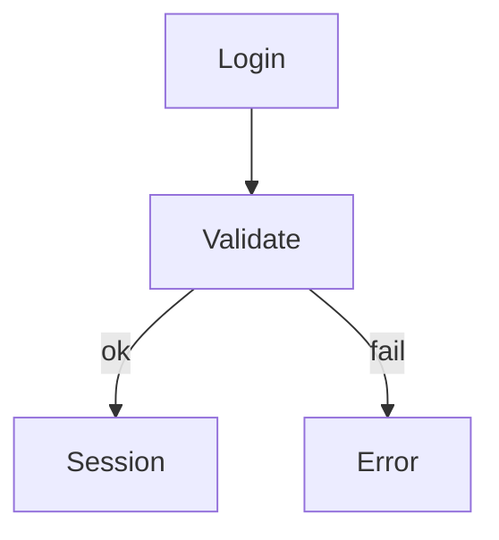

# AI assistant

KorTTY can analyze selected terminal text with an OpenAI-compatible AI endpoint and open the answer in a temporary AI result tab. You can also start agent-style workflows to automate SSH tasks or get plans reviewed before implementation.

When **Configuration > Prevent System Sleep** is enabled on macOS or Windows, korTTY keeps the computer awake while an AI API, local-model, web-tool, or local AI CLI request is waiting for a result. The assertion is released after the last concurrent AI request finishes; if no terminal is connected and no future or running Scheduler job exists, the computer may then sleep normally. Display sleep remains available.


!!! warning "Data Security"
    Selected terminal text is transmitted to the configured AI endpoint for analysis. That text can contain sensitive information such as credentials, hostnames, file paths, stack traces, or other operational details. For sensitive data, prefer a trusted local endpoint such as **LM Studio**, or verify that you trust the remote endpoint before sending anything. If you provide an **API Key**, korTTY stores it encrypted with your master password.

## Setup

1. Open **Edit > Global Settings**.
2. Go to **AI**.
3. Create one or more AI profiles and enter the **API URL** for each profile you want to use. You can manage profiles in **Settings > AI** or in **Tools > AI Manager > Profiles**.
4. Optionally enter **Model** and **API Key**. The editable model selector supports manual model names; for known cloud providers (OpenAI, Anthropic, Google Gemini, Mistral, DeepSeek, Groq, OpenRouter, MiniMax) it is pre-filled with common model names, and for local LM Studio endpoints it offers an **Auto** option plus the currently loaded local LLMs. The **API Key** is stored encrypted with your master password. Prefer local endpoints for sensitive data, or verify the endpoint's trust level before sending selections.
5. Optionally configure **Max characters**, **Tokenizer**, **Token limit**, warning thresholds, token reset cycle, supported **Reasoning** effort, and **Internet access** per profile. korTTY exposes reasoning choices based on the configured API URL and model; profiles without a supported reasoning mode stay disabled.
6. Click **Test AI Connection**.
7. Optionally choose a **Default profile** for terminal AI actions and follow-up chats that do not explicitly select another profile.
8. Optionally configure the default language for AI-generated text inside code comments and program output, enable the extra instructions field for snippet AI actions, and set how many alternative solutions the snippet editor should request.
9. Optionally configure the terminal-agent input-history size (default 20, range 5–100), the agent command name, case-insensitive command matching, execution target, prompt-hook usage, per-run setup dialog, debug/runtime visibility, and activity-panel preferences for **AI Agent** and **AI Planning**.
10. Optionally disable the confirmation dialog for **Summarize** and **Solve Problem** if you want a faster workflow. **Ask** always opens the prompt dialog.

## AI Profile Setup Wizard

A guided wizard creates AI profiles with support for both local and cloud-based language models.

To open the wizard:

* **Settings > AI**, click **Add Profile** or **Edit** an existing profile.
* **Tools > AI Manager > Profiles**, click **Add**.

The wizard guides you through:

1. **Connection Type** - Choose local LM Studio or a cloud provider.
2. **LM Studio Setup** - If local: pick a loaded LM Studio model from the list or use **Auto** mode.
3. **Cloud Provider Setup** - If cloud: select the provider (Anthropic Claude API, OpenAI, or other OpenAI-compatible endpoint).
4. **API Details** - Enter API Key and select or enter the Model name — the model list is pre-filled with common models for the chosen provider, and **Load models** merges the endpoint's live model list on top. Optionally configure Reasoning effort (if the provider/model supports extended thinking).
5. **Profile Name** - Enter a display name for the profile (e.g., "Claude Opus", "Local LM Studio").

Native Anthropic (Claude) API support is included alongside existing OpenAI-compatible endpoints.

## Model selection

The model selector in **Settings > AI** and **Tools > AI Manager > Profiles** is editable:

* For known cloud providers the dropdown is pre-filled with common model names for the configured endpoint, so a concrete model can be chosen without an API key. The refresh button next to the selector merges the endpoint's live `/v1/models` list on top when the API key is valid.
* A listed model stores that model as the manual selection.
* A typed model name is stored as a manual selection so any OpenAI-compatible endpoint works.
* **Auto** is offered only for local LM Studio endpoints, where korTTY can actually detect the loaded model. Cloud profiles need a concrete model; if none is selected, requests stop with an explicit "select a specific AI model" error.

### Local LM Studio model selection

For local LM Studio profiles, korTTY can discover currently loaded LLM model keys through LM Studio's `GET /api/v1/models` endpoint.

Auto mode resolves the effective model immediately before connection tests, AI chat and follow-up requests, terminal AI actions, and Terminal AI Agent runs. If exactly one LLM is loaded, korTTY uses that model. If multiple LLMs are loaded, korTTY uses the saved preferred model only when that model is currently loaded. If no LLM is loaded, or multiple LLMs are loaded without a valid saved preference, korTTY stops the request with an explicit error instead of guessing.

## AI internet access

Internet access is configured per AI profile. Existing and new profiles default to **Disabled**.

| Mode | Behavior |
|------|----------|
| **Disabled** | No web tools or MCP integrations are sent with AI requests. |
| **KorTTY Tavily Tool** | korTTY adds a `web_search` tool to eligible OpenAI-compatible `/v1/chat/completions` requests. Tool calls are executed by korTTY through `POST https://api.tavily.com/search`. |
| **LM Studio Tavily MCP** | korTTY sends an LM Studio native `/api/v1/chat` request with a Tavily MCP integration. |
| **Bright Data Web MCP** | korTTY sends an LM Studio native `/api/v1/chat` request with a Bright Data MCP integration. |
| **Brave Search MCP** | korTTY sends an LM Studio native `/api/v1/chat` request with a configured Brave Search MCP plugin ID. |
| **SearXNG MCP** | korTTY sends an LM Studio native `/api/v1/chat` request with a configured SearXNG MCP plugin ID. |
| **LM Studio Toolpack** | korTTY sends an LM Studio native `/api/v1/chat` request with the configured LM Studio Toolpack MCP plugin ID. |

Required provider configuration is entered under **Settings > AI > Internet tool configuration**. API keys and tokens are stored encrypted with the master password. MCP server labels and plugin IDs are stored as normal settings.

Important behavior:

* Snippet AI, text correction, translation, snippet descriptions, and alternative-solution requests do not use internet access.
* Direct korTTY web tools have a 5-second connect timeout, a 20-second request timeout, and a maximum of two web-tool rounds per AI request.
* LM Studio MCP requests with internet access use a longer total request timeout because the MCP server runs behind LM Studio.
* Canceling a running request interrupts the Java HTTP request where the active provider supports interruption.
* Tool errors are returned to the model as structured data. If the web tool times out, fails authentication, returns no results, or reaches the tool-round limit, the model is instructed to say that explicitly and not invent web facts.
* For terminal-agent JSON planning, korTTY offers web tools only when the user task clearly asks for current or external information. Local file/script review tasks should be handled by SSH commands such as `sed`, `cat`, `find`, or test commands, not by web search.

## AI Skills

AI Skills are reusable local instruction blocks that korTTY can add to AI requests. Use them for persistent preferences such as coding standards, review rules, operational policies, or language-specific style guidance.

Open **Edit > Global Settings > AI Skills**.

### Skill fields

* **Skill name** - Human-readable name shown in the skill list and activity logs.
* **Description** - Short explanation used by automatic skill matching.
* **Tags** - Comma-separated keywords used by automatic skill matching.
* **Target** - `AI Chat/Functions`, `AI Agent`, or `Both`.
* **Active** - Enables or disables only this skill.
* **Skill Markdown** - The instruction body sent to the model when the skill is selected.

### Controls

* **Enable AI Skills** disables or enables all skills globally.
* **Automatically send only matching skills** sends only active skills that match the current request. When disabled, all active skills with a matching target are sent.
* **Add** creates a new active skill with target `Both`.
* **Delete** removes the selected skill after confirmation.
* **Import** accepts `.md` and `.markdown` files.
* **Export** writes Markdown files for the selected skill, or all skills if none is selected.
* The skill list can be sorted alphabetically or by enabled/disabled status.

### Import/export format

```markdown
---
kortty-ai-skill: 1
name: My Skill
description: Short purpose statement
enabled: true
target: BOTH
tags: [linux, bash]
---

Skill instructions as Markdown.
```

Plain Markdown without korTTY frontmatter is imported with the file name as the skill name, target `Both`, and disabled by default so you can review it before use. Claude/Codex-style `SKILL.md` frontmatter with `name`, `description`, and `tags` is also accepted and imported disabled by default unless it is korTTY's own export format.

When an AI Agent run uses one or more skills, the terminal-agent activity panel logs the selected skill names. Connection tests never send skills, so `Reply with exactly OK` tests remain stable.

## Terminal selections

### Using AI for selected text

1. Select text in the terminal.
2. Right-click the selected text.
3. Open **AI** and choose:
   * **Summarize** - Creates a concise summary of the selected output.
   * **Solve Problem** - Analyzes the selected error output and suggests likely fixes.
   * **Ask** - Sends the selection together with your own follow-up question or instruction.
4. Confirm the request in the preview dialog. You can edit the selected text before sending it. For **Ask**, add your own prompt. The dialog also shows the estimated request tokens and projected remaining quota.
5. The response opens in a temporary AI tab. You can continue the same context with follow-up prompts from the bottom composer field.
6. Use **Save** in the AI tab to store the conversation under a custom title.
7. Reopen saved conversations later via **Tools > AI Manager** or ++Ctrl+Shift+Y++ (++Cmd+Shift+Y++ on macOS).

### AI result tab features

* The conversation transcript is read-only and not included in saved project/session state.
* `<think> ... </think>` blocks are removed from the visible output.
* The toolbar lets you copy the conversation, save or rename the chat, share/export it to PDF/Markdown/plain text, retry the last request, close the tab, cancel running requests, and change the font size.
* The response language defaults to the current GUI language. You can change the response language and the active AI profile per chat before sending a follow-up prompt.
* Follow-up prompts in **Summarize** and **Solve Problem** continue as normal chat questions; they are not forced back into the original summarizing/problem-analysis prompt.
* Detected code blocks get their own copy button and can also be saved directly into the Snippet Manager. Blocks that contain images, diagrams, or math render as images instead — see [Rendered images, diagrams, and math](#rendered-images-diagrams-and-math).
* Rendered markdown tables can be copied as a whole table, a single column, or a single cell.
* The chosen AI tab font size is stored globally and reused for future AI result tabs.
* Token usage is recorded per AI profile after successful requests so warnings and reset cycles remain accurate.
* If a saved chat references an AI profile that no longer exists, korTTY asks you to choose a replacement profile before you continue with follow-up prompts.

### Rendered images, diagrams, and math

AI answers that contain images, diagrams, or math formulas are rendered as images inside the chat instead of showing raw markup. This also applies to saved chats reopened from the AI Manager.

| Content in the AI answer | Rendered as |
|--------------------------|-------------|
| ` ```svg ` / ` ```xml ` / ` ```html ` code block (or untagged block) containing an `<svg>` document | Inline vector image |
| Markdown image link with a `data:image/png;base64,…` URI in the answer text, or a code block containing only such a data URI | Inline raster image (PNG, JPEG, GIF, BMP; up to 8 MB decoded) with a **copy image** button |
| ` ```mermaid ` code block | Mermaid diagram (bundled library, no network) |
| ` ```latex ` / ` ```tex ` / ` ```math ` code block, or `$$ … $$` math in the answer text | Typeset formula (bundled MathJax, no network) |

Every rendered block keeps a header with the usual copy button and a **Show code / Show image** toggle, so the underlying source stays one click away. While a Mermaid/math block is still rendering, the source remains visible; if rendering fails (for example a Mermaid syntax error), the block stays on the source view and the header shows the reason. `plantuml`/`puml` fences and untagged `@startuml` content are ordinary source-code blocks and are not rendered specially.

Example prompts that produce rendered answers:

```text
Draw a simple house as an SVG image.
Create a Mermaid flowchart of a typical login flow.
Create a Mermaid sequence diagram for an SSH handshake.
Explain the Pythagorean theorem and show the formula.
```

A Mermaid answer fenced with the `mermaid` language tag and this body renders as a flowchart:



And display math in the answer text renders as a typeset formula:

```text
$$a^2 + b^2 = c^2$$
```

!!! note "Rendering details and requirements"
    * SVG and rendered Mermaid output is displayed with JavaScript disabled and scripts/event handlers stripped from the document.
    * Mermaid 11.16.0 runs with its `strict` security level from a SHA-256-pinned local bundle; LaTeX is typeset by a separately loaded local MathJax bundle. Neither needs internet access.
    * Chat Mermaid retains the full bundled diagram support, including flowchart, sequence, class, state, ER, mindmap, and architecture diagrams. Frontmatter, directives, network/file/data/JavaScript URLs, external images/icons, links, and click callbacks are rejected; source, edge-count, raster-size, and timeout limits protect the renderer.
    * Full LaTeX documents (`\documentclass`) intentionally stay code blocks; only formulas are typeset.
    * Mermaid follows the active chat's light/dark palette; other rendered images and formulas retain a readable neutral canvas.

## AI Manager

Open **Tools > AI Manager** or press ++Ctrl+Shift+Y++ (++Cmd+Shift+Y++ on macOS).


The AI Manager has two working areas:

* **Profiles** - Create, edit, test, save, and remove AI profiles. The profile list shows the current quota/usage status for each profile.
* **Saved Chats** - Open, rename, refresh, or delete previously saved AI conversations. Saved [AI Swarm](ai-swarm.md) conversations appear in their own **Swarm Chats** section, including those produced by scheduled swarm jobs.

Use **Settings > AI** for the global defaults and behavior switches, and **AI Manager** for day-to-day profile/chat management.

## Ask the manual (AI docs search)

The built-in manual (**Help > Manual**, ++f1++) includes an AI-powered search. Toggle **AI search** in the manual window's toolbar to open a side panel, type a question in natural language — for example *"How do I run the AI agent in the terminal window?"* — and press ++enter++.

How it works:

* korTTY selects the most relevant sections from the bundled offline manual (no embeddings, no external search service) and sends only those excerpts together with your question to your **default AI profile**.
* The answer is generated **exclusively from the manual content** and is written in the app language. If the manual does not cover the question, the assistant says so instead of guessing.
* Answers cite their sources: click an inline citation or an entry in the **Sources** list to jump the manual view directly to the referenced page and section.
* If nothing in the manual matches the question, korTTY answers locally without contacting the AI endpoint at all.

Requirements:

* A configured AI profile (see [Setup](#setup)); the default profile is used.
* An unlocked master-password vault when the profile stores an encrypted API key.

!!! warning "Data Security"
    The question text and the selected manual excerpts are transmitted to the configured AI endpoint. The manual content itself is public documentation, but your question is free text — avoid pasting secrets into it, or use a trusted local endpoint such as **LM Studio**. Internet access modes are always disabled for manual questions.

## AI Agent and AI Planning

korTTY supports agent-style workflows for an active terminal session.

!!! note "SSH and local shells"
    The agent's command-execution engine is decoupled from SSH behind an `AgentCommandRunner` abstraction with two backends — **SSH** (exec channel) and **local** (a fresh local process). The **AI Agent** and **AI Planning** therefore run both in SSH sessions and in [local shells](connections.md#local-shell) on Windows, macOS and Linux: commands execute in the connection's shell (PowerShell via `-EncodedCommand`, `cmd.exe`, or `$SHELL`), the environment probe and system prompt are platform-aware so the model generates native commands, and the same approval flow applies. **Local-shell limitations:** no `sudo`/administrator elevation on Windows, and no live working-directory tracking (the agent uses the connection's start directory). The JobScheduler's headless AI-agent action stays SSH-only.

### Starting the agent

* **AI Agent** - Start from **Tools > AI Agent...**, from the terminal right-click menu, or with the terminal shortcut command. The agent can open in a dedicated chat tab or target the active terminal window, depending on **Settings > AI**.
* **AI Planning** - Start from **Tools > AI Planning...**, from the terminal right-click menu, or with `agent-plan` / `agent -plan`. Planning mode asks clarifying questions, proposes one or more options, creates a final plan report, and lets you start the accepted plan.

### Activity panel and placement

* **Split-local activity panel** - Terminal-targeted runs appear at the bottom of the terminal split where the run was started. Each split has its own panel, so different splits can run their own agent tasks in parallel.
* **Panel placement** - Use **View > AI Agent Panel** to choose **At Bottom** (default), **Dock Left**, or **Dock Right**. Docked mode shows the activity in a resizable side panel attached to the main window; drag its divider to resize. The placement and width are remembered across restarts. In side mode there is one outer tab per terminal of the active terminal tab, and runs are stacked vertically. Switching to another terminal tab swaps the dock to that tab's terminals.
* **Agent status indicators** - A per-terminal AI-agent status icon appears in the Dashboard tree and prefixed to the terminal's tab title:
  - ✋ awaiting input
  - ⚡ working
  - ⏸ paused
  - ✓ finished
* **Concurrent runs** - Multiple concurrent runs per split are shown as closable tabs in the activity panel (one tab per run), with a per-widget concurrency cap of 5 runs. Finished runs stay as tabs until closed.
* **Typing while running** - Typing is no longer locked while a run is active. You can continue typing in the shell prompt and launch another `agent ...` command (it opens a new concurrent tab). Only run-control keys are intercepted: ++Esc++ or ++Ctrl+C++ cancel the selected tab's run; ++Ctrl+R++ toggles that run's thinking details.
* **Pause and Resume** - Each run tab shows pause and cancel buttons. Pause parks the agent at a safe point between steps; paused time is excluded from the run work-time.
* **Current directory** - Terminal shortcut runs use korTTY's tracked current remote directory. Commands and generated files are executed relative to that directory.
* **Approvals and sudo** - The agent can request explicit approval before command execution and can ask for a sudo password in the activity panel. Password input is masked, can be submitted with ++Enter++, and allows up to three wrong-password retries. If a password is cached, it is used only for the current agent/session context. When user input (sudo password / command approval) is required, the panel auto-expands.
* **Collapsed status bar** - When the panel is collapsed, it shows a compact status bar with the run prompt, state, pause/cancel buttons, and an expand button. A spinner appears while the agent is actively working, and a bold ✋ marker signals when user input is required.
* **Keep collapsed** - Use **Keep collapsed** to make the panel start minimized to the status bar.
* **Terminal output** - Final terminal-agent answers are written back to the terminal area so the shell transcript contains the answer.
* **Panel controls** - Use the reload button to run the selected agent command again. Copy or snippet actions are available on activity rows. Export the current run or full history as Markdown, plain text, YAML, XML, JSON, PDF, or Asciidoctor. Use **Expand all** to keep activity details open. Use **A-** and **A+** to change the activity font size. Drag the resize handle to change the panel height.

## Terminal agent shortcut commands

When terminal agent shortcuts are enabled and the terminal is at a shell prompt, korTTY intercepts these commands locally instead of sending them to the server:

```bash
agent <goal>
agent-ask <question>
agent-plan <task>
agent -plan <task>
```

The base command name is configurable in **Settings > AI**. If you rename `agent`, korTTY derives the matching `-ask` and `-plan` commands automatically. The same settings page can make the command name case-insensitive and can disable the per-run setup dialog; when the dialog is disabled, korTTY uses the configured default profile.

### TAB completion and prompt history

At the shell prompt, TAB completion is enhanced for agent commands:

* Type the agent command name (e.g., `agent`) then press ++TAB++ to offer the command variants (`agent`, `agent-ask`, `agent-plan`).
* Type the command plus a space (e.g., `agent `) then press ++TAB++ to offer the recent agent-prompt history. Each row shows the prompt and the date/time it was last run, de-duplicated by prompt text (newest first).
* Each history row shows the prompt on the left and the date/time it was last run on the right. Prompts longer than 60 characters are shortened with an ellipsis; the full prompt is still inserted when the entry is selected.
* The history popup is resizable — drag the grip in the bottom-right corner — and remembers its size across restarts. It shows a vertical scrollbar when the history is longer than the popup.
* In the history popup, remove a single prompt by clicking the row's ✕ button (or pressing ++Del++ on keyboards with a forward-delete key), or remove the entire history with **Clear all** (a two-step confirm guards against accidental wipes). Deletions are saved immediately.
* Outside this context, ++TAB++ is normal shell completion.

History size is configurable in **Settings > AI** (default 20, range 5–100).

### How the AI Agent works

The Terminal AI Agent is a controlled SSH automation workflow. It does not run arbitrary model output directly in the interactive terminal. Instead, each turn follows this pattern:

1. korTTY probes the active SSH session with a non-interactive command and records compact context such as current user, host, operating system, active terminal working directory, sudo availability, disk path, and recent command state.
2. korTTY sends the user task, probe snapshot, previous command results, active AI Skills, and optionally web-tool availability to the selected AI profile.
3. The model must return a strict JSON decision: run commands, ask for confirmation, finish, or block.
4. korTTY validates the JSON schema and command constraints. Invalid responses are repaired once; unsafe or unsupported command decisions are rejected.
5. korTTY runs approved commands through SSH exec channels. Each command starts in the tracked active terminal directory. A `cd` inside one command does not persist to the next command.
6. Command output is added to the activity panel and to the next model turn until the task is complete, blocked, canceled, or the turn limit is reached.

### Suitable tasks

The agent is suitable for:

* inspecting files, directories, package state, logs, service state, and system configuration;
* creating or modifying scripts and configuration files when the task asks for it;
* running tests, syntax checks, linters, or read-only diagnostic commands;
* summarizing command output and explaining findings;
* planning multi-step operational changes before implementation.

The agent is not intended for:

* interactive full-screen programs such as `vim`, `nano`, `top`, `less`, `ssh`, or commands that wait for prompts;
* long-running daemons or commands without clear completion;
* secret exfiltration or blind destructive commands;
* web research for local files unless you explicitly ask for external/current information.

### Example commands

```bash
agent show the 10 largest XML files in this directory
agent update groesste_xml.pl so the -r flag searches subdirectories recursively
agent check why nginx failed to start and suggest the safest fix
agent-ask what user and directory am I currently using?
agent-plan migrate this host from package X to package Y
```

For local file review tasks, name the file in the task. The agent should then inspect it with SSH commands such as `sed -n`, `cat`, `file`, or language-specific syntax checks. If an internet-enabled profile is active, korTTY still keeps web tools away from these local file planning prompts unless your task clearly asks for current or external information.

### Activity row icons

Activity rows use semantic emoji icons to indicate the action type:

| Icon | Meaning |
|------|---------|
| 💾 | Request or input: write/create file |
| 📖 | Action: read file/directory |
| ▶️ | Action: run/execute command |
| 📁 | Action: directory operation |
| 📦 | Context: package manager |
| ⚙️ | Context: service or system |
| 🌐 | Action: network operation |
| 🔍 | Action: inspect/analyze |
| 💭 | State: thinking/reasoning |
| 💬 | Output: message or result |
| ✋ | Required: awaiting user input (sudo/approval) |
| ❌ | State: error or failed activity |
| 🚫 | State: cancelled activity |

Red styling is reserved for error and failed states.

### Safety and failure handling

korTTY adds guardrails around agent execution:

* Commands are limited per turn and must be non-interactive.
* Commands that change the system or require privilege can be routed through confirmation depending on settings and model decision.
* Sudo uses `sudo -n` and activity-panel password prompts. korTTY does not allow `sudo -S`, `su`, or commands that wait indefinitely for a terminal password prompt.
* The current remote directory is tracked from shell hooks, terminal prompt context, and probe results. If a tracked directory no longer exists, korTTY retries the probe from the SSH default directory and reports the issue.
* While a terminal-targeted run is active, normal typing is still allowed; only run-control keys (++Esc++/++Ctrl+C++ to cancel the selected run, ++Ctrl+R++ to toggle its thinking details) are intercepted.
* Web-search failures, HTTP errors, authentication errors, empty results, and timeouts are surfaced as explicit tool errors.
* If the AI response does not match the required JSON schema, korTTY asks for a repair. If repair also fails, the run is blocked with an explanation.

## AI Swarm (multi-server)

The [AI Swarm](ai-swarm.md) broadcasts one AI-agent task to many servers at once: each selected server gets its own agent run — including servers **without an open terminal** — and the per-server answers are combined into a single comparison table. The swarm tab adds an animated per-agent status strip, expandable live transcripts, pause/resume/restart/stop controls per agent and swarm-wide, AI-free script execution from the Snippet Manager, and a **Schedule…** button that turns the run into an unattended [JobScheduler](jobscheduler.md) job. Open it with **AI > AI Swarm...** or ++ctrl+alt+s++ (Cmd on macOS); see the [AI Swarm](ai-swarm.md) page for the full feature set.

## Generate Workflow Script

After a finished agent run completes successfully, a **Workflow** button turns the run into a single self-contained, reproducible script in a chosen language (Bash, Python, Perl, Ruby, PowerShell, Ansible playbook, **Windows-CMD** batch, or **AppleScript**) with robust error handling, detailed comments, and a header (script name, creator, date/time).

Script generation:

* Auto-loads matching AI Skills (e.g., a language-quality skill for the target language).
* Can produce several language variants and multiple suggestions as inline tabs.
* Supports header templates from the fixed non-deletable **Script-Header** snippet category.
* Optionally includes a Mermaid flowchart for the script logic. A working spinner is shown while the diagram is generated, so it is clear the AI connection is busy.
* Saves into the Snippet Manager with a short auto-generated name plus correct extension (de-duplicated by full name including extension).
* Tags the snippet as `workflow` for easy filtering.
* Auto-sets the **System** (OS) column from the agent's probed OS (any Linux distro becomes Linux).
* Internet access is forced OFF during generation.

**Target languages:** Bash, Python, Perl, Ruby, PowerShell, Ansible, plus **Windows-CMD** (`.cmd` batch — `@echo off` lead line, `REM` header comments, `errorlevel` checks) and **AppleScript** (`.applescript` — `osascript` shebang, `--` comments, `try`/`on error` handling).

Each generated-script editor has **A−** / **A+** buttons and supports ++ctrl++ + mouse wheel (Cmd on macOS) to change the font size; the chosen size is remembered across sessions.

The workflow dialog is resizable and remembers its size and position for future use.

!!! tip "Clearer AI backend errors"
    When the AI server runs out of memory or hits a resource limit (e.g. LM Studio/MLX "Resource limit exceeded", "metal::malloc"), the dialog shows a short, actionable hint instead of the raw multi-line backend stack trace; all other AI errors are collapsed to a single line.
