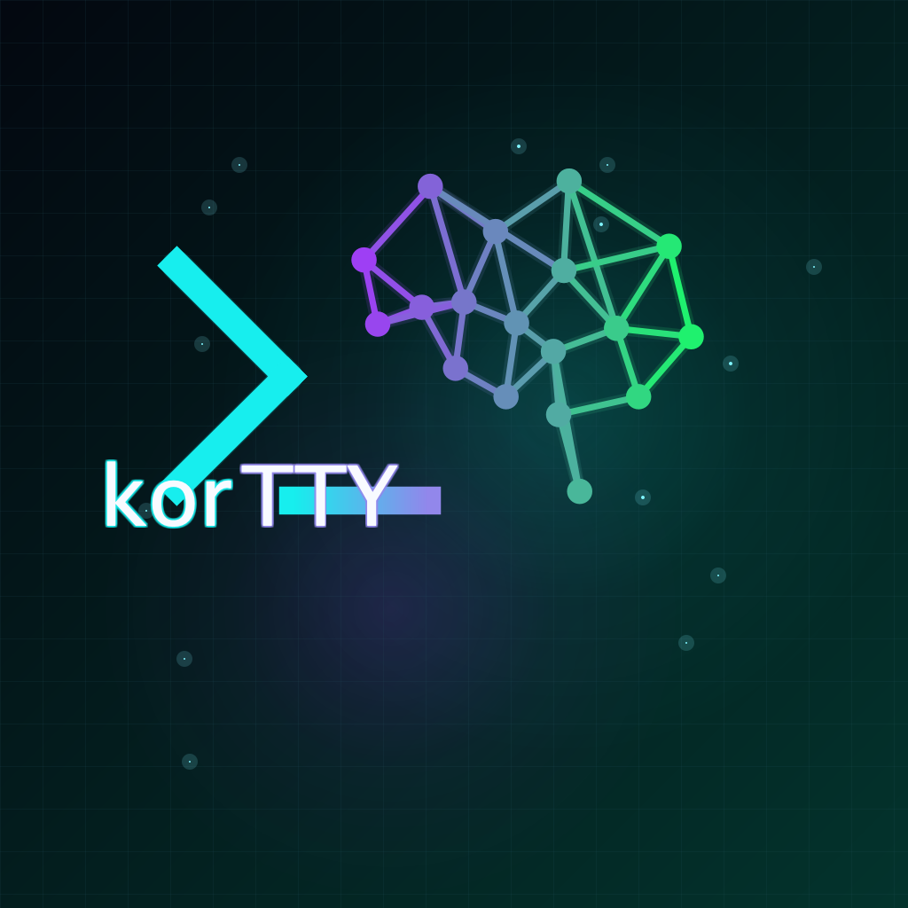

<video class="kt-hero-video" autoplay muted playsinline poster="assets/images/kortty-logo.png">
  <source src="assets/images/kortty-logo.mp4" type="video/mp4">
  
</video>

# korTTY Guide

 The complete reference for korTTY — a modern, cross-platform JavaFX SSH client with tabbed terminals, SFTP tooling, a background job scheduler, snippet management, terminal-effect plugins and OpenAI-compatible AI assistance. Every feature, setting and tool, explained in detail.

Press F1 inside korTTY to open this guide

-   :material-rocket-launch: __Getting started__

    Install korTTY, set your master password, and learn the main window.

    [:octicons-arrow-right-24: Start here](getting-started/installation.md)

-   :material-console-network: __Connections & terminal__

    SSH/Mosh connections, tabs, split-screen, tunnels, jump servers and SFTP.

    [:octicons-arrow-right-24: Connections](features/connections.md)

-   :material-tune-variant: __Settings reference__

    Every setting across all configuration tabs, with types, defaults and where each value is stored.

    [:octicons-arrow-right-24: Settings](reference/settings/index.md)

-   :material-menu: __Menus & shortcuts__

    The full menu tree and every keyboard shortcut.

    [:octicons-arrow-right-24: Menu reference](reference/menu.md)

-   :material-robot-happy: __AI assistant & agent tools__

    Profiles, skills, the AI Manager, and the terminal AI agent's tools.

    [:octicons-arrow-right-24: Connections & AI](features/connections.md)

-   :material-history: __What's new__

    Release notes for the current and previous versions.

    [:octicons-arrow-right-24: Release notes](about/release-notes.md)

!!! info "About this guide"
    This guide is bundled inside korTTY (**Help → Manual**, shortcut ++f1++) and published online. It is available in **English** and **German**, and is kept in sync with the code automatically. The korTTY version this guide was built for is shown in the footer.
